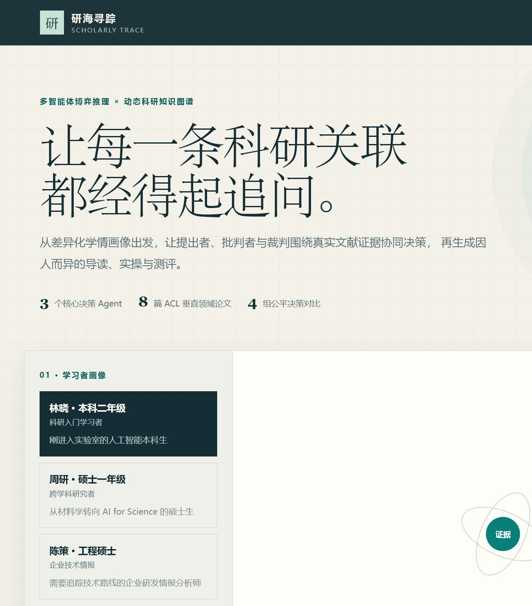
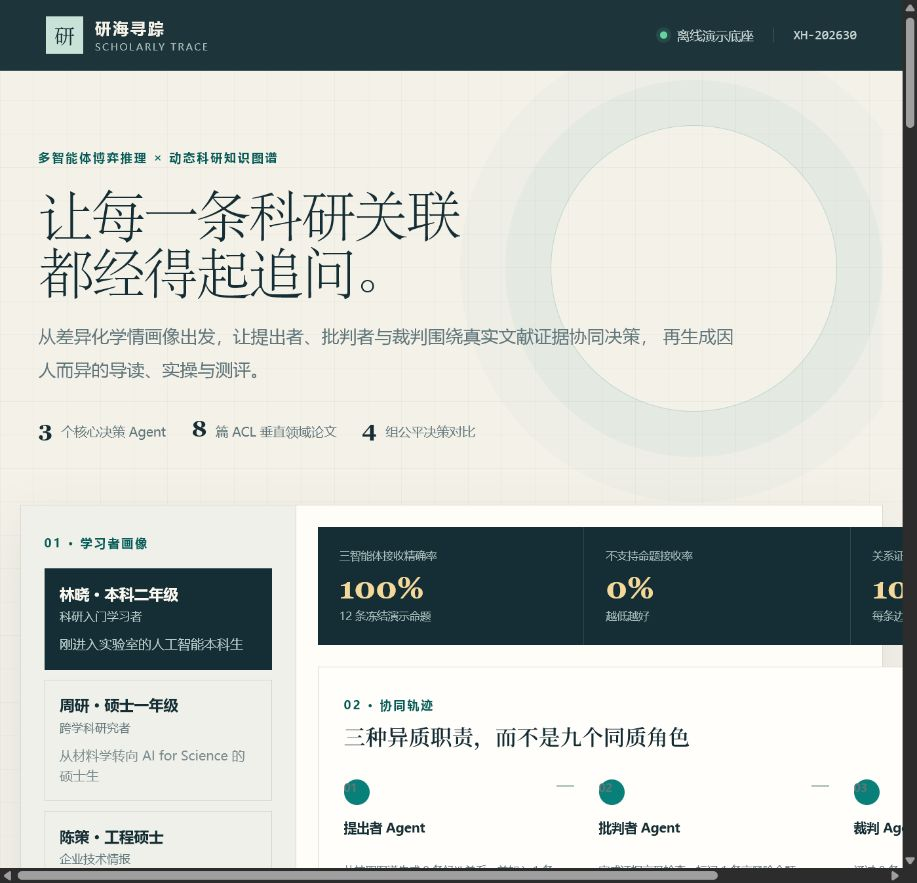
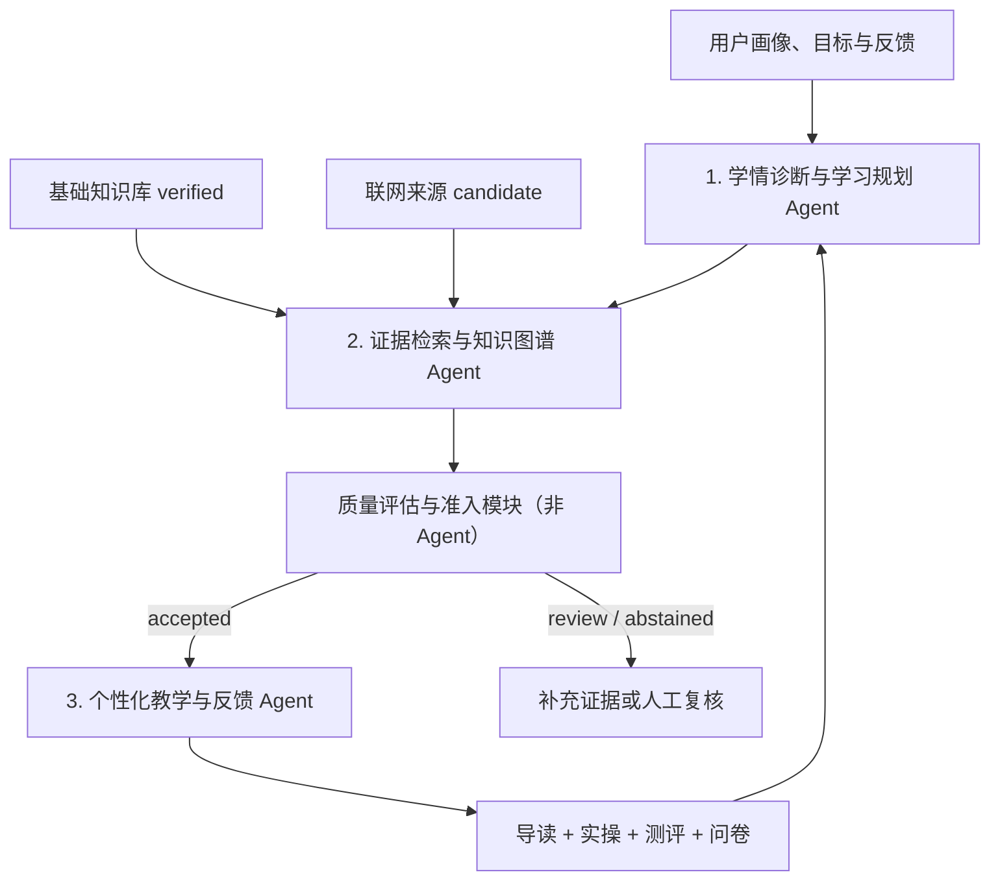

# 研海寻踪（Scholarly Trace）

> 基于证据可追溯科学信息抽取与多智能体校验的科研知识图谱发现系统

“研海寻踪”面向科研文献孤岛化、碎片化和跨学科检索困难的问题，把论文中的方法、任务、数据集、指标、实验发现和局限抽取为可验证的知识关联。系统要求每条进入正式图谱的关系都能回指论文、章节和原文证据，并通过“命题生成—内部批判—质量准入”校验后再用于技术演化、学术争议和研究空白分析。

当前仓库处于**可运行工程基线**阶段：前端和三 Agent 闭环可以离线演示；科学信息抽取已形成规则基线与统一数据协议；还没有完成全文人工金标准、神经模型对照和专家盲审，因此页面中的工程代理指标不能当作论文实验结论。

项目保留无需外部服务的离线 Mock，同时支持由用户临时提供 API Key 的
DeepSeek、GPT、Claude 与 Kimi 实时路径。实时路径会并行检索开放论文索引和
官方技术资料，并对模型返回的来源标识做确定性校验。

## 先澄清：到底有几个 Agent？

当前系统固定只有 **3 个业务 Agent**，定义于 [`src/yanhai/agents.py`](src/yanhai/agents.py)：

| 序号 | Agent | 核心职责 | 结构化输出 |
|---:|---|---|---|
| 1 | 学情诊断与学习规划 Agent | 识别盲区、难度、学习目标并更新概念状态 | `diagnosis`、`knowledge_state`、学习路径 |
| 2 | 证据检索与知识图谱 Agent | 检索本地与联网证据、形成命题和个性化知识子图 | `papers`、`claims`、`graph` |
| 3 | 个性化教学与反馈 Agent | 使用通过准入的知识生成导读、实操、测评和问卷 | `resources`、`feedback_form` |

“批判、辩论、反证、时序分析、假设排序”是第二个 Agent 的内部工具或策略，
不作为独立 Agent 展示。“质量评估与准入模块”负责证据评分、画像契合度评分
和知识准入，也不计入 Agent 数量。页面中的 9 是候选命题数量，不是 Agent 数量。
## （一）国际化

当前状态：

- 前端与说明文档以简体中文为主，论文标题和来源保留英文原文。
- `data/knowledge/extraction_schema.json` 已为核心概念提供中英文别名。
- 所有 JSON 与接口使用 UTF-8，代码避免把中文标签作为内部唯一标识。

待完成：

- 将界面文案迁移到 `locales/zh-CN.json` 与 `locales/en-US.json`。
- 为实体类型、关系类型、Agent 角色和错误信息增加稳定英文键。
- 增加中英文 README、摘要和演示脚本，并以同一冻结实验结果为数据源。

## （二）项目工程介绍

### 2.1 研究对象与任务

系统输入为 PDF、HTML、DOCX 或结构化论文元数据，核心输出不是裸三元组，而是带来源、状态和审计记录的知识单元：

```json
{
  "source": "multi-agent debate",
  "relation": "IMPROVES",
  "target": "factuality",
  "evidence_ids": ["evidence:2305.14325:abstract:0"],
  "confidence": 0.91,
  "status": "accepted",
  "criticisms": []
}
```

端到端任务包括：

1. 文档结构解析：章节、段落、句子、表格、公式、引文和页码。
2. 科学实体抽取：METHOD、TASK、DATASET、METRIC、FINDING、LIMITATION、DOMAIN。
3. 文档级关系和实验结果抽取。
4. 实体规范化、消歧与跨论文融合。
5. 证据图谱 Agent 内部完成命题生成与批判，独立质量模块执行准入。
6. 动态知识图谱及技术演化、争议和研究空白分析。
7. 面向不同使用者生成可追溯导读和科研训练资源。

### 2.2 当前 Demo 的真实技术栈

| 层级 | 当前采用的方法/模型 | 成熟度 |
|---|---|---|
| 前端 | 原生 HTML、CSS、JavaScript、SVG | 可演示 |
| Web 服务 | Python 标准库 `ThreadingHTTPServer` | 可演示 |
| 文献数据 | 8 篇 arXiv 种子文献；实时接入官方资料、OpenAlex、Crossref 与 arXiv | 工程切片 |
| 文档解析 | PlainText/Markdown；可选 Docling 适配器 | 基线 |
| 实体抽取 | 中英文 schema 词典、字符跨度匹配 | 规则基线 |
| 关系抽取 | 触发词与同句共现候选 | 规则基线 |
| 实体融合 | Unicode、大小写、连字符规范化和规范名合并 | 规则基线 |
| 知识图谱 | 内存 JSON 图、来源边、连通分量社区 | 工程基线 |
| 多智能体 | 3 个业务 Agent；独立质量准入；可选接入 DeepSeek、GPT、Claude 与 Kimi | 可回归基线 |
| 评价 | 代理指标、单元测试和证据完整性检查 | 非论文金标准 |
| 桌面 APP | PyQt6 Windows x64 免安装验证包 | 粗粒度验证版 |

### 2.3 优化目标与量化指标

项目北极星指标定义为：

> **Verified Triple Yield（VTY）**：冻结测试集中，每篇论文被人工判定为关系正确且证据跨度正确的 accepted 三元组数量。

优化时最大化 VTY，但必须同时满足“入图精确率 ≥ 90%”和“关系证据覆盖率 = 100%”，避免用大量低质量三元组换取表面召回率。

| 指标 | 当前可验证状态 | 竞赛定稿目标 |
|---|---|---:|
| PDF 解析成功率 | 尚未在全文集测量 | ≥ 95% |
| 实体 strict micro-F1 | 尚无人工金标准 | ≥ 0.82 |
| 关系 micro-F1 | 尚无人工金标准 | ≥ 0.72 |
| 证据跨度 F1 | 尚无人工金标准 | ≥ 0.80 |
| accepted 三元组精确率 | 尚无人工金标准 | ≥ 0.90 |
| 关系证据覆盖率 | 种子基线 100%，仅工程检查 | 100% |
| 实体链接 Top-1 accuracy | 尚未测量 | ≥ 0.85 |
| 错误实体合并率 | 尚未测量 | ≤ 0.05 |
| 冲突/反驳识别 F1 | 尚未测量 | ≥ 0.70 |
| 跨领域 OOD 性能下降 | 尚未测量 | 绝对下降 ≤ 0.12 |
| 多 Agent 校验增益 | 尚未测量 | 相对最强单次抽取基线，精确率提升 ≥ 5 个百分点；或无证据关系减少 ≥ 30%，且召回下降不超过 5 个百分点 |
| 演化/争议任务专家正确率 | 尚未测量 | ≥ 0.80 |
| Top-10 研究空白建议专家有用率 | 尚未测量 | ≥ 0.60 |
| 单篇处理成功率 | 尚未在全文集测量 | ≥ 95% |
| 单篇 P50 处理时延 | 尚未记录参考硬件 | ≤ 120 秒，并同时报告硬件与成本 |

当前种子抽取冒烟结果为 8 篇论文、11 个规范实体、14 条候选关系，其中 6 条自动接收、8 条进入复核，证据覆盖率 100%。这些数字只证明工程链路能运行，不证明模型达到上述目标。

## （三）项目的使用效果图

### 3.1 首页与用户画像



### 3.2 三 Agent 协同轨迹、质量准入、证据图谱与学情报告



界面目前展示 3 组脱敏合成画像、研究问题输入、3 Agent 可回放轨迹、独立质量准入、证据图谱、个性化资源和 Demo 问卷反馈。全文上传、原文高亮、人工三元组审核和动态图谱版本界面尚未接入。

## （四）项目特点

1. **证据优先**：正式关系必须携带论文、章节、原句和字符跨度，来源缺失时不能入图。
2. **校验式三 Agent**：理解用户、证据研究和个性化教学职责分离，质量准入不由教学生成角色自行决定。
3. **全文科学信息抽取**：目标覆盖正文与表格中的方法—任务—数据集—指标—结果，而不是只对摘要生成关键词。
4. **可撤销图融合**：同义实体合并、冲突关系和人工修订都要求保存版本和审计信息。
5. **研究发现有边界**：技术演化和争议可以作为事实分析；“蓝海”只能作为待验证假设排序，不能伪装成已证实结论。
6. **离线可运行基线**：无外部 API 时仍可完成固定数据演示，模型接入后仍使用同一数据协议和测试集。
7. **科研与工程双重验收**：既检查 F1、精确率和 OOD 泛化，也检查处理成功率、时延、成本和复现性。

## （五）项目的基本结构（架构）

### 5.1 总体架构



文档解析、内部批判/反证策略和质量门控都是**非 Agent 基础能力**；三个业务 Agent 分别负责理解用户、构建可信知识子图和完成个性化教学。

### 5.2 目录结构

```text
data/
  knowledge/        种子论文、关系与 extraction schema
  profiles/         脱敏合成用户画像
docs/
  assets/readme/    README 实际运行截图
  01-10_*.md        赛题、架构、路线、申报格式与团队计划
outputs/            可复现实验输出（默认不提交生成物）
references/         竞赛样例与内部参考材料
scripts/            Demo、抽取与评测入口
src/yanhai/
  agents.py         3 个业务 Agent 与内部工具策略
  extraction.py     文档对象、证据跨度、抽取、批判、裁决和图融合
  knowledge.py      种子知识库和检索
  orchestrator.py   三 Agent 编排与反馈闭环
  server.py         本地 HTTP 服务和 API
tests/              工程回归测试
web/                原生 Web 前端
```

详细研究架构见 [`docs/08_scientific_ie_kg_technical_route.md`](docs/08_scientific_ie_kg_technical_route.md)，四人工作包见 [`docs/10_team_research_workplan.md`](docs/10_team_research_workplan.md)。

## （六）集成方式

### 6.1 HTTP API

| 方法 | 路径 | 用途 |
|---|---|---|
| GET | `/api/health` | 服务健康、画像和论文数量 |
| GET | `/api/profiles` | 获取脱敏合成画像 |
| GET | `/api/knowledge-base` | 获取当前种子论文与人工关系 |
| GET | `/api/extracted-graph` | 获取规则抽取实体、关系、证据和审计图 |
| POST | `/api/run` | 运行三 Agent 与质量准入闭环 |
| POST | `/api/feedback` | 提交难度、问卷和概念级反馈并重新规划 |
| POST | `/api/knowledge-candidates` | 将增量来源放入候选区（进程内 Demo） |
| POST | `/api/knowledge-candidates/promote` | 带复核说明提升为 verified |

### 6.2 模型与基础设施适配

- 文档解析器实现统一 `ScientificDocument` 协议；当前支持 PlainText，Docling 为可选依赖。
- 候选生成器后续可接 GLiNER、GLiREL、DeepKE/OneKE 或 Qwen2.5，但必须输出相同 schema。
- 嵌入模型后续采用 SPECTER2（论文级英文表示）与 multilingual-e5-base（中英文查询和实体上下文）。
- 图存储目前为 JSON；数据规模和融合质量达标后再接 Neo4j。
- 统一 LLM Provider 接口覆盖 OpenAI Responses、Anthropic Messages 和
  OpenAI-compatible Chat；API Key 只在单次请求的进程内存中使用。
- 实时检索并行调用官方资料目录、OpenAlex、Crossref 与 arXiv；配置
  `SEMANTIC_SCHOLAR_API_KEY` 后可加入 Semantic Scholar。单一来源失败不会
  终止整轮任务，没有可靠来源时系统明确拒答。
- 桌面端使用 PyQt6 复用 Python 核心，当前发布的是无签名验证包。

## （七）使用方法

要求 Python 3.11 或更高版本。

### 7.1 启动前端

```powershell
$env:PYTHONPATH="src"
python -m yanhai --host 127.0.0.1 --port 8765
```

浏览器打开 `http://127.0.0.1:8765/`，选择画像、输入研究问题并点击“启动协同推理”。

### 7.2 选择 AI 供应商

左侧“AI 供应商”默认选择离线 Mock，无需 API Key。选择 DeepSeek、GPT、
Claude 或 Kimi 后填写自己的 API Key；Key 不写入文件、浏览器存储、日志或
返回结果。实时运行会产生模型调用费用，并依赖外部论文索引的可用性。

### 7.3 生成证据抽取图

```powershell
$env:PYTHONPATH="src"
python scripts/extract_knowledge.py
```

输出位于 `outputs/extracted_graph.json`。

### 7.4 运行评测与测试

```powershell
$env:PYTHONPATH="src"
python scripts/evaluate.py
python -m unittest discover -s tests -v
```

`scripts/evaluate.py` 目前只做 3 组画像 × 3 种反馈的工程回归。正式论文指标必须来自冻结全文测试集和人工标注。

### 7.5 可选安装 Docling

```powershell
python -m pip install -e ".[documents]"
$env:PYTHONPATH="src"
python scripts/extract_knowledge.py --input "paper.pdf" --paper-id "stable-id"
```

Docling 会引入较大的模型和二进制依赖，建议在独立虚拟环境中安装。

### 7.6 Web、Qt 与网站部署

Qt 与 Web 发布物分别通过 `scripts/build_qt_release.ps1` 和
`scripts/build_web_release.ps1` 构建。`snowsong.top/AgentDemo/start/`
提供网页版，`snowsong.top/AgentDemo/install/` 提供 Qt 验证版下载。完整的
Nginx、systemd、验收与回滚流程见 [`deploy/README.md`](deploy/README.md)，
证据来源策略见
[`docs/项目说明/证据来源与检索.md`](docs/项目说明/证据来源与检索.md)。

## （八）混淆

### 8.1 术语混淆

| 容易混淆的数字/术语 | 正确含义 |
|---|---|
| 3 个业务 Agent | 固定应用角色数量；质量门控和内部策略不计入 |
| 9 条候选命题 | 一次默认运行的关系候选数量，不是 Agent |
| 14 条候选关系 | 新增规则抽取管线在 8 篇种子文献上的冒烟输出 |
| 幻觉代理率 0% | 工程规则检查结果，不是专家盲审幻觉率 |
| accepted | 通过当前规则裁决，不等于已经获得人工金标准确认 |
| 蓝海发现 | 对待验证研究假设进行排序，不是保证发现真实空白 |

### 8.2 代码混淆

当前研究阶段不启用代码混淆，优先保证可复现和可审计。发布桌面 APP 时可以使用 `pyside6-deploy`/Nuitka 打包，但混淆不能替代许可证合规、密钥管理和服务端权限控制。

## （九）关于作者/组织及交流方式等信息

待团队确认后填写：

- 团队/组织名称：`TODO`
- 所属学校/学院：`TODO`
- 项目负责人：`TODO`
- 指导教师：`TODO`
- 项目邮箱：`TODO`
- GitHub Issues：`TODO`

公开版 README 应避免写入不必要的手机号码、个人微信或其他敏感信息。

## （十）贡献者/贡献组织

| 贡献者 | 研究角色 | 主要工作包 |
|---|---|---|
| 成员 A（待填姓名） | 数据与标注负责人 | 语料、解析、schema、标注质量 |
| 成员 B（待填姓名） | 信息抽取算法负责人 | 实体、关系、证据跨度、模型训练 |
| 成员 C（待填姓名） | 图谱与发现负责人 | 实体链接、图融合、演化/争议/空白分析 |
| 成员 D（待填姓名） | 多智能体与系统负责人 | Agent 校验、实验平台、API、前端和 APP 集成 |

具体职责、交付物、里程碑和互审关系见 [`docs/10_team_research_workplan.md`](docs/10_team_research_workplan.md)。

贡献组织：`TODO`

## （十一）鸣谢

项目研究与工程设计参考了以下公开工作：

- [Docling](https://github.com/docling-project/docling)：文档解析与统一文档对象。
- [GROBID](https://github.com/grobidOrg/grobid)：科学论文元数据、正文和引文解析。
- [DeepKE](https://github.com/zjunlp/DeepKE) 与 [OneKE](https://github.com/zjunlp/OneKE)：schema 约束知识抽取。
- [GLiNER](https://aclanthology.org/2024.naacl-long.300/) 与 [GLiREL](https://aclanthology.org/2025.naacl-long.418/)：开放类型实体和关系候选。
- [SPECTER2](https://aclanthology.org/2023.emnlp-main.338/) 与 [Multilingual E5](https://arxiv.org/abs/2402.05672)：科学论文和多语言语义表示。
- [Microsoft GraphRAG](https://github.com/microsoft/graphrag)：图社区和全局检索方法。
- [Hello-Agents](https://github.com/datawhalechina/hello-agents) 与 [CAMEL](https://github.com/camel-ai/camel)：Agent 教学、角色协作和可观测性。
- 用户提供的两份竞赛成果文档仅用于内部结构学习，不复制其文字、图表和成果。

完整文献和许可证记录见 [`docs/09_open_source_adoption.md`](docs/09_open_source_adoption.md) 与 [`docs/10_team_research_workplan.md`](docs/10_team_research_workplan.md)。

## （十二）版权信息

- 当前仓库尚未设置统一的根许可证；在许可证确定前，项目原创代码与文档默认保留全部权利。
- 第三方代码、模型、数据集、论文全文和字体分别遵循其原始许可证，不能用仓库总许可证覆盖。
- 当前未整包复制 Docling、DeepKE 或 GraphRAG 源代码；适配器主要调用公开 API 并记录上游出处。
- 两份竞赛样例可能包含身份和版权内容，公开推送前必须完成授权确认和脱敏。
- 正式开源前由团队在 MIT、Apache-2.0 或其他方案中作出书面决定，并补充 `LICENSE`、`THIRD_PARTY_NOTICES` 和模型/数据清单。
- 实时路径目前主要使用官方资料、论文元数据和摘要，不等同于全文系统综述；
  重要结论仍需打开原始来源并人工复核。

申报书和论文格式见 [`docs/07_submission_and_paper_format.md`](docs/07_submission_and_paper_format.md)。
Web 版或 Qt 版更新后，请按
[`docs/协作与运维/网站发布与维护.md`](docs/协作与运维/网站发布与维护.md)
准备发布信息并联系宋明浩：`06245011@cumt.edu.cn`。`snowsong.top` 使用其
个人主页域名和服务器，GitHub 更新不会自动上线。
