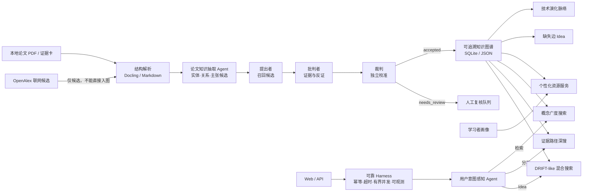
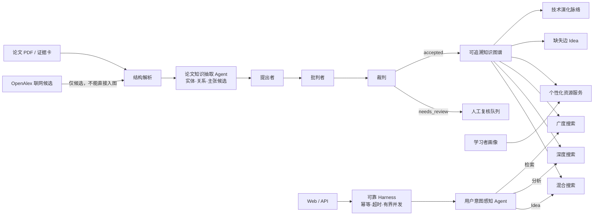

# 研海寻踪（Scholarly Trace）

> 面向科研文献的、证据可追溯的多智能体知识图谱发现系统

**项目入口：** [GitHub 源码仓库](https://github.com/Beries06/Multi-Agent-Scholarly-Trace-demo) · [在线最新版（main）](https://github.com/Beries06/Multi-Agent-Scholarly-Trace-demo/tree/main) · [版本提交记录](https://github.com/Beries06/Multi-Agent-Scholarly-Trace-demo/commits/main/)

## 项目简介

当前版本是可离线运行、可回归验证的 **Demo 工程基线 + 产品化 Web 前端**。已提供 3 个可切换垂直领域，每个领域 30 篇、合计 90 篇可核验 DOI/官方来源论文记录，并保留 19 篇已解析证据卡作为关系图谱核心；另有 9 组“领域 × 学习者”完整样例。系统真正跑通“论文证据卡 → 实体/关系抽取 → 可追溯图谱 → 三智能体裁决 → 技术脉络/Idea → 个性化资源”。新增的 71 篇元数据论文只参与书目检索，取得并解析全文前不能支撑知识关系；尚未完成大规模全文人工金标准、神经模型主实验和专家盲审。因此页面中的 24 条噪声压力集结果只用于暴露机制和失败案例，不能写成公开基准上的科研性能。

近期新增（详见 `docs/研发记录/` 各日志）：

- **产品 Web 前端**：React + Vite + TS + AntD + ECharts（`frontend/`），含多智能体思考过程时间线、证据知识图谱力导向图、裁决证据原文展开；配套 FastAPI 后端 `src/yanhai/api.py`（含 SSE 流式轨迹、`/api/ingest-paper`、`/api/ingest-pdf`）。一键启动 `SETUP_WEB.bat` → `RUN_WEB.bat`；
- **LLM 三智能体就绪**：`src/yanhai/llm_decision.py`（LLM 批判者/裁判 + 模型无关护栏 hard_guard + 失败回退规则），对比实验框架 `scripts/run_decision_experiment.py` 支持任意案例集与 6 家厂商（DeepSeek/GLM/Qwen/Kimi/GPT/Claude）；
- **测试用例扩充至 140 条**：`data/evaluation/generated-decision-cases-v1.json`（真实证据机制用例，28 正 + 112 负，冻结 + SHA-256），解除赛题“测试用例不足 50 组扣分”线；L3 人工抽查工具 `scripts/generate_l3_sample.py`；
- **语义力度校验**：批判者新增时态/体检查（进行中≠已完成，未完成体悖论，理论锚点 ACL 2026）；测评题从 accepted 图谱三元组动态生成。
- **MLflow 实验跟踪**：`RUN_MLFLOW.bat` 一键启动本地 UI 并幂等导入所有通过哈希验证的实验；`RUN_PUBLIC_EXPERIMENTS.bat` 成功后自动同步，不会重跑模型。详见 `docs/协作与运维/MLflow实验跟踪指南.md`。

当前是可离线运行、可回归验证的 **Demo 工程基线**：3 个可切换垂直领域、90 篇论文记录、19 篇已解析证据卡、9 组"领域 × 学习者"完整样例。学术定位、评测口径与实验设计详见 [docs/文档导航.md](docs/文档导航.md)。

两个前置专职 Agent：

| Agent | 当前职责 | 当前实现 | 后续模型 |
|---|---|---|---|
| 论文知识抽取 Agent | 从论文正文生成实体、关系和主张候选 | 版本化 schema + 规则抽取 + 规范化；复用离线索引 | GLiNER/GLiREL、OneKE，配合科学主张验证器 |
| 用户意图感知 Agent | 识别检索、分析、Idea 三类意图并选择图检索路线 | 可审计多标签词法基线 | Qwen2.5-3B 或 bge-m3 分类器，需做置信校准 |

三个核心决策 Agent：

| Agent | 输入 | 当前实现 | 输出 |
|---|---|---|---|
| 提出者 | 论文证据跨度、schema、候选实体 | schema 约束触发模式；可替换为 GLiNER/GLiREL、DeepKE 或 OneKE | 带实体类型、关系类型、证据 ID 和候选置信度的命题 |
| 批判者 | 候选命题与原文证据 | 证据存在性、跨度覆盖、类型约束、绝对化表述和共现关系检查 | 阻断项、限制项与反证意见 |
| 裁判 | 候选、批判项、证据来源 | 独立确定性校准规则；后续替换为验证集校准分类器 | `accepted / needs_review / rejected`、分数分解和理由 |

`agent_trace` 仍只记录提出者、批判者、裁判；两个前置 Agent 记录在 `specialist_agent_trace`。画像诊断、图检索和个性化资源生成仍是普通服务。这样既能扩展真实能力，也不会用角色数量掩盖知识抽取和裁决质量。

意图路由：

| 用户意图 | 当前路线 | GraphRAG 对应思想 | 输出重点 |
|---|---|---|---|
| 信息检索、论文推荐 | `graph_breadth` | Global Search 的领域覆盖 | 概念社区、相关论文、证据理由 |
| 分析推理、机制追踪 | `graph_depth` | Local Search 的实体与 text unit 上下文 | 多跳路径、逐边证据、适用边界 |
| 研究空白、Idea | `hybrid_drift` | DRIFT 的社区起点与局部追问 | 缺失边、追问、新颖性待验证 |

当前是 **GraphRAG-inspired 离线基线**，并未把自己的 BFS/多跳搜索冒充微软官方 GraphRAG runtime。未来可按 BYOG 接入官方 communities、community reports 和 embeddings。

## （一）国际化

- 前端与申报材料以简体中文为主，论文题名、DOI/ACL ID 和来源保留英文。
- JSON、SQLite 和 HTTP API 全部使用 UTF-8。
- `data/knowledge/extraction_schema.json` 为核心概念保存规范名、中英文别名和稳定类型键。

待完成：把界面文本迁移到 `locales/zh-CN.json`、`locales/en-US.json`，并发布中英文摘要和演示脚本。

## （二）项目工程介绍

### 2.1 已完成的核心链路

1. **多垂直知识库切片**：可切换科学文献信息抽取、材料发现图学习和教育知识追踪；每个领域均有 30 篇论文记录。系统把语料严格分为“证据卡层”和“元数据检索层”，注册表见 `data/vertical_kb/registry.json`，来源和数据边界见各领域 `manifest.json`。
2. **论文结构解析**：轻量 Markdown 解析器保留章节和字符跨度；提供可选 Docling PDF 适配器。
3. **实体抽取与规范化**：抽取 METHOD、TASK、DATASET、METRIC、FINDING、LIMITATION、DOMAIN；用 Unicode NFKC、别名和类型合并。
4. **关系候选**：按 schema 与触发模式生成 USES、ADDRESSES、BENCHMARKS、EVALUATES_ON、REPORTS、IMPROVES 等候选；普通共现只能进入 `needs_review`。
5. **证据优先图谱**：图中显式保存 `paper → CONTAINS → evidence → MENTIONS → entity`，每条关系都保存 `evidence_ids`。
6. **三智能体决策**：提出、批判、裁判职责分离；无证据绝对化压力命题会被拒绝。
7. **图谱下游发现**：按年份生成技术脉络；从“方法—任务—基准”路径中的缺失边提出待验证实验 Idea。
8. **个性化资源**：提供 3 组差异化合成画像，输出完整输入、协同中间数据、导读、实操和测评。
9. **对比与消融**：在相同 24 条固定压力候选池上比较普通规则、单次判定、同质三路投票和完整三智能体；压力集含低置信真命题、有效 ID 语义错配、无证据和结构错误。
10. **存储与联网 RAG**：图谱可重建为 SQLite；OpenAlex 只用于扩展候选，联网结果未完成本地解析与裁决前不能入图。

### 2.2 当前真实规模

运行 `python scripts/build_demo_assets.py` 后，三个固定切片得到：

| 领域 | 检索层论文 | 已解析证据卡 | 证据跨度 | 实体 | 候选关系 | 证据绑定完整率 |
|---|---:|---:|---:|---:|---:|---:|
| 科学文献信息抽取与知识图谱 | 30 | 8 | 47 | 31 | 40 | 100% |
| 材料发现与图神经网络 | 30 | 5 | 28 | 17 | 24 | 100% |
| 教育知识追踪与个性化学习 | 30 | 6 | 33 | 18 | 27 | 100% |
| **合计** | **90** | **19** | **108** | **66** | **91** | **100%** |

另有 3 组差异化合成画像、9 组完整输入输出样例和 24 条决策压力命题。这些数量是当前规则抽取输出，会随 schema 和语料版本变化；关系数不等于正确关系数。表中的 100% 是“关系均绑定本地证据 ID”的结构护栏，不是关系正确率或召回率。71 篇 `metadata_only` 记录不进入关系抽取，因此扩容不会凭题名制造伪证据。

### 2.3 公平对比结果

Track A 固定同一候选池，只改变决策机制：

| 变体 | 接收精确率 | Gold 召回 | 不支持命题接收率 | 证据绑定护栏 |
|---|---:|---:|---:|---:|
| 普通规则程序 | 50.0%（11/22） | 84.6%（11/13） | 100%（11/11） | 81.8%（18/22） |
| 单次判定 | 61.1%（11/18） | 84.6%（11/13） | 63.6%（7/11） | 100%（18/18） |
| 同质三路投票 | 61.1%（11/18） | 84.6%（11/13） | 63.6%（7/11） | 100%（18/18） |
| 提出—批判—裁判 | 84.6%（11/13） | 84.6%（11/13） | 18.2%（2/11） | 100%（13/13） |

三智能体仍有 2 个假阳性和 2 个假阴性。精确率与召回率的 Wilson 95% 区间均为 57.8%–95.7%，UAR 区间为 5.1%–47.7%，说明样本仍小。这是规则开发可见的固定压力集，不是盲测或公开基准；正式结论必须在独立双人标注金标准和真实模型输出上重跑。

## （三）项目的使用效果图

### 3.1 首页与差异化画像


### 3.2 三智能体、证据图谱、消融与 Idea


截图会随当前前端重新生成。页面可直接查看图谱规模、三智能体轨迹、原文证据、四组消融、论文演化路径和待验证 Idea。

## （四）项目特点

1. **知识图谱是计算底座，不是装饰图**：论文原文先成为 evidence 节点，关系、时间线、Idea 和学习资源都消费同一个图谱。
2. **关系必须携带原文跨度**：论文 URL 或摘要级引用不等于证据；系统保存章节、文本和字符位置。
3. **三智能体异质分工**：提出者提高召回，批判者寻找错误，裁判独立校准；同质三路投票被单独列为弱多智能体对照。
4. **承认多智能体并非天然有效**：完整方法必须与单次判定、自一致性/同质投票和去批判者版本公平比较。
5. **研究 Idea 明确降格为假设**：图谱只发现可检索的缺失边；“新颖性未验证”状态必须经过联网检索和人工复核才能更新。
6. **离线可演示、模型可替换**：无外部 API 时规则基线稳定运行；后续模型只替换 provider，不推翻证据协议和评测接口。
7. **满足赛题完整数据示例**：3 个垂直专业库、3 组画像和 9 组协同中间数据—最终个性化资源样例均可本地复现。

理论目标定义为：

```text
最大化 VTY = 正确关系且证据跨度充分的 accepted 三元组数 / 论文数
约束：accepted precision ≥ 0.90，relation evidence coverage = 1.00
```

## （五）项目的基本结构（架构）



```text
data/
  vertical_kb/
    registry.json              3 个领域的可切换注册表
    manifest.json              科学信息抽取领域（30 篇；8 篇证据卡）
    domains/                   材料与教育领域（各 30 篇）
    search_cache/              Crossref 检索快照与筛选审计
  evaluation/decision_benchmark.json
  profiles/profiles.json       3 组差异化合成画像
  examples/complete_demo_cases.json  9 组完整输入/中间/输出
  knowledge/extraction_schema.json
papers/scientific-ie-kg/       可选本地 PDF（默认不提交 Git）
src/yanhai/
  extraction.py                解析、实体/关系/证据抽取
  corpus.py                    版本化垂直语料
  knowledge.py                 检索与图谱查询
  agents.py                    2 前置专职 Agent + 3 核心决策 Agent
  graph_rag.py                 意图驱动广度、深度与混合图检索
  ablation.py                  四组同候选池决策对比
  discovery.py                 时间线与缺失边 Idea
  online_rag.py                OpenAlex 候选检索与缓存
  harness.py                   配置、指标、幂等、运行日志与熔断
  store.py                     SQLite 图谱落库
  orchestrator.py              完整运行协议
  server.py                    有界 HTTP API、错误协议与静态页面
web/                           原生 HTML/CSS/JavaScript 前端
scripts/
  build_demo_assets.py         一键生成图谱、DB、消融和完整示例
  expand_vertical_corpora.py   Crossref 召回、去重、筛选与分层扩容
  fetch_vertical_corpus.py     按 manifest 下载可公开访问 PDF
tests/                         工程与证据链回归测试
docs/                          申报、论文、实验和团队文档
```

## （六）集成方式

### 6.1 API

| 方法 | 路径 | 说明 |
|---|---|---|
| GET | `/api/health` | 服务、垂直库和核心 Agent 状态 |
| GET | `/api/ready` | 画像、语料、schema 与前端就绪状态 |
| GET | `/api/metrics` | 请求、失败、延迟、事件与熔断状态 |
| GET | `/api/profiles` | 3 组差异化画像 |
| GET | `/api/domains` | 3 个可切换领域及默认查询 |
| GET | `/api/extracted-graph` | 论文—证据—实体—关系图 |
| GET | `/api/ablation` | 四组决策对比 |
| GET | `/api/graph-insights` | 论文时间线与图谱 Idea |
| POST | `/api/graph-query` | 仅运行意图感知与概念图检索 |
| POST | `/api/run` | 完整三智能体与个性化资源闭环 |
| POST | `/api/run/stream` | SSE 流式推送多智能体轨迹（产品前端） |
| POST | `/api/ingest-paper` | 粘贴论文正文 → 完整流水线 |
| POST | `/api/ingest-pdf` | 上传 PDF → 解析 → 完整流水线 |
| POST | `/api/feedback` | 根据难度反馈重跑 |
| POST | `/api/online-rag` | 可选 OpenAlex 候选扩展 |

### 6.2 模型 Provider

当前规则基线无需 GPU。模型升级按 `config/model_routes.json` 接入：

- 提出者：GLiNER 实体候选；GLiREL/DeepKE/OneKE 关系候选；Qwen2.5-7B-Instruct 仅作结构化补充。
- 批判者：schema/跨度规则 + SciFact/MultiVerS 科学主张验证器。
- 裁判：验证集校准的逻辑回归或梯度提升；避免由同一个生成模型自提、自批、自判。

GLiREL 仓库当前代码/权重许可含非商业限制，竞赛研究可评估，未来商业化前必须重新核验并替换或取得授权。

## （七）使用方法

要求 Python 3.11+，基础 Demo 无第三方运行依赖。

### Windows 一键启动（推荐给评委）

1. 安装 Python 3.11+，安装时勾选 `Add Python to PATH`；
2. 双击根目录 `RUN_DEMO.bat`（离线 Demo，端口 8765）或 `SETUP_WEB.bat` → `RUN_WEB.bat`（产品 Web 界面，FastAPI 8766 + React 5173，首次需联网装依赖）；
3. 等待浏览器自动打开对应地址；
4. 使用结束后双击 `STOP_DEMO.bat` 或关闭两个启动窗口。

实验跟踪无需额外算力：双击 `RUN_MLFLOW.bat` 后访问 `http://127.0.0.1:5000/`。它只导入已存在且通过验证的实验产物；双击 `STOP_MLFLOW.bat` 可停止服务。

若浏览器被策略拦截，启动窗口会停留并显示地址；双击 `OPEN_DEMO.url` 或手动访问上述地址即可。

### 命令行启动

```powershell
Set-ExecutionPolicy -Scope Process Bypass
.\scripts\start_demo.ps1 -Background -StartupTimeoutSeconds 10
```

后台模式会在 10 秒内检查健康状态，失败时自动终止子进程并返回错误。浏览器打开 `http://127.0.0.1:8765/`。

### 常用命令

```powershell
$env:PYTHONPATH="src"
python scripts/build_demo_assets.py          # 生成图谱、DB、消融与完整示例
python -m unittest discover -s tests -v      # 回归测试
python scripts/smoke_test_backend.py         # 后端冒烟（完整闭环 + 幂等）
.\scripts\package_demo.ps1                   # 生成 dist/yanhai-demo-windows.zip
```

本地服务默认监听 IPv4 `127.0.0.1`，为每次请求生成 `X-Request-ID`、每次运行生成 run ID，并支持有界并发、任务 deadline、幂等重放、JSON 日志和 OpenAlex 重试熔断。容器、环境变量与详细部署见 [docs/协作与运维/部署说明.md](docs/协作与运维/部署说明.md)。

## 核心业务闭环



### 5 个协同角色，其中 3 个负责证据裁决

前置专职 Agent（记录在 `specialist_agent_trace`）：

| Agent              | 职责                                          | 当前实现                                        |
| ------------------ | --------------------------------------------- | ----------------------------------------------- |
| 论文知识抽取 Agent | 从论文正文生成实体、关系和主张候选            | 版本化 schema + 规则抽取 + 规范化；复用离线索引 |
| 用户意图感知 Agent | 识别检索、分析、Idea 三类意图并选择图检索路线 | 可审计多标签词法基线                            |

核心决策 Agent（记录在 `agent_trace`）：

| Agent  | 输入                           | 当前实现                                         | 输出                                                   |
| ------ | ------------------------------ | ------------------------------------------------ | ------------------------------------------------------ |
| 提出者 | 论文证据跨度、schema、候选实体 | schema 约束触发模式                              | 带实体/关系类型、证据 ID 和置信度的命题                |
| 批判者 | 候选命题与原文证据             | 证据存在性、跨度覆盖、类型约束、绝对化与共现检查 | 阻断项、限制项与反证意见                               |
| 裁判   | 候选、批判项、证据来源         | 独立确定性校准规则                               | `accepted / needs_review / rejected`、分数分解和理由 |

### 意图路由

| 用户意图           | 当前路线          | 输出重点                     |
| ------------------ | ----------------- | ---------------------------- |
| 信息检索、论文推荐 | `graph_breadth` | 概念社区、相关论文、证据理由 |
| 分析推理、机制追踪 | `graph_depth`   | 多跳路径、逐边证据、适用边界 |
| 研究空白、Idea     | `hybrid_drift`  | 缺失边、追问、新颖性待验证   |

当前是 GraphRAG-inspired 离线基线，不是微软官方 GraphRAG runtime；官方 BYOG 接入路线见 [docs/项目说明/系统架构.md](docs/项目说明/系统架构.md)。

## 代码结构

```text
src/yanhai/
  agents.py                2 前置专职 Agent + 3 核心决策 Agent
  corpus.py                版本化垂直语料
  extraction.py            解析、实体/关系/证据抽取
  knowledge.py             知识库检索与图谱查询
  graph_rag.py             意图驱动广度/深度/混合图检索
  ablation.py              四组同候选池决策对比
  discovery.py             时间线与缺失边 Idea
  online_rag.py            OpenAlex 候选检索与缓存
  providers.py             供应商注册表（mock / deepseek / free-deepseek / …）
  live_research.py         实时 LLM 循证路径（规划→检索→裁决→教学）
  storage.py               账号、画像与会话的 SQLite 持久化
  store.py                 SQLite 图谱落库
  harness.py               配置、指标、幂等、运行日志与熔断
  orchestrator.py          完整运行协议
  server.py                有界 HTTP API、静态页面与账号认证
  qt_app.py                可选 PyQt 桌面壳（非主线）
web/                       原生 HTML/CSS/JavaScript 前端
config/
  model_routes.json        模型路由（提出/批判/裁判）
  graphrag_routes.json     图检索路由
data/
  vertical_kb/             3 个领域注册表、manifest 与检索快照
  knowledge/               版本化抽取 schema
  profiles/                3 组差异化合成画像
  examples/                9 组完整输入/中间/输出样例
  evaluation/              24 条决策压力命题
scripts/                   构建、打包、数据扩容与测试工具
tests/                     工程与证据链回归测试
docs/                      项目说明、研发记录、协作与运维、变更记录
```

## API 一览

| 方法 | 路径                     | 说明                                          |
| ---- | ------------------------ | --------------------------------------------- |
| GET  | `/api/health`          | 服务、垂直库和核心 Agent 状态                 |
| GET  | `/api/ready`           | 画像、语料、schema 与前端就绪状态             |
| GET  | `/api/metrics`         | 请求、失败、延迟、事件与熔断状态              |
| GET  | `/api/profiles`        | 3 组差异化画像                                |
| GET  | `/api/domains`         | 3 个可切换领域及默认查询                      |
| GET  | `/api/providers`       | 可用供应商、默认模型和协议                    |
| GET  | `/api/knowledge-base`  | 文献与关系切片                                |
| GET  | `/api/extracted-graph` | 论文—证据—实体—关系图                      |
| GET  | `/api/ablation`        | 四组决策对比                                  |
| GET  | `/api/graph-insights`  | 论文时间线与图谱 Idea                         |
| GET  | `/api/auth/me`         | 当前会话用户                                  |
| GET  | `/api/auth/status`     | 注册开关状态                                  |
| POST | `/api/auth/register`   | 注册（`YANHAI_REGISTRATION_OPEN=1` 时开放） |
| POST | `/api/auth/login`      | 邮箱或昵称登录                                |
| POST | `/api/auth/logout`     | 退出并清除会话                                |
| POST | `/api/provider/test`   | 用本次提交的 Key 做最小连接测试               |
| POST | `/api/run`             | 完整三智能体与个性化资源闭环                  |
| POST | `/api/feedback`        | 根据难度反馈重跑                              |
| POST | `/api/graph-query`     | 意图感知与概念图检索                          |
| POST | `/api/online-rag`      | 可选 OpenAlex 候选扩展                        |

写请求（`/api/run`、`/api/feedback`）要求登录，会话由 `yanhai_session` Cookie 维持；登录用户的画像自动注入运行。单次请求示例：

```json
POST /api/run
{
  "domain_id": "materials-discovery-gnn",
  "profile_id": "undergraduate_ai",
  "query": "图神经网络如何用于稳定材料发现？",
  "llm": { "provider": "free-deepseek", "model": "deepseek-v4-flash" }
}
```

## 工程规模

运行 `python scripts/build_demo_assets.py` 后生成 3 个领域切片：合计 90 篇论文记录、19 篇已解析证据卡、108 个证据跨度、91 条候选关系，另有 3 组画像与 9 组完整样例。表中的"证据绑定完整率 100%"是"每条关系都绑定本地证据 ID"的结构护栏，不代表关系正确率；71 篇元数据记录只参与书目检索，不进入关系抽取。

## 集成与扩展

- 规则基线无需 GPU 即可运行；模型可替换 Provider，路由配置见 `config/model_routes.json`，候选模型与选型证据见 [docs/研发记录/技术选型与文献证据.md](docs/研发记录/技术选型与文献证据.md)。
- 联网 OpenAlex 只扩展候选；未完成本地解析和裁决的联网记录不能入图。
- 容器（Docker）、公网发布与打包分发见 [docs/协作与运维/部署说明.md](docs/协作与运维/部署说明.md)。

## 国际化

- 前端与申报材料以简体中文为主，论文题名、DOI/ACL ID 与来源保留英文；
- JSON、SQLite 和 HTTP API 全部使用 UTF-8；
- `data/knowledge/extraction_schema.json` 为核心概念保存规范名、中英文别名和稳定类型键。

待完成：界面文本迁移到 `locales/zh-CN.json`、`locales/en-US.json`。

## 项目特点

1. **图谱是计算底座**：论文原文先成为 evidence 节点，关系、时间线、Idea 和学习资源都消费同一个图谱；
2. **关系必须携带原文跨度**：保存章节、文本和字符位置，论文 URL 或摘要级引用不等于证据；
3. **三智能体异质分工**：提出者提召回、批判者找错误、裁判独立校准；同质三路投票被单独列为弱对照；
4. **离线可演示、模型可替换**：无外部 API 时规则基线稳定运行，模型只替换 Provider，不推翻证据协议与评测接口。

## 关于项目

- 项目名称：研海寻踪：基于多智能体博弈推理的科研知识图谱发现系统
- 赛题编号：XH-202630
- 团队 / 指导教师 / 负责人：待填写
- GitHub：[https://github.com/Beries06/Multi-Agent-Scholarly-Trace-demo](https://github.com/Beries06/Multi-Agent-Scholarly-Trace-demo)

四人团队按科研工作包分工，完整责任边界与 12 周计划见 [docs/协作与运维/团队工作包与验收计划.md](docs/协作与运维/团队工作包与验收计划.md)。

## 鸣谢

- [Datawhale Hello-Agents](https://github.com/datawhalechina/hello-agents)：轻量 Agent 协议与工程组织思路；
- [CAMEL](https://github.com/camel-ai/camel)：角色协作与消息边界思路；
- [Docling](https://github.com/docling-project/docling)：统一文档解析 IR 与 PDF/表格处理路线；
- [GROBID](https://github.com/kermitt2/grobid)：科学文献 TEI、元数据和引文解析路线；
- [DeepKE](https://github.com/zjunlp/DeepKE) 与 [OneKE](https://github.com/zjunlp/OneKE)：知识抽取分层思路；
- [Microsoft GraphRAG](https://github.com/microsoft/graphrag)：实体/关系/社区数据契约与查询分工，当前使用轻量兼容基线；
- ACL Anthology、OpenAlex 及本仓库列出的论文作者。

本项目借鉴架构思想，不宣称复制上游模型成果；引入任何代码、数据或权重前均需单独核验许可证。

## 版权信息

仓库尚未放置项目自身的 `LICENSE`，默认保留全部权利；在团队与学校确认成果归属前，不应假设代码可任意商用或再分发。第三方代码、模型权重和数据集遵循各自许可证；代码许可证不自动覆盖模型权重。

## 延伸文档

- [文档导航](docs/文档导航.md)：docs 统一入口
- [docs/项目说明/系统架构.md](docs/项目说明/系统架构.md)：5 角色、意图驱动检索与账号/供应商接入
- [docs/研发记录/实验设计与消融协议.md](docs/研发记录/实验设计与消融协议.md)：评测轨道、消融矩阵与指标定义
- [docs/研发记录/技术选型与文献证据.md](docs/研发记录/技术选型与文献证据.md)：模型与开源选型证据
- [docs/协作与运维/部署说明.md](docs/协作与运维/部署说明.md)：本地运行、API、环境变量与打包
- [docs/协作与运维/网站发布与维护.md](docs/协作与运维/网站发布与维护.md)：线上地址与公网发布
