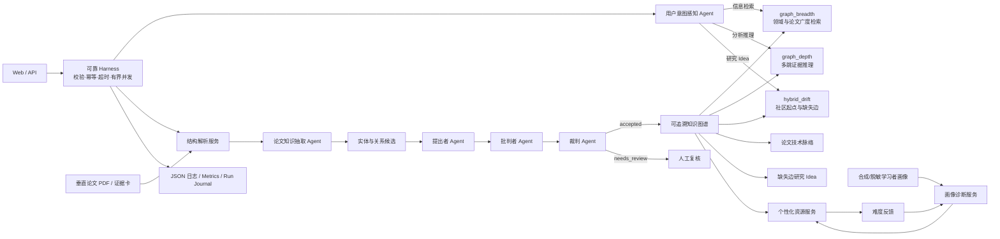

# 系统架构

## 1. 端到端链路



系统共有 5 个协同角色：论文知识抽取、用户意图感知属于前置专职 Agent；提出者、批判者、裁判属于核心决策 Agent。结构解析、画像诊断、图检索、存储和资源生成是可替换的普通服务。

## 2. 可审计数据协议

每次运行输出：

- `profile / diagnosis`：画像输入与难度诊断；
- `papers`：本轮召回论文；
- `agent_trace`：3 个核心 Agent 的摘要、状态与耗时；
- `specialist_agent_trace`：论文知识抽取与用户意图感知的可解释中间数据；
- `service_trace`：画像、检索、资源 3 项辅助服务；
- `claims`：候选、实体类型、证据、批判项、裁决分解和状态；
- `knowledge_graph`：论文、原文跨度、实体、关系、社区与质量审计；
- `graph_insights`：按年份的技术脉络、图谱上下文和待验证 Idea；
- `graph_retrieval`：意图、检索计划、纯知识概念子图、多跳路径、社区、论文推荐与回答骨架；
- `resources`：定制导读、复现实操和分阶测评；
- `ablation`：同一冻结候选池上的四组对比；
- `metrics`：画像适配等工程回归指标。

正式入图关系至少满足：证据 ID 存在、跨度覆盖两端实体、关系类型满足 schema、无阻断性批判项、裁判达到接收阈值。

## 3. 技术选型

- 基础运行：Python 标准库 + 原生 HTML/CSS/JavaScript，现场可离线运行。
- 图谱：JSON 作为交换协议，SQLite 作为本地可查询存储。
- 图检索：`graph_breadth / graph_depth / hybrid_drift` 离线基线；未来通过 Microsoft GraphRAG BYOG 接入 Local/Global/DRIFT。
- 文档：Markdown 规则解析基线，可选 Docling；GROBID 作为科学文献解析对照。
- 候选模型：GLiNER/GLiREL、DyGIE++、DeepKE/OneKE、Qwen2.5 provider。
- 验证：schema/跨度规则 + SciFact/MultiVerS 科学主张验证路线。
- 联网：OpenAlex 只扩展候选；未完成本地解析和裁决的联网记录不能入图。
- 测试：`unittest`，默认不要求安装第三方包。
- 后端 Harness：Python 标准库 HTTP 服务 + 有界执行池；请求/运行 ID、稳定错误体、幂等、deadline、OpenAlex 重试熔断和健康/就绪探针。

## 4. 状态与边界

```text
proposed -> accepted | needs_review | rejected
```

- `accepted`：可进入下游资源，但仍保留外部有效性说明；
- `needs_review`：普通共现、低置信或证据有限，进入人工队列；
- `rejected`：证据缺失、类型不匹配、跨度不足或绝对化强断言；
- Idea 使用独立 `novelty_status=unverified`，不能与 accepted 事实混用。

## 5. 部署边界

- 默认仅监听 `127.0.0.1`，避免 `localhost` 的 IPv4/IPv6解析差异；
- 非回环地址没有 Token 时拒绝启动；
- 所有耗时任务进入固定 worker/queue 容量，过载返回 429；
- 详细状态通过 `/api/health`、`/api/ready` 和 `/api/metrics` 查看；
- 当前状态是单进程竞赛 Demo，分布式状态、TLS、账号权限和集中可观测性仍属于生产化路线。
