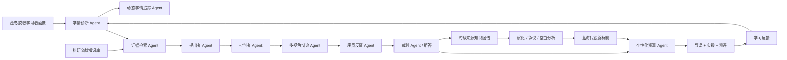

# 系统架构

## 1. 端到端链路

基础 `legacy` 预设仍走原六角色主链。网页 `full` 预设启用图中的扩展节点；
消融实验只切换配置，不修改业务模块。

## 2. 可审计数据协议

每次运行输出以下对象：

- `profile`：学习者背景、知识点得分、目标与偏好；
- `diagnosis`：准备度、知识盲区、目标难度和匹配度；
- `agent_trace`：各 Agent 的输入摘要、输出摘要和状态；
- `claims`：候选关联、证据文献、批判意见、裁决分数与状态；
- `graph`：参与本轮推理的节点和边；
- `resources`：定制导读、复现实操和分阶测评；
- `report`：盲区、难度曲线和学习路径；
- `metrics`：幻觉率代理、适配准确率和知识覆盖率。
- `system_config`：本轮预设、阈值和所有特性开关；
- `innovations`：学情状态、反证轮次、时序发现和假设排名；
- `performance`：真实本地墙钟阶段耗时、调用次数和规模计数器。

所有进入最终资源的知识结论必须至少满足：

1. 存在知识库关系；
2. 至少有一篇可追溯来源；
3. 通过批判者检查；
4. 裁判分数达到阈值；
5. 资源中保留来源 ID。

## 3. 技术选型

基础版采用 Python 标准库 + 原生 HTML/CSS/JavaScript：

- 不依赖外部 API，比赛现场可离线运行；
- 不依赖数据库，JSON 数据便于审查和提交；
- 核心编排器与 UI 解耦，后续可替换为 CAMEL、LangGraph 或自研调度器；
- 知识库访问通过单一接口，后续可替换为向量库与 Neo4j；
- 测试使用 `unittest`，无需安装额外包。

## 4. 后续替换接口

| 当前模块 | 后续能力 |
| --- | --- |
| 关键词检索 | 稀疏 + 稠密混合检索、重排器 |
| 人工关系切片 | 领域实体关系抽取与专家审核 |
| 规则提出者 | 结构化输出的大模型 Agent |
| 规则批判者 | 反证检索、NLI、一致性检查 |
| 加权裁判 | 校准模型、专家反馈学习 |
| JSON 图谱 | Neo4j / NebulaGraph |
| 单机 HTTP | FastAPI + PostgreSQL + 任务队列 |
