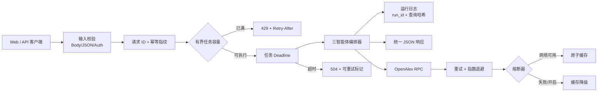

# 后端工程自检：从 Agent Demo 到可靠 Harness

## 1. 审计结论

文章指出的核心判断适用于本项目：LLM/Agent 逻辑只是系统的一层，工具调用、状态、并发、容错、日志与评估共同决定 Demo 是否可靠。改造前，研海寻踪已经有可复现科研链路，但 HTTP 层主要覆盖 happy path；改造后已经达到“受控的小规模本地 Demo”标准，仍不冒充生产级平台。

| 维度 | 改造前主要缺口 | 当前实现 | 状态 |
|---|---|---|---|
| 网络 | 无请求体上限、稳定错误协议和任务 deadline | 413/415/400、统一 error envelope、socket/task timeout | 已完成 |
| 工具调用 | OpenAlex 只有一次请求与缓存回退 | 错误分类、指数退避、原子缓存、closed/open/half-open 熔断 | 已完成 |
| 幂等 | 重复点击会重复执行 | `Idempotency-Key` 重放与请求指纹冲突保护 | 已完成（单进程） |
| 并发 | HTTP 线程数不可控，耗时任务无队列上限 | 有界执行池 + 有界等待队列，过载返回 429 | 已完成（Demo） |
| 状态 | 运行完成后无可恢复摘要 | JSONL run journal；查询只保存 SHA-256 短哈希 | 已完成（本地） |
| 可观测 | 传统文本访问日志，无法串联一次运行 | request ID、run ID、JSON 日志、路由指标、熔断状态 | 已完成（进程级） |
| 安全 | 任意地址均可无认证监听 | 默认 IPv4 loopback；非回环无 Token 时 fail-closed；安全响应头 | 已完成（本地） |
| 前端 | 无限等待、只用 alert 报错 | AbortController 超时、状态灯、内联错误、运行 ID、防重复反馈 | 已完成 |
| 评估 | 仅算法回归 | 76 项单元/集成测试 + 六实验入口 smoke + 端到端 API smoke + 82% 分支覆盖率门槛验收 | 已完成（P0） |
| 成本 | 当前无模型 API，未记录 Token | 明确保留缺口；联网次数已有事件计数 | 待模型接入 |

## 2. 可靠执行边界

这层 Harness 不改变论文抽取、图谱和三智能体算法，只负责让它们在异常输入、重复请求、短时依赖故障和有限并发下保持可解释行为。

## 3. 关键设计决定

### 3.1 工具调用按 RPC 处理

OpenAlex 调用具有明确的单次超时、有限重试、指数退避和熔断。联网结果仍是候选，失败只影响扩展检索，不会破坏本地知识库和三智能体主链路。

### 3.2 幂等与副作用边界

`/api/run`、`/api/feedback`、`/api/online-rag` 支持幂等键。首次成功结果在 TTL 内缓存；重放不再执行编排器。当前主链路主要是读/计算，但提前建立此协议，可避免未来写图谱、计费或生成文件后出现重复副作用。

### 3.3 有界并发而非无限开线程

HTTP 连接仍由标准库线程服务器处理，但实际耗时任务必须进入固定 worker 池。worker 与等待队列都满时立即返回 429，不让请求无限堆积拖垮演示服务。

### 3.4 可观测但不泄露内容

标准日志不保存 Authorization、幂等键、原始查询和完整画像。run journal 保存查询哈希及聚合结果，足以定位一次运行，又减少敏感内容落盘。

### 3.5 本地优先与安全失败

服务默认绑定 `127.0.0.1`。如果绑定 `0.0.0.0` 或局域网地址，配置层要求 Bearer Token，除非部署者显式声明无认证 override。这个 override 只用于 Compose 已把宿主端口限制在回环地址的情形。

## 4. 仍未完成的生产能力

以下能力不应在申报书或答辩中声称已经实现：

- 任务超时后底层 Python 线程无法被强制终止；当前只能停止等待并防止新请求压垮队列；
- 幂等、指标和熔断状态仅存在于单进程内存，重启或多副本不共享；
- 尚无账号体系、细粒度授权、TLS、跨用户隔离与密钥托管；
- 尚无分布式 trace、Prometheus 导出、告警策略与 SLO；
- 尚无模型 Token/金额预算、上下文压缩和长期记忆治理；
- 尚无消息队列、持久化任务状态和断点恢复；
- 还没有真实多人并发压测结果。

## 5. 31 日 Demo 的合理口径

现场可以明确展示：

1. 主流程完全离线可运行，OpenAlex 故障会降级而不是拖垮主链路；
2. 每次协同决策都有 request ID、run ID 和 append-only 摘要；
3. 重复提交相同幂等请求只执行一次；
4. 前端请求有超时和错误反馈，不会无限卡住；
5. 76 项测试全部通过且无跳过，分支覆盖率为 82%（CI 门槛 75%）；同时覆盖三智能体算法链路、六组实验入口、端口独占、后端协议、编码保护和联网故障降级。

不应把这些说成“生产部署完成”，而应表述为“为竞赛 Demo 建立了可迁移到 ASGI、Redis、OpenTelemetry 的可靠 Harness 基线”。
