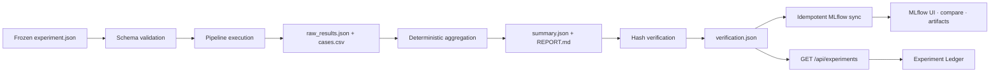

# DSH 与公开实验执行协议

> 目标：团队成员可以在自己的普通终端、DSH 或后续远程执行器中运行同一套冻结协议。DSH 是入口，不是实验事实源；仓库内配置、原始输出和验证收据才是事实源。

## 1. 一键入口

在项目根目录运行：

```bat
RUN_PUBLIC_EXPERIMENTS.bat
```

这会用项目 `.venv` 依次执行 `tests/experiments/01_*` 至 `06_*` 六个版本化协议；全部验证通过后自动启动本地 MLflow，并把通过验证的运行同步进去。也可以只执行协议：

```powershell
.venv\Scripts\python.exe -m tests.experiments.run_all --repetitions 1
```

需要由 DSH 执行和解释失败时：

```bat
RUN_PUBLIC_EXPERIMENTS.bat --dsh
```

该模式显式选择用户已有的 `yanhai` profile，并要求它先读本协议和 `tests/experiments/AGENT_RUNBOOK.md`。项目不会修改 `%USERPROFILE%\.dsh`、默认 profile 或用户 API Key。

## 2. 完整运行链



任何阶段失败都必须以非零退出码结束；正式实验禁止缺 Key 后静默退回规则模型。只有含 `verification.json` 且 `status=passed` 的目录才是有效运行。

## 3. 每次运行的公开产物

默认目录：`outputs/experiments/<protocol>/<UTC timestamp>/`。

| 文件 | 用途 |
|---|---|
| `run_config.json` | 冻结配置、有效重复次数、Python/系统环境、Git 状态、代码与输入 SHA-256 |
| `raw_results.json` | 逐案例原始结果，是统计的输入 |
| `cases.csv` | 可供人工复核和统计软件读取的等价表格 |
| `summary.json` | 从原始结果确定性汇总出的指标 |
| `REPORT.md` | 人类可读结论与主张边界 |
| `verification.json` | 对上述五个文件的验证状态和哈希收据 |

React 前端的“实验账本”只读取这些文件的索引，不修改结果。团队成员可以在页面看到协议数、运行状态、evaluation type、Git commit/dirty 状态和产物路径。

MLflow 是这一事实源的可检索投影，而不是替代品。同步器只接受 `verification.json.status=passed` 的目录，以 `yanhai_artifact_path` 标签保证重复同步不会生成重复 run，并把整个验证目录作为 artifact 保存。常用入口：

```bat
RUN_MLFLOW.bat
```

- 项目前端实验账本：打开 `http://127.0.0.1:5173/` 后选择“04 实验账本”
- MLflow UI：`http://127.0.0.1:5000/`
- 停止 MLflow：`STOP_MLFLOW.bat`

完整安装、迁移和备份方式见 [MLflow实验跟踪指南](MLflow实验跟踪指南.md)。

## 4. 当前六个协议的地位

当前协议用于代码回归、决策压力测试、provenance 反证、动态知识、查询鲁棒性、负载缩放和端到端链路。它们的 `evaluation_type` 仍是 `synthetic_proxy`、`self_supervised_proxy` 或 `simulation_only`，所以只能支持工程主张，不能写成真实用户效果或真实世界准确率。

正式结果必须另建版本化 L3 数据协议，并至少补齐：

1. 数据来源、许可、排除规则与论文级 train/dev/test 切分；
2. 双人独立标注、盲审、仲裁、一致性和冻结哈希；
3. 模型精确 revision、provider、提示词/配置哈希、随机种子、硬件、token、人民币成本和 fallback；
4. accepted precision、risk–coverage、ECE/Brier、成本/时延和失败切片；
5. 配对统计检验、95% CI、效应量和预先声明的失败判据。

## 5. 真模型运行

模型对比入口仍为：

```powershell
.venv\Scripts\python.exe scripts/run_decision_experiment.py `
  --models "deepseek:deepseek-chat,zhipu:glm-4-flash"
```

Key 只通过环境变量或本机 `.env` 注入，不写入 manifest、日志或前端。缺 Key 的组合会明确记为 skipped，不允许静默回退。价格表中为 `null` 的模型不产生伪造成本数字；运行前由负责人按供应商官方价格冻结一个版本化价格快照。

当前 `scripts/run_decision_experiment.py` 属于探索性真模型矩阵，尚未生成与六套公开协议一致的 `verification.json`，因此不会被自动标成“已验证”并混入正式 MLflow 实验。完成版本化配置、原始输出哈希和验证收据后，再通过同步器纳入正式账本。

## 6. 外部机器与远程执行边界

本协议没有绑定 Codex 沙箱。团队成员在 Windows、CI 或远程 GPU 机器上克隆同一 commit、安装同一依赖并运行同一命令即可。远程执行器后续只需要上传完整 run 目录；不得只抄一张指标表回来。验收时必须重新调用 `verify_experiment_artifacts()` 验证原始数据、汇总和哈希一致。

第一阶段不自动上传数据、不自动提交 Git、不修改 DSH 用户配置。若后续接入学校服务器或云 GPU，先单独冻结 executor 配置、数据合规和预算，再增加 launch/resume/collect adapter。
