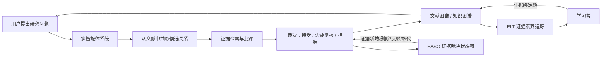
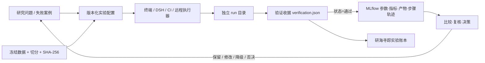
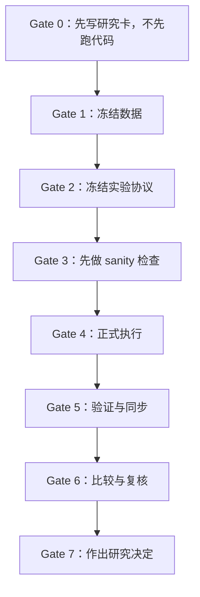
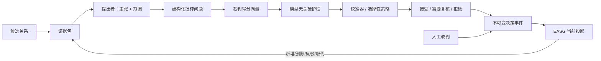

# 研海寻踪 MLflow 团队实验平台使用、开发与创新指导书（通俗版 1.2）

版本：1.2 研究证据复核版（在 1.1 通俗版基础上升级）  
适用对象：研究负责人、数据与标注成员、算法成员、实验执行成员、系统与前端成员、独立复核成员  
当前平台：MLflow 3.15.1，本地地址 `http://127.0.0.1:5000/`

> 1.2 在原 1.1 通俗版基础上加入百篇文献质量审计、2026 最近工作查新、自动化/人工责任、必做实验和产品前端路线；项目全景仍是：多智能体 → 证据裁决 → 文献图谱/知识图谱 → 应用。

---

## 0. 项目全景图：我们到底在做什么？

我们正在构建一个**多智能体系统**，从科学文献中自动抽取候选关系，经过证据检索、批评、裁决和校准，最终形成用户可浏览、可追溯的**文献图谱 / 知识图谱**。



- **多智能体系统**：是架构手段。我们可能同时使用多个 LLM 或规则代理，分别负责提出关系、找证据、批评、裁判、硬护栏、校准等任务。
- **文献图谱 / 知识图谱**：是最终产物，也是用户看到的界面。
- **EASG（Evidence Adjudication State Graph）**：是核心决策与更新机制，解决“凭什么接受这个关系”“证据变了怎么更新”的问题。这是我们最想证明的科研创新点。
- **ELT（Evidence Literacy Tracing）**：是另一个应用方向，利用 EASG 生成证据绑定题，追踪学习者的证据素养。这个方向要等 EASG 稳定后再启动。

所以，**多智能体是手段，图谱是产物，EASG 是我们要攻克的核心科学问题。**

---

## 1. 核心 idea 是怎么来的？

### 1.1 从一个具体痛点开始

科学知识图谱通常把“A 能导致 B”“X 能治疗 Y”这样的关系存成静态三元组。但现实中的科学证据是动态的：

- 一篇论文可能被撤回；
- 后续研究可能推翻早期结论；
- 同一条关系在不同条件下可能成立或不成立；
- 两个“独立”证据可能来自同一个数据集或同一组作者，存在伪独立。

如果系统只是把关系抽出来、存进去，它就无法回答：

> “你当时为什么接受这条关系？”  
> “现在出现了反驳证据，你为什么不更新？”  
> “这条关系的可信度到底有多高？”

**这就是我们最初遇到的问题：图谱没有“证据账本”，也没有“裁决过程”。**

### 1.2 文献审计只能提出候选空白，不能直接证明创新

团队此前建立了 100 篇定向语料，覆盖科学信息抽取、主张核验、RAG、多智能体、图谱与时序、知识追踪、评测和科研系统八类方向。它帮助我们发现“抽取之后的证据裁决、状态更新和人工复核”值得继续研究。

但必须准确理解这份材料的证据强度：

- 它是围绕本项目问题主动挑选的**定向证据集**，不是覆盖整个行业的随机样本或系统综述；
- 它可以帮助寻找强基线、失败模式和相邻工作，不能单独证明“行业普遍没有做过”；
- 审计程序验证了原文来源、文档哈希和目标章节关键词，但没有留下逐段阅读摘录或双人缺口编码记录；
- 2026 年补查已发现多篇高度相邻工作，说明原 100 篇仍有最新工作漏检。

因此当前只能写成：

> **“现有定向证据显示，面向科学关系入图的证据裁决与反事实更新仍存在可检验空间；EASG 是待查新、待人工金标、待实验推翻的候选机制。”**

不能写成“100 篇顶刊都证明了行业空白”，也不能使用“首创、首次、行业领先”。完整质量复核、来源分类和人工责任见第 24 节。

### 1.3 从工程实践中看到缺陷

我们当前的系统原型已经有多智能体协作的雏形，但存在明显短板：

- 裁判主要依赖固定阈值 `0.78/0.58` 和手工加减分，没有从数据中学习校准；
- 批评结果主要是自然语言字符串，裁判通过关键词识别问题，缺少结构化问题类型；
- 证据奖励主要看数量，没有系统区分“支持”“反驳”“仅相关”“条件不一致”“时间取代”；
- 关系状态只是“当前值”，没有不可变的事件历史；
- 没有 risk–coverage 曲线、校准误差驱动的阈值选择。

这些缺陷让我们意识到：**不能靠“再加两个 Agent”解决，而需要把决策从字符串和固定阈值，升级为结构化、校准、事件驱动、可反事实验证的协议。**

### 1.4 提炼出 EASG 这个核心 idea

于是我们提炼出核心 idea：

> **EASG：证据裁决状态图（Evidence Adjudication State Graph）**  
> 把字符级证据、结构化批评、校准风险和不可变裁决事件统一起来，让系统能够：
> - 记录每一条关系为什么被接受、为什么被拒绝、为什么需要复核；
> - 当证据发生变化时，能够正确更新关系状态，并重放历史；
> - 在相同覆盖率下减少错误接受、提高更新正确性、缩短人工审计时间。

EASG 不是“一个模型”，而是一套**证据与决策协议**。它需要多智能体来实现，但它的价值在于**可验证、可重放、可校准**。

### 1.5 为什么 EASG 可以作为核心研究主张？

因为它可以被一个清晰的实验证实或推翻：

- 固定候选池和模型预算；
- 比较“静态图 / 静态来源 + 单次判定 / always-on triad / EASG triggered”；
- 看等覆盖率下风险是否下降；
- 看证据删除、替换、反驳时，状态更新是否正确；
- 看人工审计时间是否缩短。

如果收益只是更多拒绝、更多 token 或更强模型带来的，EASG 就失败了。这个反主张很明确，所以它适合作为核心研究问题。

---

## 2. 先记住五件事

1. **MLflow 是实验记录本和对比台**，不是自动做实验的 AI，也不负责跑 GPU。
2. **只有验证通过的实验，才能进入 MLflow 和公开实验账本。**
3. **测试集只能在最终评估时用一次**，不能拿它反复调参。
4. **负结果不能删**，它是团队避免重复踩坑的资产。
5. **模拟数据、小规模试用数据和正式金标数据不能混着比较。**

---

## 3. 平台的三个视图

MLflow 不是唯一事实源。我们同时保留三层视图：

| 层 | 入口 | 通俗解释 | 不能做什么 |
|---|---|---|---|
| 公开实验账本 | 研海寻踪首页 → `04 实验账本` | 对外展示协议、结论上限、已验证运行和产物路径 | 不能修改实验事实 |
| MLflow | `http://127.0.0.1:5000/` | 团队内部搜索、过滤、对比参数和指标、查看产物 | 不能替代人工金标准和验证收据 |
| 运行事实源 | `outputs/experiments/**` | 保存原始配置、输出、汇总、报告、哈希和验证收据 | 运行结束后不能原地修改 |



**当前状态：**  
已有 6 个 `yanhai-*` 实验组、12 个历史运行。它们全部是模拟代理、自监督代理或纯模拟评价，只能证明代码路径和机制行为，**不能证明真实科研准确率或学习效果**。

### 3.1 新成员十分钟上手

第一次使用时，不需要先学会所有指标。按下面六步走一遍即可：

1. 双击仓库根目录的 `RUN_MLFLOW.bat`；
2. 浏览器打开 `http://127.0.0.1:5000/`；
3. 进入任意一个 `yanhai-*` 实验组，再点开一个 run；
4. 依次看 `Parameters`、`Metrics`、`Artifacts`，理解“设置—结果—证据文件”的对应关系；
5. 回到研海寻踪首页的 `04 实验账本`，对照查看同一个实验的公开结论；
6. 先阅读、不改文件；准备自己跑实验时，再从第 8 节 SOP 开始。

完成这六步后，你只需先记住一句话：**MLflow 帮我们找记录，`outputs/experiments/**` 才保存原始事实。**

---

## 4. 七个必懂词

| 术语 | 通俗解释 |
|---|---|
| Experiment | 一个研究问题下的对比组，例如“四种决策机制消融”。 |
| Run | 一次执行记录。换一个参数、换一个数据版本，就开一个新 run。 |
| Parameter | 实验设置：用什么模型、什么数据、什么阈值、什么随机种子。 |
| Metric | 评价分数：准确率、覆盖率、风险、成本、时延等。 |
| Artifact | 实验留下的证据文件包：配置、原始结果、案例表、汇总、报告、验证收据。 |
| Tag | 贴在 run 上的标签，比如负责人、数据性质、验证状态。 |
| Verification | 自动验证收据，确认产物完整、未被篡改、指标能从原始结果重新算出。 |

---

## 5. 每个成员的角色与责任

一个成员可以兼任多个角色，但“结果生产者”不能成为唯一复核者。

| 角色 | 开始前 | 运行中 | 结束后 |
|---|---|---|---|
| 研究负责人 | 冻结最多两个主张、强基线与失败判据 | 处理方案变更 | 作出继续、修改、降级或停止决定 |
| 数据负责人 | 冻结来源、许可、去重、切分、标签与哈希 | 不改测试集 | 处理勘误并发布新数据版本 |
| 标注成员 A/B | 独立阅读标注规范 | 盲标，不互相抄标签 | 提交分歧，禁止私下统一答案 |
| 仲裁人 | 不参与初始盲标 | 只看分歧案例 | 冻结金标版本和一致性统计 |
| 算法成员 | 提交方法、消融与参数空间 | 不看测试标签调阈值 | 解释机制和失败，不挑最好一次 |
| 实验执行者 | 核对代码版本、环境、预算和命令 | 保留完整输出和错误日志 | 输出绝对路径、run ID 与异常 |
| 独立复核者 | 不参与该 run 的实现 | 核查原始结果→汇总→报告 | 签署通过或给出最小复现 |
| 平台维护者 | 维护 MLflow、同步器和备份 | 监控服务，不改研究结果 | 修复平台故障，记录迁移 |
| 前端与演示成员 | 确认展示口径 | 只读消费 API | 不隐藏负结果，不重算指标 |

**最低分工建议：**  
每个正式实验至少有 `owner`、`runner`、`reviewer` 三个身份；`owner` 与 `reviewer` 不应是同一人。

---

## 6. 每天如何启动、进入和停止平台

### 6.1 启动

在项目根目录双击：

```bat
RUN_MLFLOW.bat
```

它只启动 MLflow 并同步已经验证的 run，不会重跑模型，不会调用外部 API，不会消耗 GPU。

访问地址：

- MLflow：`http://127.0.0.1:5000/`
- 研海寻踪：`http://127.0.0.1:5173/`，选择 `04 实验账本`

### 6.2 健康检查

```powershell
Invoke-WebRequest http://127.0.0.1:5000/health -UseBasicParsing
```

HTTP 200 才表示服务可用。日志位于 `.mlflow/server.out.log` 和 `.mlflow/server.err.log`。

### 6.3 停止

```bat
STOP_MLFLOW.bat
```

脚本会同时停止 Windows 启动器与监听进程。不要随意在任务管理器里结束同名 Python 进程，以免误停其他实验任务。

---

## 7. 如何阅读 MLflow 界面

### 7.1 实验列表

进入左侧 `Model training → Experiments`。当前六个实验组对应六套固定协议：

| Experiment | 通俗用途 | 合法比较范围 |
|---|---|---|
| `yanhai-01_core_ablation` | 四种决策机制消融 | 同一候选池、同一数据版本 |
| `yanhai-02_provenance_falsification` | 证据失败类型反证 | 同一错误类型集合 |
| `yanhai-03_dynamic_knowledge` | 反馈难度回归 | 同一画像和反馈语义 |
| `yanhai-04_query_robustness` | 查询与绝对化措辞鲁棒性 | 同一查询集 |
| `yanhai-05_workload_scaling` | 本地工作负载扩张 | 同一机器和计时范围 |
| `yanhai-06_end_to_end_regression` | 全链路回归 | 同一代码契约 |

**不要跨评价类型直接比较百分比。** 例如模拟通过率不能与真实金标关系 F1 放在同一排名中。

### 7.2 Run 列表

进入某个实验组后：

1. 先显示 `Run name`、`Created`、`Status`；
2. 添加需要对比的参数/指标列；
3. 只勾选数据版本、切分和评价类型一致的 run；
4. 点击 Compare；
5. 同时检查主指标、覆盖率、成本、时延和失败切片；
6. 打开候选最佳 run 的详情，不要只看总表。

推荐过滤条件示例：

```text
tags.verification_status = 'passed'
tags.data_kind = 'gold'
params.git_dirty = 'False'
metrics.evidence_triad.accepted_precision >= 0.90
```

当前同步器使用标签 `yanhai_artifact_path` 作为幂等键。相同目录再次同步会显示 `skipped`，这是正常行为。

### 7.3 Run 详情

检查顺序：

1. **Notes**：本次假设、预期失败判据和结论；
2. **Parameters**：方法、数据、模型、阈值、随机种子、运行环境和 Git；
3. **Metrics**：主指标、覆盖率、风险、校准、成本与时延；
4. **Artifacts**：`run_config.json`、`raw_results.json`、`cases.csv`、`summary.json`、`REPORT.md`、`verification.json`；
5. **Tags**：负责人、数据性质、验证状态、产物路径和主张编号；
6. **Trace**：后续接入后查看提出者、批评者、裁判、硬护栏和检索步骤。

若汇总与原始结果不一致，以验证目录和重新计算结果为准，不以 UI 中某个旧值为准。

---

## 8. 一次合格实验的标准作业流程（SOP）

用七个“门”来理解：



### Gate 0：先写研究卡，不先跑代码

每次实验开始前必须回答：

```text
问题：当前哪个具体失败值得解决？
主张：若方法有效，我们能让审稿人相信什么？
反主张：收益是否只是更多拒绝、更多 token、更强模型或测试集泄露？
强基线：最可能推翻我们的现有方法是什么？
主指标：哪个数字决定继续或停止？
失败判据：出现什么结果就降级或放弃？
预算：最大 API 成本、墙钟时间、GPU 小时和人工小时是多少？
```

不能回答这些问题的任务只能叫探索或 debug，不能进入正式实验组。

### Gate 1：冻结数据

正式数据必须新建版本，不覆盖模拟数据：

- 来源 URL、论文 ID、许可；
- 论文级训练/验证/测试切分；
- 标注规范版本；
- 标注者、复核者、仲裁状态；
- 文件 SHA-256；
- `proxy / pilot / gold / human_eval` 明确标签；
- 可能泄露模型训练数据或答案的风险说明。

**测试集只能在最终评估时使用。阈值、提示词和消融选择只能看训练/验证集。**

### Gate 2：冻结实验协议

每个正式协议放在 `tests/experiments/<编号_名称>/`，至少包含：

```text
experiment.json
run.py
README.md（建议）
```

`experiment.json` 的核心语义示例：

```json
{
  "slug": "07_easg_counterfactual_update",
  "title": "EASG 证据删除与替换反事实更新",
  "purpose": "检验关系状态能否随证据事件正确迁移",
  "mode": "adjudication_state_graph",
  "evaluation_type": "pilot_gold",
  "claim_ceiling": "只支持冻结 pilot 数据上的更新正确性",
  "variants": ["static_provenance", "always_on_triad", "easg_triggered"],
  "repetitions": 3,
  "primary_metrics": ["state_update_accuracy", "accepted_risk", "coverage"]
}
```

随机模型用至少 3 个 seed；确定性重放只算一个独立结果，不能把重复次数当样本量。

### Gate 3：先做 sanity 检查

必须先完成：

- 单案例能从输入走到产物；
- 一个小样本能刻意过拟合或达到预期规则结果；
- 指标在手算样例上正确；
- 故意损坏一个产物时验证会失败；
- 缺 Key、超时、空输出不会静默退回另一种方法；
- 日志不含 API Key、完整私人数据或未授权全文。

### Gate 4：执行

现有公开实验：

```bat
RUN_PUBLIC_EXPERIMENTS.bat
```

单个已版本化实验：

```powershell
.venv\Scripts\python.exe -m tests.experiments.<实验目录>.run
```

DSH：

```bat
RUN_PUBLIC_EXPERIMENTS.bat --dsh
```

执行者必须保留：命令、代码版本、环境、开始/结束时间、错误输出、run 目录和实际成本。

### Gate 5：验证与同步

只有 `verification.json.status=passed` 才能同步：

```powershell
.venv\Scripts\python.exe scripts\sync_mlflow.py `
  --run-dir outputs\experiments\<protocol>\<timestamp>
```

若是全量扫描：

```bat
RUN_MLFLOW.bat
```

### Gate 6：比较与复核

比较前逐项确认：

- 数据哈希、切分、金标版本一致；
- 模型、提示词和配置哈希可见；
- 随机种子与重复语义可见；
- 备选方案没有改变算法身份；
- 主指标之外同时报告覆盖率；
- 95% 置信区间、效应量和独立样本单位正确；
- 失败切片和最差案例没有被删；
- API 成本与本地墙钟时间没有混为一谈。

### Gate 7：作出研究决定

每组正式 run 必须得到以下之一：

| 决定 | 含义 |
|---|---|
| `PROMOTE` | 通过预先声明门槛，进入更大数据或论文主结果 |
| `ITERATE` | 有信号但机制或数据仍需修改，生成新协议版本 |
| `DOWNGRADE` | 仅保留为工程特性，不再作为创新主张 |
| `REJECT` | 反证成立，停止投入；负结果仍保留 |

**禁止删除 `DOWNGRADE/REJECT` run。**

---

## 9. 统一的 MLflow 数据契约

### 9.1 实验组命名

```text
yanhai-<两位编号>_<研究问题>
```

实验组应对应一个稳定研究问题，不要按成员、日期或模型名称创建。模型和日期属于 run。

### 9.2 Run 命名

```text
<variant>__<dataset-version>__<model-or-rule>__s<seed>__<UTC>
```

例如：

```text
easg_triggered__l3-v1__deepseek-chat__s17__20260824T081500Z
```

### 9.3 必记 Parameters

| 类别 | 字段示例 |
|---|---|
| 协议 | `protocol_version`, `evaluation_type`, `claim_ceiling` |
| 数据 | `dataset_id`, `dataset_sha256`, `split`, `sample_unit`, `sample_count` |
| 方法 | `variant`, `method_version`, `threshold_policy`, `trigger_policy` |
| 模型 | `provider`, `model`, `model_revision`, `temperature`, `max_tokens` |
| Prompt | `critic_prompt_hash`, `judge_prompt_hash`, `schema_hash` |
| 决策 | `accept_threshold`, `review_threshold`, `calibrator_version` |
| 运行 | `seed`, `repetitions`, `python`, `platform`, `git_head`, `git_dirty` |

参数在同一个 run 内不可改写。需要换阈值就开新 run。

### 9.4 必记 Metrics

**核心决策层：**

- `accepted_precision`、`gold_recall`、`unsupported_acceptance_rate`；
- coverage 与 risk–coverage AUC；
- `needs_review_rate`、错误类型分层；
- ECE、Brier、NLL；
- `state_update_accuracy`、`supersession_accuracy`；
- 每条 accepted claim 的 token、成本、P50/P95 时延；
- 人工审计时间和人工改判率（override rate）。

**抽取层：** 实体和关系的准确率、召回率，证据原文是否完整命中，以及每条关系是否绑定了可定位的证据。  
**检索层：** `Recall@k`、`nDCG@k`、真正支持结论的证据召回、多跳路径准确率，以及无关上下文比例。  
**图谱层：** 增量更新正确率、删除证据后的稳定性、冲突检测、错误传播深度和重建一致性。  
**ELT / 个性化层：** 证据判断准确率、AUC、NLL、Brier、延迟后测、跨领域迁移，以及题目泄露检查。  
**系统层：** 成功率、吞吐、P50/P95 时延、峰值内存、token/人民币成本、重试次数和 fallback 次数。

新成员不必一次记住所有英文指标。每个正式实验只需在申请卡中明确：**一个主指标、一个覆盖或安全指标、一个成本指标，以及失败门槛。**

### 9.5 必记 Tags

```text
project=yanhai-trace
claim_id=C1-EASG
owner=<成员标识>
reviewer=<成员标识>
data_kind=proxy|pilot|gold|human_eval
verification_status=passed|failed
yanhai_artifact_path=<仓库相对路径>
baseline_family=<名称>
decision=promote|iterate|downgrade|reject
```

禁止写入 Key、密码、身份证明、未脱敏私人文本。

### 9.6 必存 Artifacts

最低六件套：

1. `run_config.json`
2. `raw_results.json`
3. `cases.csv`
4. `summary.json`
5. `REPORT.md`
6. `verification.json`

正式研究还应增加：数据卡、标注指南、分歧与仲裁表、环境锁定文件、prompt/schema、校准曲线、risk–coverage 图、失败案例集和统计脚本。

---

## 10. 如何在平台基础上进行开发

开发路线像一个阶梯：


### Level 0：当前状态——验证后同步

入口：`src/yanhai/mlflow_tracking.py` 与 `scripts/sync_mlflow.py`。  
优点：实验事实先验证再进入 UI；缺点：运行过程中看不到 Agent 内部步骤。

### Level 1：先统一真模型实验产物（最高优先级）

当前 `scripts/run_decision_experiment.py` 只生成 `summary.json`、`cases.csv`、`REPORT.md`，还没有标准 `run_config.json`、`raw_results.json` 和 `verification.json`。

开发顺序：

1. 把它迁入 `tests/experiments/07_decision_model_matrix/`；
2. 复用 `tests/experiments/framework.py` 的运行目录与验证逻辑；
3. 记录 provider/model revision、prompt hash、token、成本、备选方案和错误；
4. 缺 Key 的组合必须 `skipped`，不得偷偷变成规则基线；
5. 验证通过后自动同步 MLflow。

完成标准：同一 run 在产物、MLflow 与自动报告中指标完全一致。

### Level 2：记录多智能体 Trace

为每个候选 claim 建一个 trace，建议步骤树：

```text
adjudicate_claim
├── retrieve_evidence
├── proposer
├── critic
├── judge
├── hard_guard
├── calibrator
└── state_transition
```

每个步骤记录输入/输出摘要、证据 ID、模型、token、耗时、错误和决策原因；原始全文不要直接写进 trace。

接入位置：

- `src/yanhai/agents.py`：规则提出者/批评者/裁判；
- `src/yanhai/llm_decision.py`：LLM 调用与硬护栏；
- `src/yanhai/orchestrator.py`：父 trace 与运行关联；
- `src/yanhai/mlflow_tracking.py`：统一封装，业务代码不散落 MLflow 细节。

完成标准：能在 MLflow 中定位“哪一步、哪条证据、哪项规则”导致接受/复核/拒绝。

### Level 3：把失败 Trace 变成评测集

从生产或团队实验 trace 中筛选：误收、误拒、高成本、超时、人工改判、跨模型分歧。经脱敏和人工复核后，进入版本化评测集。修复后必须在同一冻结集合上回归。

### Level 4：注册可部署的小模型，而不是盲目注册外部 LLM

适合 Model Registry 的对象：

- 校准器（逻辑回归、GBDT、conformal wrapper）；
- 科学主张验证器；
- 关系候选器；
- 学习者证据素养追踪器。

外部 API LLM 通常只记录 provider/model revision，不把它冒充本项目拥有的模型产物。候选版本通过验证后使用别名 `candidate`、`champion`、`rollback`。

### Level 5：升级为团队共享服务

达到以下条件才迁移：多人需要同时写入、需要远程机器上传、SQLite 写入竞争明显、需要账号权限或集中备份。

目标架构：反向代理 + TLS + 认证、PostgreSQL/MySQL 后端、受控对象存储、日备份、最小权限和审计。不得直接把当前 `127.0.0.1` SQLite 服务暴露公网。

---

## 11. 当前核心决策层的真实短板

当前实现值得保留，但还不是论文级决策器：

1. 裁判主要依赖固定 `0.78/0.58` 阈值与手工加减分，没有在独立验证集上学习校准；
2. 批评结果主要是自然语言字符串，裁判通过关键词识别阻断项，缺少结构化问题类型；
3. “来源独立性”目前主要按不同论文 ID 近似，不能识别同一数据集、同一实验或引用链造成的伪独立；
4. 证据奖励依赖数量，尚未系统区分支持、反驳、仅相关、条件不一致和时间取代；
5. LLM 批评者/裁判可以异质组合，但没有正式验证收据与逐步 trace；
6. 没有 risk–coverage 曲线、ECE/Brier 驱动的阈值选择；
7. 关系状态仍是当前值，不是可重放的不可变裁决事件流；
8. 当前 24/140 条压力集是开发数据，不能支撑真实性能主张。

因此改进不应是“再加两个 Agent”，而应把决策从字符串和固定阈值升级为结构化、校准、事件驱动、可反事实验证的协议。

---

## 12. 目标决策架构



建议新增结构：

```text
CritiqueIssue:
  code, severity, evidence_ids, rule_version, explanation

DecisionScore:
  support, contradiction, provenance, semantic_strength,
  source_independence, temporal_consistency, calibrated_risk

DecisionEvent:
  event_id, claim_id, previous_state, new_state, trigger,
  evidence_snapshot_hash, actor, model/config hashes, timestamp
```

裁判只消费结构化问题类型和得分，不通过中文字符串决定逻辑。硬护栏保持模型无关；校准器只在冻结验证集上训练；测试集只评估一次。

---

## 13. 可以从哪些角度做实验

| 分类 | 可做实验 |
|---|---|
| 数据与分布 | 模拟数据 → 小规模金标 → 多领域金标 → 真人评测；短句、跨句、跨章节、跨论文证据；时间更新、撤稿、条件变化；对抗性措辞；无全文、证据截断；已见论文与未见过论文切分 |
| 候选与抽取 | 规则 vs GLiNER/GLiREL/OneKE/LLM；span exact 与部分覆盖；候选召回提高是否造成后端风险上升；别名归并、类型约束、跨句关系、负关系 |
| 证据与检索 | BM25/向量/图检索/混合检索；top-k 与证据召回—上下文噪声曲线；支持与反驳双路检索；来源独立性加权；主动检索；删除/替换证据后的反事实稳定性 |
| 决策机制 | rule-only、single-pass、同质投票、always-on triad、triggered heterogeneous triad；自然语言批评 vs 结构化问题；固定阈值 vs 校准器；只看支持证据 vs 支持+反驳+条件+时间；大模型裁判 vs 小型非生成校准器 |
| 风险与成本 | 相同覆盖率下比较风险；每减少一个错误接受的 token/人民币成本；触发策略的成本节省；并发、重试、超时影响 |
| 图谱更新 | 新增支持、加入反驳、删除证据、证据失效、人工纠错；事件重放是否得到相同当前投影；更新是否错误传播 |
| 人机协作 | 审计者定位错误证据的时间；结构化问题是否降低复核时间；人工改判率和原因；不同背景复核者一致性 |
| ELT 与个性化 | concept-only vs concept + evidence literacy；静态画像 vs 可更新状态；随机题 vs 状态驱动题；无证据绑定 tutor vs 证据绑定 tutor |

---

## 14. 创新候选池：什么能当主张，什么只能当机制

根据 100 篇定向语料、2026 最近工作补查和独立新颖性审查，当前没有任何单项达到 HIGH 新颖性。EASG 只保留为 LOW 的组合协议/实证候选，ELT 是有条件的 MEDIUM-low 后置研究线；其余方向只能作为支撑机制、评测贡献或工程创新。

| 排名 | 方向 | 研究地位 | 关键实验 | 当前建议 |
|---:|---|---|---|---|
| 1 | EASG：证据裁决状态图 | LOW：组合协议/实证候选 | 证据删除/替换、等覆盖率风险、更新准确率、审计时间 | 先过 L0 文献门和强基线门，再谨慎继续 |
| 2 | ELT：证据素养追踪 | MEDIUM-low：条件性独立候选 | 真人后测、concept-only KT、TLSQKT、证据绑定题 | C1 过门后做；没有真人数据就不形成主张 |
| 3 | 结构化批评问题类型 | C1 支撑机制 | 字符串批评 vs 结构化问题 | 立即做消融 |
| 4 | 校准选择性裁决 | 严谨性机制 | risk–coverage、ECE/Brier、等覆盖率 | 立即做 |
| 5 | 反事实证据更新基准 | 评测贡献 | 新增/删除/反驳/取代 | 立即建 pilot |
| 6 | 状态触发异质裁决 | 非创新支撑机制 | always-on、DOWN/SELENE/iMAD 式通用触发 vs EASG 状态触发 | C1 主实验后 |
| 7 | 来源独立性感知聚合 | 证据机制 | 论文 ID vs 谱系感知 | 有数据后 |
| 8 | 语义强度与时态验证器 | 决策机制 | 模态/时态/条件切片 | 近期做 |
| 9 | 信息价值检索 | 检索创新候选 | 固定 top-k vs 主动补证 | 中期探索 |
| 10 | 人工改判学习 | 人机机制 | 改判预测与审计时间 | 需真实复核日志 |
| 11 | 跨领域证据契约迁移 | 泛化评测 | 三领域不调阈值迁移 | 金标足够后 |
| 12 | 最简三角色 / 非生成裁判 | 简洁性结果 | 大模型裁判 vs 小校准器 | 必做 simplicity check |

### 14.1 C1 / EASG 的两句研究陈述

科学知识图谱当前常把带不确定性和时间条件的关系压成静态三元组，导致证据被删除、反驳或取代后，系统无法重放“为什么曾经接受、为什么现在改变”。我们把字符级证据、结构化批评、校准风险和不可变裁决事件统一为证据裁决状态图，并检验它能否在相同覆盖率下减少错误接受、提高更新正确性和缩短人工审计时间。

这里的候选贡献是**协议、基准和公平实证结果**，不是字符证据、状态表示、事件溯源或多智能体组件本身。

最强反对意见：收益可能只来自更高拒绝率、更多 token 或更强模型。对应实验必须固定候选池和模型预算，比较等覆盖率风险，并加入规则、静态来源和 always-on triad 强基线。

### 14.2 C2 / ELT 的两句研究陈述

传统知识追踪主要估计“是否掌握知识点”，但 TLSQKT、跨文档阅读—写作追踪等最近工作已经开始研究高阶 literacy 和来源理解。ELT 只能把差分缩小为：复用同一个可版本化证据边生成证据绑定题并更新证据素养状态，检验其是否比 concept-only KT、literacy tracing 和无证据绑定 tutor 更好预测并改善后续证据判断。

最强反对意见：它可能只改变题目或文案风格。必须使用冻结题、延迟后测、跨领域迁移和真人数据，而不是主观 UI 评分。

---

## 15. C1 的五个核心实验块

### B1：真实 anchor 结果（必须做）

- 数据：论文级未见的 L3 pilot；正式阶段扩为多领域金标；
- 系统：静态规则图、SciGraph-LLM 式证据绑定图、Semantic Units 式 epistemic provenance、FOIS 式版本历史、SCIMKG 式动态验证、单次判定、always-on triad、通用触发器和 EASG 状态触发；
- 主指标：接受精度、覆盖率、风险-覆盖率、金标召回；
- 成功：在等覆盖率下，相比最强基线风险下降，且不是牺牲全部召回；
- 失败：置信区间重叠且效应很小，或收益完全由拒答增加造成。

### B2：反事实状态更新（必须做）

- 操作：新增支持、删除关键证据、替换无效证据、加入反驳、加入更晚取代证据；
- 指标：状态迁移准确率、重放一致性、下游污染；
- 成功：事件重放稳定，状态变化符合金标；
- 失败：FOIS 式版本历史 + 确定性规则同样完成，或 EASG 频繁错误取代。

### B3：创新隔离与简洁性（必须做）

- 消融：去结构化问题、去时间条件、去校准器、去事件历史、改为自然语言字符串；
- 额外对照：大模型裁判 vs 小型非生成校准器；
- 目标：证明真正贡献来自状态与证据协议，而不是更多 Agent。

### B4：触发策略与前沿必要性（必须做）

- 比较：纯规则、单 LLM、always-on 同质、always-on 异质、DOWN/SELENE/iMAD 式通用置信或分歧触发、CARP 式异质 support/refutation、EASG 状态触发和 oracle trigger 上界；
- 指标：风险、覆盖率、token、人民币成本、P95；
- 目标：给出 Pareto 前沿，不把成本更高自动解释为更先进。

### B5：失败分析与人工审计（必须做）

- 双人复核静态图与 EASG 的错误案例；
- 指标：定位时间、纠错时间、人工改判率、一致性；
- 重点切片：跨句、时态、条件、来源依赖、只有元数据、冲突；
- 结果无论正负都保留。

---

## 16. 优先运行顺序与停止门

| 阶段 | 任务 | 成本 | Go 条件 | Stop 条件 |
|---|---|---|---|---|
| L0 | 来源/venue 分层双人复核、closest-work 全文差分、gap 一致性和检索饱和 | 人工，中 | 最近工作差分可复核，主张口径冻结 | closest work 已覆盖同一协议与评测，或语料错误率不可接受 |
| M0 | 决策矩阵标准产物与 MLflow 接入 | CPU，低 | 验证 + 幂等同步通过 | 指标无法从原始结果重算 |
| M1 | 60–100 条 L3 pilot 双人盲标 | 人工，中 | 一致性达可解释水平，分歧完成仲裁 | 数据许可/证据跨度不可靠 |
| M2 | 结构化问题 + 校准器 | CPU，低 | 验证集校准改善且测试集未泄露 | 仅训练集改善 |
| M3 | 反事实状态更新 pilot | CPU，低—中 | 明显暴露静态图缺陷 | 静态基线完全等价 |
| M4 | 真实模型矩阵 | API，中 | 找到风险—成本 Pareto 组合 | 成本超预算或无优于规则信号 |
| M5 | 人工审计研究 | 人工，中 | 审计时间/准确性有稳定信号 | UI 学习成本抵消收益 |
| M6 | 多领域扩展与论文主结果 | 人工/API，高 | pilot 全部过门 | 任一核心反主张成立 |
| M7 | ELT pilot | 真人研究，高 | C1 状态稳定且伦理/招募就绪 | C1 未过门 |

前 3 个应执行的 run：

1. `R001`：把规则决策矩阵迁入完整验证协议；
2. `R006`：在手工构造、可手算的证据删除集上比较静态来源与 EASG 重放；
3. `R009`：在冻结验证集上比较固定阈值与逻辑回归/等距回归校准器。

---

## 17. 两周团队推进建议

| 天 | 研究/数据组 | 算法/平台组 | 复核/展示组 |
|---:|---|---|---|
| 1 | 冻结 C1 研究卡与标注规范 | 迁移决策矩阵产物 | 验证现有 12 run |
| 2 | 选 L3 论文、论文级切分 | 加 run 参数与验证收据 | 审查数据许可 |
| 3–4 | 双人盲标第一批 | 结构化批评问题类型 | 统计分歧，不泄露答案 |
| 5 | 仲裁并冻结 pilot v1 | 校准器与指标单测 | 独立手算指标 |
| 6–7 | 构造反事实更新事件 | EASG 最小事件流 | 复核状态迁移 |
| 8 | 冻结模型/价格/prompt | 8-case API 冒烟 | 检查 fallback/成本 |
| 9 | 不看测试集调参 | 跑验证集模型矩阵 | MLflow 对比 |
| 10 | 解封测试集一次 | 跑核心矩阵 | 独立验证产物 |
| 11 | 选择人工审计案例 | trace 与审计 UI | 双人计时实验 |
| 12 | 统计与失败切片 | 生成曲线与表 | 检查置信区间/效应量 |
| 13 | 决定 promote/downgrade | 修复复现问题 | 演示口径审计 |
| 14 | 冻结结论 | 备份与打包 | 全员复跑关键命令 |

---

## 18. 团队禁止事项

- 不得用 MLflow UI 手工改指标；
- 不得覆盖旧 run 目录；
- 不得把确定性重复当独立样本；
- 不得把模拟数据或 L2 当金标；
- 不得看测试标签调阈值或提示词；
- 不得只汇报最好模型、最好 seed 或最好错误切片；
- 不得缺 Key 后静默改用规则或其他模型；
- 不得把 LLM-as-a-judge 当唯一真值；
- 不得把更多 Agent、更多 token 或更长思考自动写成创新；
- 不得将 `.mlflow/mlflow.db` 通过 Git 多人合并；
- 不得把当前本地服务直接绑定 `0.0.0.0` 暴露公网；
- 不得把 API Key、密码、未授权全文写入标签、notes、trace 或 artifacts。

---

## 19. 常见故障

| 症状 | 检查 | 处理 |
|---|---|---|
| 5000 打不开 | `/health`、`server.err.log` | `STOP_MLFLOW.bat` 后重新 `RUN_MLFLOW.bat` |
| 新 run 不出现 | 是否有通过验证的收据 | 先修验证，再同步 |
| 同步显示 skipped | 产物路径已存在 | 正常幂等；新配置应生成新目录 |
| 指标列很乱 | 汇总 key 不统一 | 冻结指标命名，禁止同义词双写 |
| run 无法公平比较 | 数据/哈希/参数不同 | 分组或重跑，不能硬比较 |
| 产物缺失 | 上传前 run 不完整 | 判 run invalid，不手工补漂亮报告 |
| 模型结果突然变 | provider revision/prompt 未冻结 | 新建版本并标注模型漂移 |
| 成本异常 | 重试/并发/fallback | 查看 trace 与用量累加器 |
| Windows 停服后重启 | 启动器未停 | 使用项目 STOP 脚本，不只杀监听 PID |

---

## 20. 可复制模板

### 20.1 实验申请卡

```markdown
# Experiment Request
- Owner:
- Reviewer:
- Claim ID:
- Problem:
- Hypothesis:
- Anti-claim:
- Dataset/version/hash:
- Strong baselines:
- Primary metric:
- Coverage metric:
- Failure criterion:
- Max budget:
- Expected artifact path:
```

### 20.2 Run 复核记录

```markdown
# Run Review
- MLflow run ID:
- Verification receipt:
- Git commit / dirty:
- Data split/hash:
- Raw→summary recomputation:
- Missing/skipped/fallback:
- Main result + 95% CI:
- Worst failure slice:
- Budget actual:
- Decision: PROMOTE / ITERATE / DOWNGRADE / REJECT
- Reviewer signature/date:
```

### 20.3 PR 验收清单

- [ ] 新协议有结论上限；
- [ ] 数据和 prompt/config 有哈希；
- [ ] 主指标可从原始结果重新计算；
- [ ] 失败会返回非零退出码；
- [ ] 缺 Key 不静默 fallback；
- [ ] 生成六件套产物；
- [ ] 验证能检测篡改；
- [ ] 同步幂等；
- [ ] 单元测试和完整回归通过；
- [ ] 文档明确模拟/金标边界。

---

## 21. MLflow 官方能力与本项目采用边界

为了避免把“平台能力”和“项目创新”混在一起，团队统一按下面的边界理解：

- MLflow 提供实验、run、参数、指标、产物、步骤轨迹、评测数据集和模型版本等通用管理能力；
- 我们负责定义研究协议、金标、校准方法、EASG 状态更新规则、验证收据和公开实验账本；
- MLflow 里的记录不自动等于科研结论。只有通过独立验证、达到预设门槛，并明确数据性质和结论上限后，才能进入论文或公开页面；
- 当前本地单机版适合开发和小团队实验。需要多人账户、远程访问、数据库、对象存储和备份时，再升级为共享服务，不必现在重复开发一套实验平台。

需要核对平台原始定义时，优先查阅官方文档：

- [实验跟踪（Tracking）](https://mlflow.org/docs/latest/tracking)
- [自托管 Tracking Server 架构](https://mlflow.org/docs/latest/self-hosting/architecture/tracking-server/)
- [步骤轨迹（Tracing / Span）](https://mlflow.org/docs/latest/genai/concepts/span/)
- [基于步骤轨迹运行评测](https://mlflow.org/docs/latest/genai/eval-monitor/running-evaluation/traces/)
- [评测数据集（Datasets）](https://mlflow.org/docs/latest/genai/datasets/)
- [模型注册与版本流程（Model Registry）](https://mlflow.org/docs/latest/ml/model-registry/workflow/)

---

## 22. 最终优先级

1. **P0：L0 文献有效性门**——双人复核来源/gap、closest-work 全文差分和检索饱和；
2. **P0：真模型决策矩阵标准化**——没有验证收据就不能进入正式比较；
3. **P0：L3 pilot 金标**——没有真实未见数据，核心决策层无法产生科研主张；
4. **P0：结构化批评问题类型 + 校准器**——先消除字符串逻辑和固定阈值；
5. **P0：EASG 反事实更新实验**——用最便宜实验判断 C1 是否值得继续；
6. **P1：最强组合基线**——加入 SciGraph/Semantic Units/FOIS/SCIMKG 和通用触发器对应实现；
7. **P1：Agent trace 与基于代码的评分器**——让错误定位进入平台；
8. **P1：模型异质性与触发策略 Pareto**——在相同覆盖率下比较风险和成本；
9. **P1：人工审计时间实验**——证明可审计性对真人有价值；
10. **P2：共享 MLflow 服务**——多人/远程需求出现后再升级；
11. **P2：ELT 真人 pilot**——只有 C1 稳定后才启动。

这条顺序的核心是：**先得到能推翻我们的真实证据，再增加模型、Agent、远程服务和前端复杂度。**

---

## 23. 一句话总结核心 idea 的来源

> 我们原本想做一个多智能体系统来构建文献图谱/知识图谱，但很快发现：**图谱里最缺的不是“抽取”，而是“裁决与更新”**。  
> 静态三元组无法回答“为什么接受这条关系”“证据变了为什么不变”。  
> 所以我们提炼出 **EASG**：把证据、批评、校准和不可变裁决事件统一起来，让图谱的每一条关系都有可追溯、可重放、可校准的“证据账本”。  
> 这个 idea 来自实际痛点、文献审计和工程短板，而不是凭空想象。

---

## 24. 百篇文献质量、创新证据责任与产品前端路线（2026-08-22 复核）

### 24.1 先直接回答四个问题

| 问题 | 严格答案 |
|---|---|
| 这 100 篇质量怎么样？ | **来源质量总体较高，阅读与 gap 判定证据不足。** 82 篇标注为 ACL、EMNLP、NAACL、ICLR、NeurIPS、ICML 或 Nature，但自动审计主要证明“找到了原文并检测到章节”，没有证明双人精读。 |
| 是否都是顶刊？ | **不是。** 多数是顶级或高水平会议论文，只有少量期刊论文；另有 Findings、Demo、专项 venue 和作者预印本。不能写“100 篇顶刊”。 |
| 能否代表整个行业的不足？ | **不能。** 它是围绕项目假设挑选的八类定向语料，不是系统综述、随机样本或行业普查。它能提出候选缺口和强基线，不能证明行业共识或首创。 |
| 能否直接作为创新点？ | **不能直接作为创新证据。** 独立查新给 EASG/ELT 总体新颖性 4.0/10，建议 PROCEED WITH CAUTION；只有完成最近工作全文差分、人工金标、公平强基线和真人实验后，组合主张才可能成立。 |

### 24.2 100 篇来源质量的事实底账

| 审计维度 | 实际结果 | 应如何解释 |
|---|---:|---|
| 冻结条目 | 100 | 是 100 条论文记录，不等于 100 篇都由研究者完整精读 |
| 官方会议原文 | 59 | 来源可信度高，可回到 ACL Anthology、PMLR、NeurIPS Proceedings 等原文 |
| 作者预印本 | 39 | 是一手来源，但最终 venue、版本差异和撤稿状态仍需人工核验 |
| 正式出版页 | 2 | 直接使用正式出版来源 |
| 有 PDF / HTML 哈希 | 100 | 99 个 PDF 收据，1 个 Nature HTML 收据，可验证当时读取的版本 |
| abstract / method / conclusion 命中 | 100 / 100 | 只表示程序在提取文本中检测到相关章节关键词 |
| 审计 JSON 中 abstract 字段非空 | 39 / 100 | 61 篇官方来源行没有保存摘要正文；不能把 JSON 本身当作完整阅读笔记 |
| limitations / future-work 命中 | 86 / 100 | 其余 14 篇不能据此说“读过 limitations” |
| 原始 2025–2026 论文 | 7 / 100 | 最近工作覆盖偏弱；另有 2 篇 2026 补充语料，仍不是最近六个月全量检索 |
| 标题匹配低于 1.0 | 3 / 100 | 最低仍为 0.9333；来源解析整体稳定，但这不是内容判定准确率 |

需要特别注意：审计脚本会下载原文、提取文字、计算哈希并检查章节关键词，但逐篇的 gap 字段来自预先写好的语料表，脚本不会自动证明这个 gap 正确。因此：

- **来源收据强**：我们能说明“读的是哪一个文件”；
- **内容判断收据弱**：目前没有逐篇页码摘录、第二判断人、分歧仲裁和一致性统计；
- **创新证明不足**：程序返回 targeted_sections_read 不能等同于“论文不足已经被学界证明”。

可复核入口：

- [100 篇完整来源、类别和质量分层](../研发记录/百篇文献来源与质量分层_2026-08-22.md)
- [百篇缺口矩阵](../研发记录/百篇顶会文献缺口矩阵_2026-08-21.md)
- [2026 补充 closest-work 差分](../研发记录/最近工作差分与C1口径修订_2026-08-21.md)
- [本轮独立新颖性复核报告](../研发记录/实验规划/新颖性复核报告.md)
- 机器事实表：config/文献/literature_corpus_100.json
- 来源与哈希收据：docs/研发记录/审计/数据/百篇文献审计.json
- 审计程序：scripts/audit_literature_corpus.py

### 24.3 venue 质量分层：为什么不能说“100 篇顶刊”

下面是项目内部的风险分层，不是官方排名：

| 层级 | venue | 数量 | 使用方式 |
|---|---|---:|---|
| 核心旗舰会议 / 顶级综合期刊 | ACL、EMNLP、NAACL、ICLR、NeurIPS、ICML、Nature | 82 | 作为主要方法、数据集和系统基线来源 |
| 其他高影响力主会 / 期刊 | TMLR、SIGIR、KDD、UIST、CIKM、EACL、WWW、ECML-PKDD | 8 | 作为检索、图谱、HCI、教育等相邻方向强来源 |
| 专项 venue / track | NeurIPS Datasets and Benchmarks、EDM、LAK | 5 | 对数据集和知识追踪问题重要，不能与所有旗舰主会简单等同 |
| Findings / Demo | EMNLP Findings、NAACL Findings、EACL System Demonstrations | 5 | 有同行评审价值，但必须明确论文类型 |

时间分布也不均衡：

- 2015–2019：12 篇；
- 2020–2022：40 篇；
- 2023–2024：41 篇；
- 2025–2026：7 篇。

所以这套语料对经典方法和 2020–2024 主流路线覆盖较好，对 2026 快速变化的 Agent、科学 KG 和 evidence literacy 路线覆盖不足。

### 24.4 八类语料分别能说明什么

| 类别 | 数量 | 代表工作 | 能支持的判断 | 不能推出的结论 |
|---|---:|---|---|---|
| 科学信息抽取 | 15 | SciREX、SciER、GLiREL | 抽取、开放标签和跨文档关系已有强基线 | “绑定证据跨度就是创新” |
| 事实与科学主张核验 | 15 | SciFact、RARR、FActScore、AVeriTeC | 支持/反驳、rationale 和事实评分已成熟 | “支持/反驳标签就是创新” |
| RAG 与检索 | 15 | RAG、DPR、Self-RAG、HippoRAG | 主动检索、自反思、图检索已很拥挤 | “加入 RAG 或 GraphRAG 就有创新” |
| 多智能体 | 15 | Multiagent Debate、ReConcile、MetaGPT | 辩论、共识、多角色 SOP 已有大量先例 | “三个 Agent 或按需辩论是创新” |
| 图谱与时序 | 15 | TeMP、xERTE、TimeTraveler、LightRAG | 时间、图推理、增量检索有成熟方法 | “时序状态图本身是创新” |
| 个性化与知识追踪 | 10 | DKT、SAKT、simpleKT、pyKT | 学习者状态追踪和强基线成熟 | “个性化文案变化证明学习效果” |
| 评测与复现 | 10 | CheckList、HELM、BEIR、ARES | 多指标、行为测试和公开产物有成熟规范 | “MLflow 中有记录就等于科学结论” |
| 科研系统 | 5 | STORM、OpenScholar、PaperQA2、Virtual Lab | 强系统依赖大语料、工具、专家或现实验证 | “借用其架构即可拥有同等科研能力” |

这些桶可以帮助团队避免伪创新，却不能按论文数量投票得出“行业共同不足”。逐篇 gap 的计数只是导航，不是统计显著性。

### 24.5 为什么它不能代表整个行业

若要接近“系统综述级”结论，至少还缺：

1. 明确数据库范围，例如 ACL Anthology、OpenAlex、Semantic Scholar、Web of Science、Scopus、arXiv 和专利库；
2. 可复现的检索式、时间窗口、语言、学科和文献类型；
3. 预先声明的纳入/排除标准与去重规则；
4. PRISMA 风格筛选流图和排除原因；
5. 两名成员独立筛选与 gap 编码、第三人仲裁；
6. 页码级原文摘录，而不是只有一行二手概括；
7. 前向/后向引文链和最近六个月滚动补查；
8. 对专利、真实开源系统、负结果和领域外相邻理论的覆盖；
9. 连续两轮不再出现改变主张的 closest work，才能称为“检索趋于饱和”。

在这些工作完成前，正确说法是“100 篇定向证据集”，不是“行业全景样本”。

### 24.6 2026 最近工作如何改变创新口径

| 最近工作 | 已经覆盖 | 对我们的影响 |
|---|---|---|
| [SciGraph-LLM](https://doi.org/10.1145/3779211.3793169) | 科学 KG、原子 claim、直接证据跨度、provenance | 字符证据绑定和 evidence-grounded scientific KG 不能作为创新 |
| [Semantic Units Framework](https://www.nature.com/articles/s41597-026-07588-3) | statement identity、非断言内容、条件、epistemic stance 和 disagreement | 显式支持/拒绝/不确定状态表示不能作为创新 |
| [StatefulDiscovery](https://arxiv.org/abs/2606.11851) | 显式状态、支持/削弱/反驳/不确定、证据校准 | “stateful evidence-calibrated claim” 表述必须避让 |
| [Full Traceability and Provenance for KGs](https://doi.org/10.3233/FAIA241309) | 三元组级变更、delta history、历史版本恢复 | 不可变日志、重放和历史恢复不能作为通用架构创新 |
| [SCIMKG dynamic verification](https://doi.org/10.1002/aaai.70062) | 科学 KG 多源融合、动态验证和时间一致性 | 必须全文差分后才能界定 EASG 剩余空间 |
| [SELENE](https://aclanthology.org/2026.eacl-industry.7/) 与 [iMAD](https://doi.org/10.1609/aaai.v40i35.40181) | 选择性辩论、校准/分歧触发、成本优化 | 按需辩论和成本节省不能作为创新 |
| [CARP](https://doi.org/10.1609/icwsm.v20i1.42710) | 异质模型 support/refutation 团队 | 异质提出者—批判者—裁判不能作为创新 |
| [TLSQKT](https://arxiv.org/abs/2510.22488) | higher-order literacy tracing | literacy tracing 不是新概念 |
| [Reading-to-writing KG assessment](https://doi.org/10.1016/j.asw.2026.101098) | KG+LLM 追踪跨文档理解和 idea flow | ELT 必须证明同一证据边版本带来的新增测量效度 |

独立审查的结论为：

| 核心主张 | 新颖性 | 当前处理 |
|---|---:|---|
| K1：统一科学关系入图协议 | LOW | 作为组合协议和实证对象，不声称组件首创 |
| K2：不可变事件与重放 | LOW | 作为领域事件代数和工程基础 |
| K3：state-triggered heterogeneous adjudication | LOW | 只作支撑机制，必须对比通用触发器 |
| K4：EASG 驱动 evidence literacy tracing | MEDIUM-low，有条件 | 拆成后置独立研究线，必须真人纵向验证 |

总体：**4.0/10，PROCEED WITH CAUTION。**

### 24.7 还可能成立的最小创新是什么

当前最安全、仍可被实验证伪的组合表述是：

> **以同一个版本化证据边身份贯通“原文跨度 → 科学关系准入 → 状态风险触发裁决 → 不可变证据事件 → 重放与人工审计”，并在等 coverage、公平模型预算和强组合基线下，检验它是否降低错误接收、提高状态更新正确性并缩短真人审计时间。**

这个主张的价值可能来自以下三类产物：

1. **协议贡献**：科学关系准入字段、合法状态转移和 conformance suite；
2. **基准贡献**：含字符跨度、条件、时态、反驳、取代和来源 lineage 的状态更新金标；
3. **实证贡献**：发现这种组合何时优于静态 provenance，何时增加成本或伤害判断。

它不是“新 KG”“新 event sourcing”或“新多智能体算法”。如果最强静态 provenance + 规则系统达到同样效果，EASG 应降级为工程规范。

### 24.8 我能完成什么，必须由团队完成什么

| 工作 | 我能完成 | 必须人工验证或执行 |
|---|---|---|
| 文献底账 | 搜索、去重、解析 DOI/URL、哈希、来源分层、候选差分表 | 核对最终版本、venue、撤稿状态；阅读全文并对 gap 签字 |
| 最近查新 | 扩展关键词、引文链候选、生成 closest-work 表 | 确认纳排标准；判断技术实质；导师/专家/法务确认对外口径 |
| EASG 逻辑 | 实现 schema、事件存储、确定性重放、非法转移检查、单元测试和反例生成 | 确定“支持充分、反驳、条件不一致、取代、来源独立”的科学语义 |
| 标注系统 | 做盲化标注页面、随机分配、分歧表、哈希和一致性计算 | 两名领域成员独立标注；第三人仲裁；冻结 gold |
| 模型实验 | 编排运行、记录 MLflow、统计、置信区间、图表、失败案例 | 冻结预算/模型/主指标；批准 test 只运行一次；解释领域意义 |
| 人机审计实验 | 生成随机化任务、计时、配对分析和数据脱敏流程 | 招募真实复核者、取得知情同意、处理伦理与异常情况 |
| ELT 实验 | 实现题目绑定、IRT/BKT/KT 基线和分析脚本 | 专家内容效度、真实学习者、延迟后测和跨领域迁移 |
| 产品前端 | 实现设计系统、证据阅读器、图谱、时间线、实验账本和自动测试 | 冻结用户角色；真实用户可用性测试；决定哪些信息允许公开 |
| 对外论文/专利 | 起草主张、证据表、限制和复现材料 | 作者、导师、负责人或法务承担最终学术与知识产权责任 |

我不能替代：

- 领域专家判断一条科学关系是否真实；
- 两名独立标注者和仲裁人；
- 真人受试者、知情同意或伦理审批；
- 湿实验、临床验证或现实世界操作；
- 专利律师、学校学术委员会和论文作者的最终责任；
- 购买 API、分配算力和批准公开数据许可。

### 24.9 EASG 逻辑应该怎样共同验收

程序可以保证“执行一致”，但科学含义必须由人确认。建议冻结七条逻辑：

1. 抽取器只能生成 candidate，不能直接写 accepted；
2. 每条支持或反驳必须绑定原文跨度、来源、条件、时间和 lineage；
3. hard guard 先拦截错跨度、否定/时态错误、条件不一致和绝对化语义；
4. 校准器只在冻结 dev 上学习，test 不参与阈值选择；
5. add/delete/refute/supersede/human override 都追加事件，不覆盖历史；
6. 同一事件流重放必须得到同一当前投影；非法状态转移必须失败；
7. 人工改判也是可追溯事件，必须记录理由、操作者和依据，不能静默改值。

团队需要用真实案例共同回答：

- 一篇更新论文是“反驳”还是“条件不同”？
- 更晚论文何时可以 supersede，何时只能 contested？
- 同一作者、数据集或实验系列是否算独立来源？
- “可能、相关、导致、证明”分别允许什么关系强度？
- 哪些高风险情况必须进入 needs_review，不能自动接受？

这些答案应形成版本化 annotation guideline 和状态转移真值表。代码测试通过不代表这套科学逻辑正确。

### 24.10 必做实验、责任人与停止条件

| 阶段 | 实验 | 自动化工作 | 人工工作 | 通过 / 停止条件 |
|---|---|---|---|---|
| L0 | 100 篇来源与 gap 复核 | 分层抽样、来源检查、计算一致性 | 双人复核至少 20 篇；closest work 全文页码差分 | 若来源/gap 大量错误，先重建语料，不进入创新实验 |
| M1 | L3 pilot 金标 | 标注工具、论文级切分、哈希 | 双人盲标 6–10 篇、60–100 条关系，第三人仲裁 | 一致性和标签分布可用；否则修改指南重新 pilot |
| M2 | 反事实状态更新 | add/delete/refute/supersede/override 重放 | 人工确认每条合法 gold transition | 静态 provenance 若等效，C1 组合空间缩小 |
| M3 | typed issue 与校准 | logistic/isotonic、ECE/Brier、risk–coverage | 审核错误类型和 dev/test 隔离 | 固定阈值若不劣，删除复杂校准器 |
| M4 | 等 coverage 主结果 | 统一候选池、预算、统计和 CI | 只批准一次 test；解释错误切片 | 收益仅来自拒绝更多，C1 失败 |
| M5 | 触发器与异质性 | always-on/通用置信触发/EASG 状态触发、二因素消融 | 冻结模型和人民币预算 | 未形成风险—成本 Pareto，K3 删除 |
| M6 | 真人审计 | 随机、顺序平衡、计时和配对分析 | 独立复核者实际完成任务 | 未减少时间/错误，审计价值主张撤回 |
| M7 | 多领域真实链 | 迁移、lineage 和时间链分析 | 领域专家确认真实反驳/修正/取代 | 只在单领域成立则缩小适用范围 |
| C2 | ELT 真人纵向实验 | 题目、KT 基线、心理测量统计 | 招募、专家效度、延迟后测 | 无跨文档/跨领域迁移则降级为产品功能 |

完整运行编号、指标和依赖见 [EASG 主张驱动实验计划](../研发记录/实验规划/实验计划.md) 与 [实验追踪表](../研发记录/实验规划/实验追踪表.md)。

### 24.11 产品前端的唯一推荐平台

**结论：不换技术栈，不另造实验平台。**

| 层 | 推荐平台 / 技术 | 决策 |
|---|---|---|
| 产品前端 | React + TypeScript + Vite | 保留现有工程；当前无需迁移 Next.js |
| 组件与主题 | Ant Design | 保留组件能力，用 design tokens 改成科学编辑式外观 |
| 指标图表 | ECharts | 保留，用于 risk–coverage、校准、Pareto 和时间趋势 |
| 证据图谱 | Cytoscape.js | 新增，负责交互式节点/边、筛选、路径与状态样式 |
| API | FastAPI | 保留现有 API，前端不直接读取磁盘或 MLflow 数据库 |
| 实验内部后台 | MLflow | 继续负责 run、参数、指标、产物和 trace，不重新开发 |
| 公开实验页面 | 研海寻踪 Experiment Ledger | 只读展示通过验证的结论、限制和产物入口 |
| 设计协作 | Figma + Storybook | Figma 冻结页面和 tokens，Storybook 冻结已实现组件状态 |
| 当前存储 | SQLite + 本地 artifacts | pilot 阶段继续使用 |
| 多人部署后 | PostgreSQL + MinIO/S3 + MLflow Tracking Server | 出现远程多人、权限和备份需求时再升级 |
| 部署 | Docker Compose + Caddy/Nginx | 把 Web、API、MLflow、数据库和对象存储分服务管理 |

选择现有栈的原因：

- 当前仓库已经使用 React 18、Vite 5、TypeScript、Ant Design 5 和 ECharts，迁移只会消耗时间；
- [Vite](https://vite.dev/guide/) 适合现代前端快速开发和静态生产构建；
- [Ant Design](https://ant.design/docs/react/introduce/) 提供类型化组件和完整主题能力，可以改视觉而不重写基础控件；
- [Cytoscape.js](https://js.cytoscape.org/) 专门用于交互式图可视化与图分析，比用普通 SVG 手写图谱可靠；
- MLflow 是内部实验事实的搜索和对比界面，产品只展示经过验证的只读投影。

暂不采用：

- **Streamlit / Gradio**：适合快速模型 demo，不适合复杂证据阅读、版本时间线、多人标注和长期产品导航；
- **Grafana / Superset**：适合监控和 BI，不适合 claim—evidence—decision 工作流；
- **重新仿写 MLflow**：没有科研收益，会重复开发 run、过滤、对比、artifact 和 trace；
- **把 MLflow iframe 当产品首页**：内部字段复杂，也无法表达我们的科学证据语义；
- **立即迁移 Next.js**：当前没有 SSR、SEO 或大型服务端渲染需求，迁移收益不足。

### 24.12 前端信息架构

建议固定五个工作区：

1. **01 研究工作台**：用户提出问题，查看回答、关键证据和结论边界；
2. **02 论文摄入与标注**：上传论文、候选关系、双人盲标和仲裁；
3. **03 证据图谱**：围绕 claim 展示支持、反驳、条件、时间和来源 lineage；
4. **04 实验账本**：公开验证状态、主指标、失败案例、产物和 MLflow 入口；
5. **05 审计控制台**：needs_review 队列、人工改判、理由、事件历史和复核统计。

最重要的页面不是“大图谱”，而是 **Claim Dossier（关系证据档案）**：

- 顶部：关系文本、当前状态、风险和结论上限；
- 左侧：论文原文阅读器，精确高亮 evidence span；
- 中部：支持/反驳/相关/不足证据卡，显示条件、时间和来源独立性；
- 右侧：为什么进入当前状态、hard guard、typed issue 和校准结果；
- 底部：add/delete/refute/supersede/人工改判的不可变时间线；
- 操作：接受、需要复核、拒绝、人工改判都必须填写理由并生成事件。

### 24.13 “Nature 级审美”应理解成什么

不复制 Nature 的商标、Logo 或页面，而采用科学编辑式设计原则：

- **版式**：1440px 桌面画布、12 列网格、正文最大宽度约 1200px、8px 间距体系；
- **字体**：标题使用 Source Serif 4 / Noto Serif SC，正文使用 Inter / Noto Sans SC，哈希和参数使用 JetBrains Mono；
- **颜色**：暖白纸张背景、近黑正文、克制的深红强调；状态颜色另行固定，不能只靠颜色表达；
- **信息优先级**：先显示原文证据和限制，再显示模型分数；不使用来源不明的大百分比；
- **图表**：白底、细轴、直接标注、95% CI、样本量、gold/proxy 标签和图注；
- **动效**：只用于状态变化、证据定位和加载反馈，不做装饰性粒子或无意义渐变；
- **可访问性**：键盘可操作、色盲安全、状态同时有文字/图标、正文对比度达标。

### 24.14 前端开发顺序

1. **F0 设计系统**：颜色、字体、间距、状态语义、按钮和证据卡进入 Storybook；
2. **F1 Claim Dossier**：先打通原文跨度、裁决原因和人工改判；
3. **F2 证据图谱与事件时间线**：接入 Cytoscape.js，图谱只消费同一 evidence contract；
4. **F3 标注与审计控制台**：双人盲标、仲裁、needs_review 队列和计时；
5. **F4 实验账本增强**：risk–coverage、校准、Pareto、失败切片和 MLflow 深链；
6. **F5 多人部署**：最后再做账号、权限、PostgreSQL、MinIO 和远程 MLflow。

前端验收不看“像不像某个网站”，而看三件事：

- 用户能否在 30 秒内找到一条关系的原文依据；
- 复核者能否解释状态为什么变化并正确完成改判；
- 每个数字能否回到 gold/proxy 标签、run、配置和验证收据。
