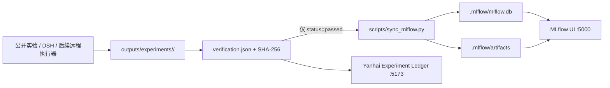

# MLflow 实验跟踪指南

> 目标：用 MLflow 提供统一的实验检索、指标对比、参数追踪和 artifact 浏览，同时继续把仓库内的版本化运行目录与验证收据作为唯一事实源。

面向所有角色的日常 SOP、开发规范、核心决策层实验矩阵和创新优先级，见 [MLflow团队实验平台使用、开发与创新指导书](MLflow团队实验平台使用开发与创新指导书.md)。

## 1. 已安装的本地架构



当前采用项目私有 `.venv`、SQLite 后端和本地文件 artifact store，不需要 Docker、GPU 或任何模型 API。MLflow 状态全部位于被 Git 忽略的 `.mlflow/`，不会污染源码提交。

职责边界：

- `outputs/experiments/**/verification.json` 是实验有效性的事实源；
- MLflow 是其可搜索、可比较、可视化的投影；
- 同步器拒绝未通过验证的目录；
- `yanhai_artifact_path` 是幂等键，同一目录重复同步只会返回 `skipped`；
- 六个 protocol 分别映射到 `yanhai-<slug>` 实验，run 名包含 protocol 与 UTC 时间戳。

## 2. 一键使用

双击项目根目录：

```bat
RUN_MLFLOW.bat
```

脚本会：

1. 在 `127.0.0.1:5000` 启动项目专属 MLflow 服务；
2. 健康检查通过后，扫描所有验证收据；
3. 只导入通过验证的运行，不重新执行模型或消耗算力；
4. 输出 imported / skipped 数量和每条 MLflow run ID。

访问地址：

- 研海寻踪：`http://127.0.0.1:5173/`
- 项目实验账本：打开 `http://127.0.0.1:5173/` 后选择“04 实验账本”
- MLflow：`http://127.0.0.1:5000/`

停止服务：

```bat
STOP_MLFLOW.bat
```

## 3. 新实验如何进入 MLflow

标准公开实验直接运行：

```bat
RUN_PUBLIC_EXPERIMENTS.bat
```

六个协议全部成功后会自动调用 MLflow 启动与同步。只同步某一条已经验证的运行：

```powershell
.venv\Scripts\python.exe scripts\sync_mlflow.py `
  --run-dir outputs\experiments\<protocol>\<UTC timestamp>
```

同步内容包括：

- 参数：protocol、evaluation type、claim ceiling、重复语义、运行环境和 Git 状态；
- 指标：`summary.json` 中所有有限数值，按 variant / combo 加前缀；
- 标签：原始 artifact 路径、数据性质、验证状态和同步来源；
- artifacts：完整的 `run_config.json`、`raw_results.json`、`cases.csv`、`summary.json`、`REPORT.md` 与 `verification.json`。

探索性脚本若没有上述验证收据，不应手工伪装成正式 run。先把它迁移到相同的版本化产物协议，再接入同步器。

## 4. 命令行安装与诊断

重新安装或升级到项目约束范围：

```powershell
.venv\Scripts\python.exe -m pip install ".[tracking]"
.venv\Scripts\python.exe -m pip check
```

手工启动后台服务：

```powershell
powershell -NoProfile -ExecutionPolicy Bypass `
  -File scripts\start_mlflow.ps1 -Background
```

健康检查：

```powershell
Invoke-WebRequest http://127.0.0.1:5000/health -UseBasicParsing
```

日志：`.mlflow/server.out.log` 与 `.mlflow/server.err.log`。Windows 启动器与监听进程 PID 分别记录在 `.mlflow/launcher.pid` 和 `.mlflow/server.pid`，停服脚本会按顺序收口两者，避免子进程被启动器重新拉起。

Windows 上服务固定使用单 worker。MLflow 的可选 Jobs execution backend 当前不支持 Windows；这不影响 Tracking Server、UI、参数/指标/artifact 记录。本项目的实验执行仍由冻结协议、普通终端或 DSH 完成，MLflow 只负责跟踪与比较。

## 5. 备份、迁移与团队共享

停止服务后，完整复制以下内容即可恢复本地跟踪状态：

- `.mlflow/mlflow.db`
- `.mlflow/artifacts/`

不要只备份数据库而遗漏 artifacts。恢复时保持两者的相对位置，然后重新运行 `RUN_MLFLOW.bat`。

本地服务只绑定 `127.0.0.1`，不会暴露给局域网或公网。升级为团队共享服务时，不应直接把 SQLite 和本地 artifact 目录暴露出去；应改为受认证的反向代理、PostgreSQL/MySQL 后端和受访问控制的对象存储，并单独冻结域名、TLS、账号、备份、保留期和数据合规策略。

## 6. 验收清单

- `http://127.0.0.1:5000/health` 返回 HTTP 200；
- UI 中能看到 6 个 `yanhai-*` 实验；
- 当前历史基线共 12 个 run，状态均为 `FINISHED`；
- 每个 run 至少有一项数值指标，并带 `yanhai_artifact_path`；
- 再次运行同步器显示 `imported=0, skipped=12`；
- 项目前端实验账本可以一键打开 MLflow；
- `python -m unittest discover -s tests` 全部通过。
