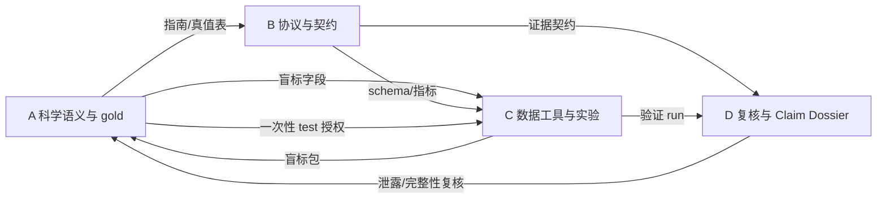

# 研海寻踪：四成员分工与推进计划

> 原版日期：2026-08-22
>
> 本次修订：2026-08-24
>
> 提交节点：9 月 5 日压缩包、9 月 20 日初审、11 月终审
> 总原则：科学语义、代码实现、实验执行和独立复核分开；synthetic proxy、human pilot 和 adjudicated gold 分开。

## 1. 修订后的分工总览

| 成员 | 核心定位 | 必须负责 | 不再承担 |
|---|---|---|---|
| **A** | 数据协议、人工标注与金标准发布 | 标注指南、双标/仲裁组织、数据版本、train/dev/test、三指标协议、候选卡片复核 | 独自判完所有题；同时做初标和仲裁；全队全部 novelty 检索 |
| **B** | EASG 决策协议、schema 与校准 | 事件协议、typed critique、硬护栏、重放、证据契约、正式校准和消融 | 定义科学真值；用程序标签形成正式性能结论 |
| **C** | 数据工具、真模型实验与 MLflow | 盲标包工具、六件套、模型调用、成本记录、MLflow、一次性 test 执行 | 提前查看封存答案；未解锁就跑 12×390 付费矩阵 |
| **D** | 独立复核、最小核心前端与提交整合 | 泄露/产物审查、closest work、Claim Dossier、作品书、视频、提交包 | 9 月 5 日前同时完成五个前端区、完整专利饱和检索和真人审计 |

不合并到四条执行线的责任：负责人/导师决定主领域、标注者资格、人民币上限、知识产权结论、正式指标和对外发布。

## 2. 当前数据等级重新定义

| 等级 | 定义 | 可支持的结论 |
|---|---|---|
| `synthetic_proxy` | 390 条程序构造案例，以及 `outputs/l3-sample.csv` 28 条程序抽样 | 工程连通性、错误类型压力、回归测试；不能作为正式性能 |
| `annotation_training` | 从 28 条程序题中选出的共同讨论样本 | 修改标注指南；不计算正式 kappa/性能 |
| `human_pilot` | 2–3 篇未见真实论文、20–30 条、双标并仲裁 | 流程可行性、小样本点估计和 CI；不得外推行业水平 |
| `adjudicated_gold` | 6–10 篇以上未见论文、按论文切分、双标/仲裁/数据卡/哈希完整 | 正式 dev 比较；test 只运行一次 |

现有 `outputs/l3-sample.csv` 不再被描述为“可直接发放的盲标表”。其中自动标签和构造类型必须从正式盲标包移除，并补齐原文、上下文、论文版本和精确跨度。

## 3. 全队 Gate

### G-A：标注语义 Gate

通过条件：

- A/B 会签《标注指南 v1》和《状态真值表 v1》；
- evidence stance 与 admission decision 分开；
- 来源独立性、条件差异、争议、取代、撤稿风险有判例；
- 两名初标者与仲裁者角色不冲突。

### G-P：盲标包 Gate

通过条件：

- A 确认内容可判；
- C 生成两份独立标注表和 manifest；
- D 确认没有自动标签、构造类型、系统预测或他人答案泄露；
- 论文来源、许可、版本、证据原文、上下文和字符跨度齐全。

### G-B：协议 Gate

通过条件：

- B 发布证据契约 v0.1/v1.0；
- 事件重放一致、非法转移可检测、下游状态不污染；
- A 签署规则—代码—测试核对表。

### G-C：真模型 Gate

通过条件：

- C 完成 R001–R003；
- 8-case 冒烟记录真实 token/成本，失败不静默；
- provider、model ID、prompt、价格和预算冻结；
- D 能从 raw 重算 aggregate。

### G-T：一次性 test Gate

通过条件：

- A 发布 test 哈希但不公开答案；
- B 已在 dev 冻结阈值、触发策略和主指标；
- C 冻结代码和预算；
- D 完成空跑与产物审查；
- 负责人批准运行一次。

## 4. 任务—成员映射

| 任务 | Owner | 协作者 | 独立验收 | 当前处理 |
|---|---|---|---|---|
| L001 来源、venue、版本和撤稿分层复核 | A | 两名独立复核者 | D 检查记录；负责人签字 | 保持 BLOCKED，等复核者 |
| L002 9 篇 closest-work 全文差分 | D | A 复核范围 | 负责人/导师 | READY，9 月 5 日前必须 |
| L003 gap 双人编码与仲裁 | A | 两名编码者 + 第三仲裁 | D 检查盲化 | human pilot 后执行 |
| L004 引文链与专利检索 | D | A 复核检索边界 | 负责人/导师 | 提交前做初步版，正式饱和门后置 |
| R001–R003 六件套、篡改检测、MLflow 幂等 | C | B 提供字段 | D | 立即执行，不用 API |
| R004–R005 真实 pilot 与 gold v1 | A | C 数据工具、两名标注者、仲裁者 | D 检查流程 | 旧 28 条降级为 training |
| R006–R008 事件重放和下游污染 | B | A 签科学语义 | D | R006 DONE；R007/R008 立即执行 |
| R009–R012 校准与组件消融 | B | C 执行 | D | 正式结论等待真实 dev |
| R013–R016 gold anchor | B 定协议、C 执行 | A 提供数据 | D | 等 G-A/G-P/G-B/G-C |
| R017 8-case API 冒烟 | C | B 检查 schema | D | Key 和预算到位后即可 |
| R018–R020 真模型矩阵和 Pareto | C | B 解释算法切片 | D | 正式 dev 解锁前不得全量付费 |
| F1 Claim Dossier | D | B 契约、A 数据、C run 链接 | A/B 分字段验收 | 9 月 5 日前唯一前端主任务 |
| F2–F4 图谱、标注台、账本增强 | D | B/C | B | 9 月 5 日后 |
| R021–R023 真人审计 | D | B 提供失败案例/复核分析 | B | 9 月 5 日后 |
| 作品书与视频 | D | A/B/C 提供各自已验证材料 | A 审数字、B 审机制、C 审 run | 9 月 5 日前必须 |

## 5. 成员 A 任务清单

| 编号 | 任务 | 交付物 | 验收条件 | 目标日期 |
|---|---|---|---|---|
| A-1 | 与 B 冻结两层标签、七类边界和判例 | 标注指南 v1、状态真值表 v1 | A/B 会签 | 8-25 |
| A-2 | 提交盲标包字段规范 | schema 需求 + 示例 | C 可生成，D 可审查 | 8-25 |
| A-3 | 用旧题进行 6–10 条规则训练 | 歧义清单、指南 v1.1 | 不计正式一致性 | 8-26 |
| A-4 | 选择 2–3 篇未见开放论文 | pilot 数据卡、许可与去重记录 | D 抽查来源 | 8-27 |
| A-5 | 组织 20–30 条真实双标与仲裁 | human pilot v0.1、分歧表、哈希 | G-P 通过；按论文管理 | 8-30 |
| A-6 | 扩展到 6–10 篇、60–100 条以上 | gold v1 train/dev/test | 样本量与 CI 如实说明 | 9-10 |
| A-7 | 冻结三指标协议 | 定义、分子分母、CI、失败案例 | D 可从 raw 复算 | 9-10 |
| A-8 | 授权 test 一次性使用 | test 版本和使用登记 | G-T 全通过 | 9-15 至 9-18 |
| A-9 | 每周复核候选卡片 | 复核记录和升级 manifest | 机器解读不直接当证据 | 每周 |

A 不作为同一批数据的“初标者兼最终仲裁者”。如 A 参与初标，必须由另一名领域成员仲裁。

## 6. 成员 B 任务清单

| 编号 | 任务 | 交付物 | 验收条件 | 目标日期 |
|---|---|---|---|---|
| B-1 | 与 A 会签标签和事件语义 | 真值表、判例 | A/B 会签 | 8-25 |
| B-2 | 发布 schema 与证据契约 v0.1 | schema、样例、校验器 | C/D 均可消费 | 8-26 |
| B-3 | R007 重放一致性 | 六件套 run | 投影一致，验证通过 | 8-27 |
| B-4 | R008 下游污染检查 | 状态传播报告 | timeline/Idea/资源不消费失效边 | 8-29 |
| B-5 | 支持盲标包字段校验 | 规则—字段映射 | 无科学标签泄露 | 8-27 |
| B-6 | 在 human pilot dev 上试校准 | proxy/pilot 报告 | 明确数据等级 | 9-01 |
| B-7 | 在 gold dev 上完成 R009–R012 | 校准、消融、risk–coverage | test 未触碰 | 9-14 |
| B-8 | 冻结证据契约 v1 和 test 配置 | 契约、prompt/阈值 hash | G-B 通过 | 9-15 |

B 可以提前开发 schema 和重放，但正式校准、触发策略和性能结论必须等待真实 dev。

## 7. 成员 C 任务清单

| 编号 | 任务 | 交付物 | 验收条件 | 目标日期 |
|---|---|---|---|---|
| C-1 | R001–R003 | 六件套、篡改拒绝、MLflow 幂等 | D 可复算 | 8-27 |
| C-2 | 无泄露盲标包工具 | 两份盲表、hidden record、manifest | A 可判、D 无泄露 | 8-27 |
| C-3 | 安全接入三类 provider | Key 健康状态、价格快照 | 不输出 Key | 8-27 |
| C-4 | R017 8-case 冒烟 | 真调用、token、成本、失败记录 | D 验证 | 8-29 |
| C-5 | 可选 30 条 proxy 筛选 | 明确标为 synthetic_proxy | 不进入正式性能 | 9-01 |
| C-6 | gold dev 正式矩阵 | 全模型/策略结果和 Pareto | G-C、真实 dev 解锁 | 9-15 |
| C-7 | 一次性 test | 主结果 run、使用登记 | G-T 通过，只运行一次 | 9-18 |
| C-8 | MLflow trace | proposer/critic/judge/guard/calibrator/event 链 | 可定位失败环节 | 9-18 |

provider 数量统一以 `config/experiment_models.json` 为准；当前文档不再出现“三家实现、四家 Key”的冲突。

## 8. 成员 D 任务清单

| 编号 | 任务 | 交付物 | 验收条件 | 目标日期 |
|---|---|---|---|---|
| D-1 | 审核盲标包 | 泄露/字段/许可检查表 | G-P 通过 | 8-27 |
| D-2 | 9 篇 closest-work 页码差分 | overlap/delta/边界表 | 每项有原文位置 | 8-30 |
| D-3 | 专利初步检索 | 渠道、检索式、日期、命中清单 | 不下“无冲突”结论 | 8-30 |
| D-4 | F1 Claim Dossier | 原文跨度、理由、时间线、run 入口 | 三十秒定位证据 | 9-01 |
| D-5 | 复核 C 冒烟与提交用 run | 独立 verification 记录 | raw 可重算 aggregate | 9-02 |
| D-6 | 作品书第 2/4/7/10 章 | 终稿 | 数字/措辞由 A/B/C 分别签字 | 9-03 |
| D-7 | 视频与打包 | 视频、讲稿、提交清单、压缩包 | 只用已验证素材 | 9-04 |
| D-8 | F2–F4、真人审计、完整专利门 | 后续 run 与前端 | 由 B/负责人复核 | 9-05 后 |

D 对 A/B/C 的复核限于独立重算、盲化、版本和措辞；不替代领域专家签署科学真值。

## 9. 修订后的依赖关系

四条线并行：

- A/B 先冻结最小语义；
- B 同时实现 schema 和重放；
- C 同时完成六件套与盲标工具；
- D 同时完成 closest work 和 Claim Dossier 骨架。

不再采用“A 全部做完 → B → C → D”的串行方式。

## 10. 时间表

| 日期 | A | B | C | D |
|---|---|---|---|---|
| 8-24～8-25 | 指南/真值表、盲标字段 | schema 骨架、会签 | R001、盲标工具设计 | 盲标审查表、F1 骨架 |
| 8-26～8-27 | 旧题规则训练、选真实论文 | 契约 v0.1、R007 | R002/R003、生成盲标包 | 审核盲标包、closest work |
| 8-28～8-30 | 20–30 条真实 pilot 双标/仲裁 | R008、支持 pilot 字段 | 8-case 冒烟 | 页码差分、专利初步版、F1 |
| 8-31～9-01 | pilot 数据卡和测量协议草稿 | pilot 校准仅作小样本 | 可选 30 条 proxy 筛选 | F1 最小版、作品书合并 |
| 9-02～9-04 | 核对数据口径 | 提供机制材料 | 提供已验证片段 | 作品书、视频、提交包 |
| **9-05** | 冻结数据口径 | 冻结机制口径 | 冻结实验引用 | **提交压缩包** |
| 9-06～9-15 | 扩 gold、冻结 test | gold dev 校准/消融 | gold dev 矩阵 | 复核 run、准备真人审计 |
| 9-15～9-18 | 一次性授权 | 冻结配置 | 运行 test 一次 | 独立复算 |
| 9-19～9-20 | 正式口径签字 | 失败切片 | Pareto 与成本 | 初审材料与 Q&A |

9 月 5 日提交时若只有 human pilot，必须显示样本量和 CI；不得将“正式指标待测”改写成“已经达到指标”。

## 11. 指标与样本量纪律

1. 幻觉率同时报告 unsupported accepted 数、accepted 总数、coverage 和 95% 区间；
2. 若使用双侧 95% Wilson 区间，0/73 accepted 才能使上界低于 5%；总样本数需根据 coverage 增加；
3. 画像适配与知识点覆盖分别定义分子和分母，不能与关系裁决共用一个模糊“准确率”；
4. 运行次数不等于独立案例数；重放三次仍是一条案例；
5. 自然分布集与平衡压力集分别报告；
6. 任何正式数字必须标明 `synthetic_proxy / human_pilot / adjudicated_gold`。

## 12. 全队红线

1. 测试集不能由被测系统独立生成并独立评分；
2. 自动标签、错误类型和系统预测不得进入盲标表；
3. 同一成员不得兼任同一结果的 owner 和唯一 reviewer；
4. test 只运行一次，所有调参在 train/dev 完成；
5. 缺 Key 显式跳过，禁止静默规则回退；
6. 负结果、失败调用、弱模型和不利切片不得删除；
7. 前端不重算指标、不补造字段、不隐藏失败；
8. 专利初步检索不能支持“没有同类专利”；
9. 数据和全文逐项检查许可，不能绕过访问控制；
10. 对外统一使用“候选机制，谨慎推进”，禁用“首创、首次、领先、零幻觉”。

## 13. 每日站会只问五件事

1. G-A/G-P/G-B/G-C/G-T 当前卡在哪一步；
2. 今天新增的是 synthetic proxy、human pilot 还是 adjudicated gold；
3. 有没有数据泄露、角色冲突或未记录的人工改判；
4. 有没有推翻 EASG 的负结果；
5. 距 9 月 5 日最小提交物还缺哪一个可验收产物。
