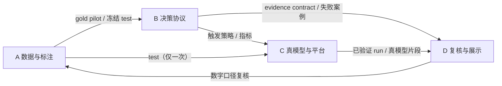

# 研海寻踪：四成员分工与推进计划

> 版本：2026-08-22（依据指导书 v1.2、EXPERIMENT_PLAN、EXPERIMENT_TRACKER 的 L001–L004 / R001–R025、外部阻塞清单与 C1 口径修订）。
> 时间基准：8-22；提交截止 9-05（压缩包发榜方邮箱），9-20 初审，11 月终审。
> 约定：每个正式实验 run 的 owner 与 reviewer 不得为同一人；本计划将 9 个角色职责合并为 4 名成员的工作线。

---

## 1. 分工总览

| 成员 | 定位 | 主要职责 | 对应指导书角色 |
|---|---|---|---|
| **A** | 数据与标注负责人 | 文献有效性门（数据侧）、L3 金标、标注规范与状态转移真值表、数据版本管理、三硬指标测量协议 | 数据负责人、标注协调、研究负责人（主张冻结） |
| **B** | 决策协议与校准负责人 | EASG 事件内核、typed critique、校准器、硬护栏消融、下游一致性、evidence contract | 算法成员（状态机与决策协议） |
| **C** | 真模型实验与平台负责人 | Key 与预算、决策矩阵标准化、真模型对比、风险—成本 Pareto、MLflow 与 trace、成本记账 | 模型实验成员、实验执行者、平台维护者 |
| **D** | 复核、前端与展示负责人 | L0 文献门（差分与检索侧）、专利检索、前端五个工作区、演示视频、作品书定稿、人工审计实验 | 独立复核者、前端与演示成员、写作成员 |

**交叉复核矩阵**：A 的实验由 D 复核；B 的由 C 或 D；C 的由 B 或 D；D 产出的数字由 A/B 把关。

---

## 2. 全体任务—成员映射矩阵

状态取自 EXPERIMENT_TRACKER（DONE / READY / TODO / BLOCKED）。owner 负责执行，reviewer 负责独立验收。

| 任务 | 内容 | Owner | Reviewer | 状态 |
|---|---|---|---|---|
| L001 | 100 篇来源与 venue 分层双人复核（≥20 篇样本） | A（数据侧）+ D（差分侧） | 研究负责人 | BLOCKED（需两名复核者） |
| L002 | 2024–2026 closest-work 全文页码差分 | D | A | READY |
| L003 | gap 双人盲化编码与仲裁 | A | D | BLOCKED |
| L004 | 引文链、专利与检索饱和门 | D | A | BLOCKED |
| R001–R003 | 真模型矩阵标准化、篡改检测、MLflow 幂等 | C | B | READY / TODO |
| R004–R005 | L3 双人盲标与仲裁、冻结 gold v1 | A | 仲裁人（第三成员） | BLOCKED |
| R006 | 手算反事实状态迁移（已完成） | B | A | DONE |
| R007–R008 | 事件重放一致性、下游污染检查 | B | A | TODO |
| R009–R012 | 校准器对比、typed issue、hard guard、简洁性消融 | B | D（统计复核） | READY / TODO |
| R013–R016 | 金标 test 上的四条强基线与 EASG anchor | C（执行）+ B（协议）+ A（数据） | D | BLOCKED（依赖 R005） |
| R017–R020 | 真模型冒烟、同质/异质、触发策略、Pareto 冻结 | C | B | BLOCKED（缺 Key） |
| R021–R023 | 审计任务预试、双人交叉审计、配对分析 | D | B | TODO / BLOCKED |
| R024 | 三领域无重调迁移 | A + B | D | BLOCKED（C1 过门后） |
| R025 | ELT 协议原型 | A + D（仅协议设计） | 研究负责人 | BLOCKED（C2 后置） |
| F0–F5 | 前端设计系统 → Claim Dossier → 证据图谱 → 标注控制台 → 实验账本增强 → 多人部署 | D | B（证据契约一致性） | F1 优先 |
| S1 | 作品书定稿（第 2/4/7/10 章） | D | A + B（数字复核） | 进行中 |
| S2 | ≤10 分钟演示视频 | D | C（真模型片段来源） | 待 Key |
| S3 | 提交物打包与对表核对 | D | 全组 | 9-04 |
| S4 | Key 与预算冻结 | C | 负责人 | 8-23 前 |
| S1–S4 | 文献周报扫描：arXiv 三类目×三关键词、去重、新颖度初筛、周报 md | C | D | 已落地（`scripts/weekly_literature_scan.py`） |
| C1–C3 | 句子级切块与元数据（全局偏移、不割句、表格 OCR 标记） | C | D | 已落地（`scripts/chunk_corpus.py`） |
| I1–I4 | 候选队列三态协议：candidate → evidence_card → EASG 裁决入图（AI 解读≠证据） | C（脚本）+ A（复核）+ D（协议） | 研究负责人 | 已落地协议，每周执行 |

---

## 3. 成员 A：数据与标注负责人

### 3.1 职责背景

决策层当前唯一可用的开发池是 24/140 条压力集，它只证明机制行为，不构成真实性能主张（指导书 §11 短板 8、§24.2）。赛题实用价值 30 分对应的三个硬指标（幻觉率 <5%、画像—资源难度适配 ≥85%、核心知识点覆盖率 ≥90%）都必须以未见论文上的金标关系为分母。A 的工作产出是 B、C 两线所有正式结论的计量基准。

### 3.2 任务清单

| 编号 | 任务 | 交付物 | 验收标准 | 依赖 | 时限 |
|---|---|---|---|---|---|
| A-1 | 与 B 共同签署七条裁决逻辑（指导书 §24.9），并裁定五个语义判例：反驳 vs 条件不同、supersede 与 contested 的边界、来源独立性的判定（同数据集/同作者/引文链）、四档谓词强度与关系类型的对应、必须 needs_review 的高风险情形 | 标注指南 v1（含判例） | 双方签字；判例覆盖五个语义问题 | 无 | 8-23 |
| A-2 | 组织两名标注者独立盲标 `outputs/l3-sample.csv` 28 条 | 两份独立标注表 + 分歧表 | 双人独立完成，无中途串标 | A-1 | 8-24 |
| A-3 | 仲裁分歧，计算 kappa/alpha，冻结 gold pilot v1（论文级切分、SHA-256、类分布） | gold v1 数据卡 + 哈希 | R004/R005 置 DONE；一致性达可解释水平 | A-2 | 8-25 |
| A-4 | 按方差需求将标注量扩充至 60–100 条关系（6–10 篇论文） | gold v1 完整版 | 论文级切分不泄露；train/dev 公开、test 封存 | A-3 | 9-01 |
| A-5 | 撰写三硬指标测量协议（定义、分子/分母、失败案例、Wilson 95% 区间、样本量） | 一页测量协议 | 每个指标可复算、可溯源 | A-4 | 9-01 |
| A-6 | L001/L003 文献有效性门的数据侧复核与 gap 盲化编码 | 复核表、编码记录 | 与 D 的结果交叉一致 | 两名复核者到位 | 8-25 |
| A-7 | 9-20 前发布冻结 test（仅限 C 的 M4 主结果使用一次） | test 版本 + 哈希 | 记录使用次数，只允许一次 | A-4 | 9-20 |
| A-8 | M7 多领域真实链案例（真实反驳/修正/取代的人工确认） | 多领域案例集 | 领域专家确认语义 | C1 过门 | 11 月前 |
| A-9 | 候选队列每周人工复核：过一遍 `data/vertical_kb/candidate_queue.json` 新增条目，确认解读、纠正新颖度标签，通过后升 evidence_card（含 `source_verified_against_original=true`、复核人、日期） | 复核记录 + manifest 升级 | 与 D 的复核协议一致；AI 解读绝不直接当证据 | C 的周报 | 每周（首次 8-30 前） |

### 3.3 工作方法与接口

- 流程：论文筛选（许可与未见性）→ 标注指南（带判例）→ 双人独立盲标 → 分歧仲裁 → 一致性统计 → 冻结版本（编号 + SHA-256）→ 发布 train/dev、封存 test。
- 与 B 的接口：状态转移真值表是 B 实现 schema 的科学需求文档；代码测试通过不代表科学语义正确（§24.9）。
- 与 C 的接口：只交付数据版本与哈希，不参与阈值选择；test 使用一次后记录于 run 配置。
- 红线：模拟数据与 L2 不得冒充金标；标注分歧禁止私下统一。

---

## 4. 成员 B：决策协议与校准负责人

### 4.1 职责背景

当前裁判依赖固定阈值 0.78/0.58 与关键词解析，批评以自然语言字符串传递，关系状态只有当前值而无事件历史（指导书 §11 七条短板）。独立查新将 EASG 定为 4.0/10 的"谨慎推进"候选（NOVELTY_CHECK_REPORT），其存续取决于消融能否证明收益来自状态协议本身，而非更多 Agent、token 或拒绝率。R006 已以 12 条手算反事实完成最小内核（EASG 12/12 对静态基线 3/12，toy/dev）。

### 4.2 任务清单

| 编号 | 任务 | 交付物 | 验收标准 | 依赖 | 时限 |
|---|---|---|---|---|---|
| B-1 | 将 `src/yanhai/easg.py` 的 toy 语义按七条裁决逻辑对齐，实现 CritiqueIssue / DecisionScore / DecisionEvent 结构（指导书 §12） | 生产级 schema + 迁移说明 | 与 A 的真值表逐条一致；非法转移被拒绝 | A-1 | 8-24 |
| B-2 | R007：事件重放一致性正式 run（重放 ×3 不记独立样本） | 六件套 run 产物 | 三次重放投影完全一致；verification 通过 | B-1 | 8-24 |
| B-3 | R009：冻结 dev 上比较固定阈值 vs logistic/isotonic 校准 | risk–coverage、ECE、Brier 报告 | dev 改善且 test 未触碰；若固定阈值不劣则记录为简洁性结论 | 无 | 8-26 |
| B-4 | R010：typed critique vs 自然语言批评消融；R011：hard guard 有无对照 | 消融 run 产物 | 裁判不依赖关键词解析中文；灾难性 FP 单独切片 | B-1 | 8-29 |
| B-5 | R008：状态变化向 timeline/Idea/资源的下游传播检查 | 污染率报告 | 状态变化传播且可解释 | B-2 | 9-01 |
| B-6 | evidence contract 冻结（供 D 前端与 C 链路共同消费） | 契约 schema v1 + 样例 | 三方可解析同一证据结构 | B-1 | 9-01 |
| B-7 | 整理 C1 协议贡献部分的作品书第 4 章素材 | 章节素材 + 图表 | 数字均可溯源至 run 产物 | B-2~B-5 | 9-03 |
| B-8 | Phase B：B2 完整反事实（gold pilot 上）、B3 创新隔离消融（去 event history / temporal / calibrator / hard guard，LLM judge vs GBDT） | 主表 1/2 + 消融结论 | 至少一个状态协议组件不可替代；多数组件无贡献则删除 | A-4 | 9-20 前 |
| B-9 | Phase C：R012 简洁性定稿，配合 R024 多领域迁移 | 简洁性结论 + 迁移报告 | 简单方法等效即采用简单方法 | B-8 | 11 月前 |

### 4.3 工作方法与接口

- 流程：研究卡（问题/主张/反主张/强基线/主指标/失败判据/预算）→ 与 A 共签语义 → schema 与单测（手算金标锁语义）→ 六件套 run → 独立复核 → MLflow 同步 → 决定（PROMOTE/ITERATE/DOWNGRADE/REJECT）。
- 消融纪律：接口分离与确定性执行拆开测（P102 的教训），避免高估 hard guard 贡献。
- 红线：不看 test 调参；负结果照实登记；禁止静默回退。

---

## 5. 成员 C：真模型实验与平台负责人

### 5.1 职责背景

指导书将"Level 1 统一真模型实验产物"列为最高优先级：现有 `scripts/run_decision_experiment.py` 尚无验证收据，其数字不能进入正式比较。真模型矩阵是回答评委三必问（是否真调模型、比单模型强在哪、成本是否可接受）的唯一途径；390 条 L2 冻结用例与 10 分钟 runbook 均已就绪，唯一外部阻塞是 `.env` 缺少 API Key。

### 5.2 任务清单

| 编号 | 任务 | 交付物 | 验收标准 | 依赖 | 时限 |
|---|---|---|---|---|---|
| C-1 | 催办并管理 4 家 Key 填入 `.env`；冻结人民币上限与官方价格快照 | `.env`（本地）+ 价格快照 v1 | Key 不进源码/日志/标签；价格表带来源日期 | 负责人 | 8-23 |
| C-2 | R001–R003：将决策矩阵迁入 `tests/experiments/07_decision_model_matrix/`，补齐六件套与篡改检测，MLflow 幂等同步 | 07 协议完整 run | 二次同步 imported=0；损坏产物非零退出 | 无（不调 API） | 8-25 |
| C-3 | R017：8-case 真模型冒烟（格式、fallback、成本记账） | 冒烟 run | 真实 JSON 契约；缺 Key 组合记 skipped | C-1 | 8-27 |
| C-4 | 390 条 L2 上跑"模型×角色"初版矩阵（先两家 provider） | 矩阵初版 + 成本风险初表 | 无静默回退；成本只来自冻结价格快照 | C-3 | 9-01 |
| C-5 | 提供录视频用的真模型片段（须取自已验证 run） | 片段 + run 引用 | 与 S2 视频数字一致 | C-4 | 9-03 |
| C-6 | Phase B：R018/R019（同质/异质、always-on/triggered）、R020（风险—成本 Pareto 冻结）、M4 等 coverage 主结果（用 A 的冻结 test，仅一次） | Pareto 图 + 主结果表 | 等 coverage 下风险下降才成立；否则按失败判据处理 | A-7、B-6 | 9-20 前 |
| C-7 | MLflow L2 trace（adjudicate→retrieve/proposer/critic/judge/hard_guard/calibrator/state_transition） | trace 协议 + 样例 run | 可定位"哪步、哪证据、哪规则"导致裁决 | B-6 | 9-20 前 |
| C-8 | Phase C：终审复跑、价格快照更新、成本面板数据 | 复跑报告 | 与 9-05 版本可对比 | 全部过门 | 11 月前 |
| C-9 | 文献管线 P0：周报扫描（已落地）、切块（已落地）、候选队列协议（已落地）；Key 到位后开启 `--interpret` 四问解读；P1 引文链与邮件订阅 | 周报 md + candidate_queue + search_cache 快照 | 缺 Key 显式报错不静默；解读与证据跨度字段分离 | Key | 每周执行，首次 8-30 前 |

### 5.3 工作方法与接口

- 流程：冻结预算与价格 → 协议六件套（先 sanity：单案例走通、损坏检测生效）→ 8-case 冒烟 → 全量矩阵 → 同数据同预算比较 → Pareto + 95% CI + 失败切片 → 复核 → 决定。
- 红线：缺 Key 必须 skipped，严禁静默回退规则模型；`null` 价格不产生伪造成本。

---

## 6. 成员 D：复核、前端与展示负责人

### 6.1 职责背景

体验 15 分与提交物完整性主要由该线承担。评委验收标准为三问：30 秒内定位原文依据、能解释状态变化并完成改判、每个数字可回溯到 run 与收据。当前作品书预审核初稿尚未写入 EASG 口径（仍为旧状态模型），且最近工作差分（SciGraph-LLM、Semantic Units、StatefulDiscovery、FOIS、SCIMKG、SELENE、iMAD、CARP、TLSQKT 等 9 篇）必须逐条写入 related work。专利检索此前仅完成标题级筛选。

### 6.2 任务清单

| 编号 | 任务 | 交付物 | 验收标准 | 依赖 | 时限 |
|---|---|---|---|---|---|
| D-1 | L002：9 篇 closest-work 全文页码差分表；与 A 共同完成 L001 的 20 篇复核 | 差分表 + 复核记录 | 每篇标注重叠面、本系统独有、对方独有、对 C1 的裁决 | 无 | 8-25 |
| D-2 | L004 专利侧：SooPAT / CNIPA / Google Patents 分类号 + 关键词组合检索，留存检索式 | 专利命中清单 | 每篇一行"相邻面/是否冲突"结论 | 无 | 8-25 |
| D-3 | 作品书定稿：第 2 章 related work 差分、第 4 章 C1 口径（"指导书定义概念，本项目贡献可执行协议与实验证据"）、第 7 章待测→实测迁移表、第 10 章局限 | 终稿 + 预审核材料清单更新 | 禁用词复查通过；数字带来源与样本量 | D-1、B-7、A-5 | 9-02 |
| D-4 | 前端 F0 设计系统 + F1 Claim Dossier 最小版（原文跨度、裁决原因、事件时间线、人工改判） | Storybook 组件 + 页面 | 三问验收：30 秒找依据、可解释状态变化、数字可回溯 | B-6 | 9-02 |
| D-5 | S2：≤10 分钟演示视频（画像输入→调度可视化→资源生成闭环） | 视频 + 讲稿 | 真模型片段与 C 的已验证 run 一致；覆盖闭环 | C-5、D-4 | 9-04 |
| D-6 | S3：提交物对表逐项核对，打包 | 压缩包 | 作品书/视频/源码/部署说明/单元测试/测试数据六项齐全 | D-3、D-5 | 9-04 |
| D-7 | Phase B：R021 审计任务预试、R022 双人交叉审计（定位时间/纠错时间/override 率）、R023 配对分析；初审备询问答库 | 审计 run + Q&A 库 | 客观时间或正确率有稳定信号；顺序平衡 | B-8 失败案例 | 9-20 前 |
| D-8 | Phase B/C：F2 证据图谱与事件时间线（Cytoscape.js）、F3 标注与审计控制台、F4 实验账本增强 | 前端增量 | 图谱只消费 evidence contract；不重算指标 | B-6 | 11 月前 |
| D-9 | 文献管线复核协议：四问解读口径、创新/改进标签复核规则、I2 升级签字流程、周报对外口径（"线索级，以人工复核为准"） | 复核协议一页 + 周报口径条款 | A 的每周复核按协议执行；周报口径与作品书一致 | 无 | 8-30 前 |

### 6.3 工作方法与接口

- 口径先行：先冻结"什么能说"，再动界面与文字；前端只读消费 API 与实验账本，不重算、不隐藏负结果。
- 展示数字一律带 gold/proxy 标签、样本量、CI 与产物路径。
- 红线：作品书禁用"首创/首次/领先"；视频不得使用未验证的一次性调参秀。

---

## 7. 依赖关系与当前堵点

当前最优先解除的三个阻塞：

1. **API Key（.env）**——阻塞 C 全线真模型工作，负责人 8-23 前填写；
2. **L3 双人盲标 28 条**——阻塞 A 的 gold v1 进而阻塞 B1/M4，两名标注者各 2 小时，8-24 前完成；
3. **七条裁决逻辑会签**——阻塞 B 的 schema 与 A 的标注指南，A、B 于 8-23 会签。

## 8. 三阶段时间表

| 日期 | A | B | C | D |
|---|---|---|---|---|
| 8-22 | 认领 pilot 论文清单 | 准备 R007 研究卡 | Key 催办 | 认领 L001/L002 清单 |
| 8-23 | 七条逻辑会签 + 指南 v1 | R007 跑 | R001 矩阵迁移 | L002 差分 + 专利检索启动 |
| 8-24 | 28 条盲标完成 | R007 收尾 | R002/R003 | 专利结论合并 |
| 8-25 | 仲裁 → gold pilot v1 | R009 启动 | 价格快照冻结 | 作品书 related work 定稿 |
| 8-26 ~ 8-29 | 扩标 60–100 条 | R009/R010/R011 | R017 冒烟 + L2 矩阵初版 | F0 设计系统 |
| 8-30 ~ 9-01 | 三指标测量协议 | R008 下游检查 | 矩阵初版成本表 | F1 Claim Dossier 最小版 |
| 9-02 ~ 9-04 | gold v1 冻结发布 | 第 4 章素材 | 真模型片段 | 视频录制 + 提交物对表 |
| **9-05** | — | — | — | **提交** |
| 9-06 ~ 9-20 | test 发布（一次使用） | B2/B3 完整实验 | R018–R020 + M4 主结果 | R021–R023 审计 + 备询 |
| 9-21 ~ 11 月 | R024 多领域案例 | R012 简洁性定稿 | 终审复跑 | 终审演示与 F2–F4 |

## 9. 工作纪律

1. 实验前先写研究卡：问题、主张、反主张、强基线、主指标、失败判据、预算；
2. 测试集只评估一次；阈值、提示词与消融只在 train/dev 上决定；
3. 有效 run 以六件套 + `verification.json(status=passed)` 为准，run 目录生成后不原地修改；
4. 负结果保留；禁止只报告最优模型、种子或切片；
5. 缺 Key 记 skipped，禁止静默回退；成本只来自冻结价格快照；
6. 模拟数据与 L2 不得作为金标；确定性重放不记独立样本；LLM-as-judge 不作唯一真值；更多 Agent/token 不自动构成创新；
7. AI 生成内容默认可疑，关键数字必须回溯到 `outputs/experiments/**` 文件与哈希，经人验收签字；
8. 对外口径统一为"候选机制，谨慎推进"（新颖性 4.0/10），禁用"首创/首次/领先"。

## 10. 检查点

每两天站会（10 分钟），固定四问：

1. 哪个 run 卡在哪个 Gate，原因是什么？
2. 是否出现推翻 C1 的反证据（等 coverage 风险未降 / 收益仅来自拒绝 / 静态基线等效）？
3. 三个优先阻塞（Key、盲标、七条逻辑）状态是否变化？
4. 距 9-05 提交物对表还差哪一项？
