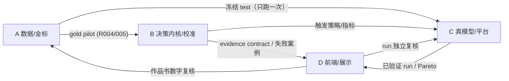

# 研海寻踪 4 人分工清单（基于创新指导书 v1.2）

> 版本：2026-08-22。依据：`docs/协作与运维/MLflow团队实验平台使用开发与创新指导书.md`（v1.2，第 5/8/10/11/12/14/16/17/22/24 节）、`refine-logs/EXPERIMENT_PLAN.md`、`refine-logs/EXPERIMENT_TRACKER.md`（R000–R025）、`docs/协作与运维/外部阻塞与推动清单_2026-08-21.md`、`docs/研发记录/最近工作差分与C1口径修订_2026-08-21.md`。
> 时间基准：今天 8-22，提交截止 **9-05**（压缩包 → 602808600@qq.com），初审 9-20，终审 11 月。
> 指导书角色可兼任，但每个正式实验 **owner 与 reviewer 不得同一人**；本清单把 9 个角色合并为 4 条工作线。

---

## 0. 总览：四条工作线 → 四名成员

| 成员代号 | 工作线 | 对应指导书角色 | 核心板块（R 编号） | 一句话目标 |
|---|---|---|---|---|
| **A** | 研究 / 数据线 | 研究负责人 + 数据负责人 + 标注协调 | L0 文献门、R004/R005（L3 金标）、标注规范与状态转移真值表、三硬指标口径 | 让 C1 有真实未见数据的金标准 |
| **B** | 决策内核 / 校准线 | 算法成员（状态机与决策协议） | R007/R008（重放与污染）、R009–R012（typed issue / 校准 / hard guard / 简洁性）、B2/B3 实验、evidence contract | 让决策从"字符串+固定阈值"升级为结构化、校准、事件驱动协议 |
| **C** | 真模型 / 平台线 | 模型实验成员 + 实验执行者 + 平台维护者 | R001–R003（矩阵标准化）、R017–R020（真模型矩阵与 Pareto）、MLflow L1/L2、价格快照与成本 | 拿到"模型×角色"的风险—成本 Pareto 证据 |
| **D** | 复核 / 前端 / 展示线 | 独立复核者 + 前端与演示成员 + 写作成员 | L0 双人复核、前端 F0–F4、演示视频、作品书定稿、B5/M6 人工审计、专利正式检索 | 让评委 30 秒看懂证据、作品书口径零风险 |

**交叉复核约定（强制）**：A 的 run 由 D 复核；B 的 run 由 C 或 D 复核；C 的 run 由 B 或 D 复核；D 的产物由 A/B 复核数字口径。任何人不得给自己的 run 当 reviewer。

---

## 1. 成员 A：研究与数据线（金标准是命根子）

### 1.1 负责板块

- **L0 文献有效性门（与 D 分担）**：按指导书 §24.2 事实底账，双人复核至少 20 篇来源/gap（A 做数据/科学语义侧，D 做检索饱和与差分侧）；
- **L3 pilot 金标（R004/R005）**：6–10 篇未见论文、60–100 条关系、论文级切分、双人盲标 + 第三人仲裁；
- **标注规范与状态转移真值表**：与 B 共同签署指导书 §24.9 七条逻辑，并回答五个语义问题（"反驳"还是"条件不同"？何时 supersede 何时 contested？什么算独立来源？四种谓词强度各允许什么？哪些必须 needs_review？）；
- **数据版本管理**：来源 URL / 许可 / 哈希 / `proxy|pilot|gold|human_eval` 标签 / 论文级 train-dev-test；
- **三硬指标口径**：幻觉率 <5%、适配 ≥85%、覆盖率 ≥90% 的测量协议、Wilson 区间与样本量说明；
- **390 条 L2 冻结用例**的维护与对外口径（只当开发/校准池，不当金标）；
- **M7 多领域真实链（9 月中后）**：三领域迁移与真实反驳/修正/取代案例。

### 1.2 研究背景（为什么是你这块）

- 指导书 §11 短板 8 与 §24.2 说得清楚：**当前 24/140 条压力集是开发数据，不能支撑真实性能主张**；100 篇语料只证明"读过哪个文件"，不证明"行业空白"。
- 赛题评分里**实用价值 30 分**的三硬指标（幻觉率/适配/覆盖率）全部需要真实未见数据才能落笔；没有 gold，B/C 两线的所有实验结果都只能是 proxy。
- 交接文档的纪律原话："synthetic proxy ≠ real_gt；对外数字以 390 条 L2 + L3 锚点为准"——L3 就是那个锚点。
- 现状：`outputs/l3-sample.csv`（28 条抽查）已存在，是 pilot 的现成起点；R004/R005 仍 BLOCKED（缺双人标注与仲裁）。

### 1.3 接下来该怎么做（按提交节奏）

**Phase A（8-22 ~ 9-05，提交线）**
1. 8-22/23：与 B 共同签署七条逻辑（§24.9），产出 v1 标注指南（含"反驳 vs 条件不同"等五问的判例）；
2. 8-24 前：组织两名标注者盲标 `l3-sample.csv` 28 条（各约 2 小时）→ 仲裁 → 计算 kappa/alpha → 冻结 gold pilot v1（带 SHA-256 与论文级切分），R004/R005 置 DONE；
3. 8-25~8-28：按 power 需求扩到 60–100 条（不要贪多，方差够用就停）；
4. 9-01 前：写"三硬指标测量协议"页（定义、分子/分母、失败案例、CI），供 D 写入作品书第 7 章。

**Phase B（9-06 ~ 9-20，初审备询）**：补数据卡、许可与排除规则；给 B1 实验交付冻结 test（只让 C 跑一次）。

**Phase C（9-21 ~ 11 月，终审）**：M7 多领域迁移 + 真实反驳/修正/取代案例人工确认。

### 1.4 工作流程与思路

```text
选论文（许可→未见切分） → 写标注指南 v1（带判例） → 双人独立盲标
→ 分歧表（不私下统一） → 第三人仲裁 → 一致性统计（kappa/alpha）
→ 冻结 gold vN + SHA-256 → 发布给 B/C（只发 train/dev，test 封存）
```

- 严格 Gate 1（§8）：数据必须新建版本，不覆盖模拟数据；**测试集只能最终评估用一次**；
- 每个数据版本保留：来源、切分、标注者、仲裁状态、哈希、泄露风险说明；
- 与 B 的接口：状态转移真值表是 B 写代码的"科学需求文档"，代码测试通过≠科学语义正确（§24.9 原话）。

---

## 2. 成员 B：决策内核与校准线（把决策升级为协议）

### 2.1 负责板块

- **EASG 内核**：`src/yanhai/easg.py` 从 toy 语义对齐到生产决策层（`llm_decision.py`/`agents.py`），实现指导书 §12 的 `CritiqueIssue / DecisionScore / DecisionEvent` 结构；
- **R007 事件重放一致性**（正式 run，重放 ×3 不算独立样本）；
- **R008 下游污染检查**：状态变化必须传播到 timeline / Idea / 资源，且可解释；
- **R009 校准器**：冻结 dev 上比较固定阈值 0.78/0.58 vs 逻辑回归 / 等距回归，报告 ECE/Brier/risk–coverage；
- **R010 typed issue 消融**：结构化问题类型 vs 自然语言批评（裁判不得靠关键词解析中文句子）；
- **R011 hard guard 必要性**：with/without，单独报告绝对化/错证据的灾难性 FP；
- **R012 简洁性**：小校准器（logistic/GBDT）若等效于大 LLM 裁判，就采用简单版本并写成优点；
- **evidence contract**：为 D 的前端 Claim Dossier 提供统一证据数据结构。

### 2.2 研究背景（为什么是你这块）

- 指导书 §11 列了决策层 7 条真实短板（固定阈值、字符串批评、伪独立、证据奖励只看数量、无 trace、无 risk–coverage、状态是当前值）——这是工程上最诚实、也最值得先改的部分。
- §14 创新候选池：EASG 总体新颖性 **4.0/10，PROCEED WITH CAUTION**；C1 的存活条件全在 B2/B3 两个实验块：**"收益不能只来自更多拒绝、更多 token 或更强模型"**。
- 本会话已打底：R006 完成（最小 EASG，EASG 12/12 vs 静态基线 3/12，toy/dev）；P102 的消融教训必须吸收——**"接口分离"与"确定性执行"要拆开测**，否则会高估 hard guard 的贡献。

### 2.3 接下来该怎么做（按提交节奏）

**Phase A（8-22 ~ 9-05，提交线）**
1. 8-23：跑 **R007**（R006 的 12 条案例 + 重放 ×3 正式登记，重放不算独立样本）；
2. 8-24~8-26：跑 **R009**（校准器对比，dev 冻结、test 不触碰）；若固定阈值不劣，删校准器并把"简化"写成结论；
3. 8-27~8-29：typed issue schema + **R010/R011** 消融（CPU 即可，不依赖 Key）；
4. 9-01 前：跑 **R008**（下游污染检查）；与 A 冻结状态转移真值表 v1；
5. 9-02~9-04：把六件套产物与结论整理成作品书第 4 章素材（协议贡献部分）。

**Phase B（9-06 ~ 9-20）**：B2 完整反事实（用 A 的 gold pilot）+ B3 创新隔离消融（去 event history / 去 temporal / 去 calibrator / 去 hard guard / LLM judge→GBDT）；输出"最小不可删组件"结论。

**Phase C（9-21 ~ 11 月）**：R012 简洁性定稿；与 C 合作把 evidence contract 接入真实模型链路。

### 2.4 工作流程与思路

```text
研究卡（Gate 0：问题/主张/反主张/强基线/主指标/失败判据/预算）
→ 冻结案例与真值表（与 A 共签） → schema 与单测（手算金标锁语义）
→ 六件套 run（raw→summary→REPORT→verification） → 独立复核
→ MLflow 同步 → Gate 7 决定（PROMOTE/ITERATE/DOWNGRADE/REJECT）
```

- 一切以"可重放、可手算"为验收：任何状态迁移都能在 30 秒内手算出预期结果；
- 实验里**禁止静默回退**、禁止看 test 调参；负结果（如校准器不优于固定阈值）照常登记，本身就是简洁性结论；
- 与 C 的接口：B 定协议和指标，C 在真模型上执行 B1/B4 的对比。

---

## 3. 成员 C：真模型与平台线（命门实验的执行者）

### 3.1 负责板块

- **Key 与预算管理**：`.env` 只进 Key（不进源码/聊天框/日志）；冻结人民币上限与官方价格快照；
- **R001–R003**：把 `scripts/run_decision_experiment.py` 迁入 `tests/experiments/07_decision_model_matrix/`，补齐 `run_config.json/raw_results.json/verification.json`，验证篡改检测与 MLflow 幂等同步（指导书 §10 Level 1，最高优先级）；
- **R017**：8-case API 冒烟（格式、fallback、成本；缺 Key 必须 `skipped`，不得静默回退）；
- **R018/R019**：同质 vs 异质组合、always-on vs triggered（B 提供触发策略）；
- **R020**：风险—成本 Pareto 冻结（每减少一个 FP 的成本）；
- **M4 等 coverage 主结果**：统一候选池与模型预算下执行 B1/B4 对比（与 B 共出结论，D 独立复核）；
- **MLflow L2 trace**：`adjudicate_claim → retrieve/proposer/critic/judge/hard_guard/calibrator/state_transition` 逐步记录（token/耗时/错误/原因）；
- **平台运维**：RUN_MLFLOW/STOP_MLFLOW、同步、备份、故障处理（§19）。

### 3.2 研究背景（为什么是你这块）

- 这是**命门**：指导书 §10 明确"Level 1 统一真模型实验产物"是最高优先级——当前真模型脚本没有验证收据，任何数字都无法进入正式比较；
- §14 的 K3（state-triggered 异质裁决）只有 LOW 新颖性，所以它的价值不在"我们有异质 Agent"，而在 **B4 的风险—成本 Pareto**：证明 triggered 组合位于前沿，否则就删掉多 Agent（§18 原话：不得把更多 Agent/token 自动写成创新）；
- 390 条 L2 冻结用例 + `cases_sha256` 已就绪，模型对比指南（10 分钟 runbook）在 `docs/协作与运维/模型对比实验指南.md`；
- 当前唯一硬阻塞：**`.env` 无 Key**（见外部阻塞清单 P0-1，验收标准 = R017 冒烟跑出真实 JSON 契约）。

### 3.3 接下来该怎么做（按提交节奏）

**Phase A（8-22 ~ 9-05，提交线）**
1. 8-23 前（阻塞项）：负责人把 4 家 Key 填入 `.env`；
2. 8-23~8-25：R001–R003（矩阵标准化 + MLflow 幂等 + 篡改检测），不调 API 也能完成大部分；
3. 8-26~8-27：R017 冒烟（8 cases）→ 锁定格式/fallback/成本记账；
4. 8-28~9-01：在 390 条 L2 上跑"模型×角色"矩阵初版（先用 2 家 provider），输出成本与风险初表；
5. 9-02~9-04：把"当前模型矩阵初版 + 成本阶梯"整理成作品书第 5/7 章素材与演示视频的真模型片段。

**Phase B（9-06 ~ 9-20）**：R018/R019/R020 全量（4 家×多模型，Pareto 冻结）；M4 等 coverage 主结果（用 A 的冻结 test，只跑一次）。

**Phase C（9-21 ~ 11 月）**：终审复跑、价格快照更新、成本面板上线、失败切片答辩材料。

### 3.4 工作流程与思路

```text
冻结预算与价格快照 → 协议六件套（Gate 2/3：sanity 先行，单案例走通）
→ 8-case 冒烟 → 全量矩阵（dev 调参，test 封存）
→ 比较（同数据哈希/同预算） → Pareto 图 + 95% CI + 失败切片
→ Gate 7 决定 → MLflow 同步（yanhai_artifact_path 幂等）
```

- 任何组合缺 Key 就记 `skipped`，**绝不静默回退规则模型**（这是指导书 §18 的红线）；
- 成本数字只来自冻结价格快照，`null` 价格不产生伪造成本；
- 与 D 的接口：D 的演示视频"真模型片段"必须用 C 的已验证 run 录，不能录一次性调参秀。

---

## 4. 成员 D：复核、前端与展示线（评委 30 秒看懂的线）

### 4.1 负责板块

- **L0 文献门（与 A 分担）**：双人复核 20 篇 + closest-work 全文页码差分（SciGraph-LLM / Semantic Units / StatefulDiscovery / FOIS / SCIMKG / SELENE / iMAD / CARP / TLSQKT，见 §24.6 表）；
- **专利正式检索**：SooPAT/CNIPA/Google Patents 分类号+关键词组合（承接 `专利查新记录_2026-08-21.md` 的行动项）；
- **前端 F0–F4**（§24.14 顺序）：F0 设计系统 → F1 Claim Dossier（最高优先级页面）→ F2 证据图谱+事件时间线（Cytoscape.js）→ F3 标注与审计控制台 → F4 实验账本增强；
- **演示视频**（≤10 分钟）：画像输入 → 多智能体调度可视化 → 资源生成闭环；
- **作品书定稿**：按 `作品书措辞检查_2026-08-21.md` 的 4 处修订 + C1 新口径（"指导书定义的概念，我们贡献可执行协议与实验证据"）；
- **B5/M6 人工审计实验**：审计任务预试、双人交叉审计（定位时间/纠错时间/override 率）。

### 4.2 研究背景（为什么是你这块）

- 体验 15 分 + 提交物完整性 30 分的一半都在这条线上；评委验收标准（§24.14 末尾）就三句话：**30 秒找到原文依据、复核者能解释状态变化、每个数字能回到 run 与收据**；
- 作品书现状：预审核初稿**没有 EASG 口径**（还写旧状态模型），这是最大的口径风险；禁用词检查已通过，但 §24.6 的 9 篇最近工作差分必须写进 related work；
- 前端现状：React 版"比之前好但一般"，指导书 §24.11 已定死技术栈（不换框架、加 Cytoscape.js、MLflow 不当前端）；
- 专利与文献口径是 9-05 提交前能闭环的两项"低人工成本、高防杠收益"工作。

### 4.3 接下来该怎么做（按提交节奏）

**Phase A（8-22 ~ 9-05，提交线）**
1. 8-23~8-25：L0 双人复核 20 篇 + closest-work 页码差分表（与 A 分工）；补正式专利检索并合并进专利查新记录；
2. 8-26~8-30：作品书定稿——第 2 章相关 work 差分、第 4 章 C1 新口径、第 7 章"待测→实测"迁移表、第 10 章局限；同步更新预审核材料清单；
3. 8-25~9-02：前端 F0 设计系统 + F1 Claim Dossier 最小版（用 B 的 evidence contract + 现有图谱数据）；
4. 9-02~9-04：录制演示视频（真模型片段用 C 的已验证 run）；9-04 全量检查提交物对表。

**Phase B（9-06 ~ 9-20）**：F2/F3、B5 审计预试 + M6 双人交叉审计（用 B 的失败案例）、初审备询 Q&A 库。

**Phase C（9-21 ~ 11 月）**：终审演示打磨、F4 实验账本增强、宣传与答辩材料。

### 4.4 工作流程与思路

```text
口径先行：先读赛题对齐/提交物对表/指导书 §24.6 → 冻结展示口径
→ 前端只读消费 API 与实验账本（不重算指标、不隐藏负结果）
→ 每页验收三问（30 秒找依据 / 解释状态变化 / 数字回到 run）
→ 视频脚本 → 素材（全部来自已验证 run） → 录制 → 双人审查口径
```

- 展示的数字一律带 gold/proxy 标签、样本量、CI 与产物路径，禁止来源不明的大百分比；
- 评审纪律：D 复核别人 run 时按 §20.2 Run 复核记录走；D 自己的作品书数字由 A/B 复核。

---

## 5. 交叉依赖图（谁卡谁）



**最卡的三个依赖**（按解除顺序）：
1. **`.env` Key（阻塞 C 全部真模型工作）** → 负责人 8-23 前填；
2. **L3 双人盲标 28 条（阻塞 A 的 gold，进而 B1/M4）** → 两名标注者 8-24 前各 2 小时；
3. **七条逻辑共签（阻塞 B 的 schema 与 A 的指南）** → A+B 8-23 会签。

---

## 6. 三阶段时间表（对照指导书 §17 两周表压缩）

| 日期 | A（研究/数据） | B（决策内核） | C（真模型/平台） | D（复核/展示） |
|---|---|---|---|---|
| 8-22（今天） | 认领 pilot 论文清单 | R007 研究卡 | `.env` 催办 | 认领 L0 复核 20 篇清单 |
| 8-23 | 七条逻辑会签 + 指南 v1 | R007 正式 run | R001 矩阵迁移 | L0 复核 + 专利检索启动 |
| 8-24 | 28 条双人盲标完成 | R009 研究卡 | R002/R003 | 专利结论合并 |
| 8-25 | 仲裁 → gold pilot v1 | R009 跑 | R017 冒烟 | 作品书 related work 差分 |
| 8-26~8-29 | 扩标 60–100 条 | R010/R011 消融 | L2 矩阵初版 | F0 设计系统 |
| 8-30~9-01 | 三硬指标协议页 | R008 下游污染 | 成本/风险初表 | F1 Claim Dossier 最小版 |
| 9-02~9-04 | gold v1 冻结发布 | 第 4 章素材 | 真模型片段素材 | 视频录制 + 提交物对表 |
| **9-05** | — | — | — | **提交压缩包** |
| 9-06~9-20 | B1 数据卡 | B2/B3 完整实验 | R018–R020 + M4 | B5/M6 审计 + 备询 Q&A |
| 9-21~11 月 | M7 多领域 | R012 简洁性 | 终审复跑 | 终审演示打磨 |

---

## 7. 全员公共纪律（摘自指导书 §8/§18，人手一份）

1. **Gate 0 先行**：回答不了"问题/主张/反主张/强基线/主指标/失败判据/预算"的任务只算探索，不进正式实验组；
2. **测试集只跑一次**；阈值/提示词/消融只在 train/dev 上决定；
3. **六件套 + verification.json(status=passed) 才算有效 run**；产物 run 目录生成后不原地修改；
4. **负结果不删**（DOWNGRADE/REJECT 保留），不得只汇报最好模型/seed/切片；
5. **缺 Key 记 skipped**，禁止静默回退；成本数字只来自冻结价格快照；
6. **禁止**：把模拟数据/L2 当金标、把确定性重放当独立样本、把 LLM-as-judge 当唯一真值、把更多 Agent/token 写成创新、把 Key/未授权全文写进产物；
7. **AI 生成默认可疑**：每个关键数字必须能回溯到 `outputs/experiments/**` 文件与哈希，人验收后签字；
8. **口径红线**：对外统一"候选机制 / 4.0·PROCEED WITH CAUTION"等级，禁用"首创/首次/领先"（作品书措辞检查已确认初稿干净，终稿再跑一遍）。

---

## 8. 检查点（每两天站会 10 分钟，只问四句）

1. 哪个 run 卡在哪个 Gate？为什么？
2. 有没有出现会推翻 C1 的反证据（等 coverage 下风险没降 / 收益只来自拒绝 / 静态基线等效）？
3. 三个阻塞项（Key / 盲标 / 七条逻辑）状态有没有变化？
4. 距离 9-05 提交物对表还差哪一项？

> 本清单由 2026-08-22 会话基于指导书 v1.2 生成；任何指导书版本升级或 R 状态变化，只改对应小节并在 MANIFEST 追加一行，不整体重写。
