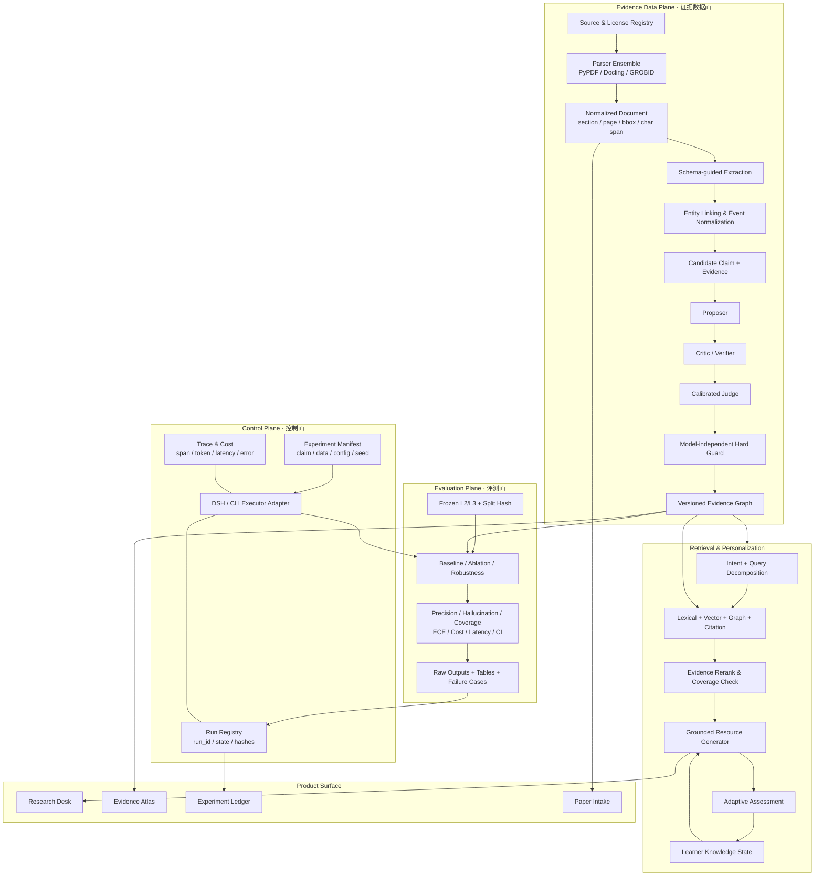

# 研海寻踪关键路径升级方案（2026-08-21）

> 目标：在 2026-09-05 提交前，把当前“功能可运行的 Demo”升级为“证据可追溯、实验可复现、主张可审计、演示可理解”的科研产品。
>
> 本文中的创新点均是**待查新研究假设**。只有完成百篇文献证据库、最近工作查新和消融实验后，才能升级为对外创新主张。

## 1. 完成定义

项目升级完成必须同时满足五条，不以页面数量或 Agent 数量代替：

1. **研究证据完整**：核验不少于 20 个优秀公开研究项目与不少于 100 篇相关顶会/权威期刊论文；每条架构借鉴和创新判断可回到官方仓库、论文或文档。
2. **核心主张可证伪**：最多冻结 2 个主张；每个主张都有强基线、关键消融、失败判据和统计方案。
3. **实验可公开复现**：数据、配置、模型、提示词、代码、硬件、成本和原始输出均有版本与哈希；同伴可在 DSH 或普通终端复跑。
4. **硬指标有真实锚点**：幻觉率、画像适配准确率、知识点覆盖率必须来自冻结集和人工金标准，不能再用 synthetic proxy 冒充。
5. **产品讲清证据闭环**：观众在一个主界面内能看懂“问题—检索—证据—多智能体争议—裁决—图谱—个性化资源—反馈”的完整链路。

## 2. 四条工作流与依赖

### W1：20 个优秀项目架构审计

只纳入有官方仓库或论文、能看到方法或代码结构、与本项目至少一个模块直接相关的项目。每个项目记录：

- 团队与官方来源；
- 输入、状态、节点、边、存储、执行与评测架构；
- 公开复现实验入口；
- 可直接学习的工程模式；
- 不适合照搬的成本、数据或部署条件；
- 与研海寻踪的差异。

初始对标池按功能分层，而不是按 GitHub 热度排名：

- 科研检索与综述：OpenScholar、PaperQA2、STORM/Co-STORM、Open Deep Research、GPT Researcher；
- 自动科研：The AI Scientist v2、Agent Laboratory、The Virtual Lab、SciAgents；
- 科研图谱与工具：SciToolAgent、KARMA、SciAtlas；
- 图检索与长期记忆：Microsoft GraphRAG、LightRAG、HippoRAG 2；
- 多智能体基础设施：Microsoft Agent Framework/AutoGen、CAMEL、MetaGPT；
- 个性化学习与评测：DeepTutor、DeepResearch Bench/FS-Researcher。

最终名单必须经官方来源核验；弱相关或只有营销页面的项目将被替换。

### W2：至少 100 篇论文的证据化综述

论文池分为八个主题桶，避免只搜“multi-agent + knowledge graph”造成同温层：

| 主题桶 | 目标篇数 | 要回答的问题 |
|---|---:|---|
| 科学文档解析与信息抽取 | 15 | 如何保留章节、表格、页码、跨度和跨句关系？ |
| 科学主张与证据校验 | 15 | 如何判断支持、反驳、条件、时态和证据充分性？ |
| Agentic RAG 与自适应检索 | 15 | 何时分解、重检索、扩引文链和停止？ |
| 多智能体辩论、裁判与校准 | 15 | 多角色何时真正优于单模型，如何避免同质化自证？ |
| GraphRAG、实体融合与时序冲突图 | 15 | 如何同时支持局部证据、全局主题、增量与冲突？ |
| 个性化学习与知识追踪 | 10 | 如何把画像变成可测量、可更新的学习状态？ |
| 评测、事实性与可复现性 | 10 | 如何构造冻结集、拒答、置信区间与成本报告？ |
| 科研交互与可视分析 | 5 | 如何让人理解并纠正 Agent 和证据链？ |
| **合计** | **100** | — |

纳入标准：优先 ACL、EMNLP、NAACL、NeurIPS、ICML、ICLR、KDD、WWW、CHI、AAAI 及 Nature 系列等正式发表工作；近两年工作优先，必要时纳入奠基论文。预印本与正式论文分栏，不混写。

每篇论文至少形成一张记录：canonical ID、题目、作者、年份、venue、问题、方法、数据、关键结果、作者明示局限、可复现资产、与本项目的关系、不可越界的表述。仅看搜索摘要不能标记为“已精读”。

### W3：创新查新与完整科研架构

百篇综述后只保留 3–5 个候选机制，再对每个机制使用至少三组不同查询查最近工作。当前值得验证、但尚不能宣传为首创的候选是：

1. **证据状态机图谱**：关系不只是三元组，而是带原文跨度、来源独立性、时态、条件、争议和决策历史的可逆状态机。
2. **争议触发式多智能体校验**：只对模型分歧、证据冲突、低校准置信或高影响关系启动辩论；研究“相同精确率下是否显著降低成本”。
3. **证据强度校准与选择性入图**：将跨度蕴含、解析置信、来源独立性、语义力度和模型分歧输入可校准裁判，允许拒答/待审，而不是强制二分类。
4. **条件化时序冲突图**：保留 support/contradict/extend 及实验条件、年份，不把冲突证据覆盖掉；研究其对演化发现和空白排序的贡献。
5. **证据覆盖驱动的个性化闭环**：生成资源的每个关键句绑定 evidence_ids，同时根据答题反馈更新知识状态；研究适配提升而不是只展示不同难度文案。

最终核心论文主张最多 2 个。其余机制作为工程支撑或未来工作，避免贡献叙事发散。

### W4：Nature 编辑设计语言的产品重构

这里的“Nature 风格”指克制、编辑化、数据优先的科学传播审美，不复制 Nature 商标或页面：

- 米白纸张底色、炭黑正文、单一深红强调色；
- 标题使用高对比 serif，正文与控件使用清晰 sans-serif，ID/哈希使用 monospace；
- 用细规则线、编号、脚注和留白建立层级，减少默认卡片阴影、彩色 Tag 和“仪表盘拼盘感”；
- 第一屏先回答“系统发现了什么、证据是否充分、当前运行是否可信”，再展开控制项；
- 图谱、Agent DAG、证据原文和实验结果使用同一颜色语义；
- 所有指标同时显示样本量、来源与状态（proxy / gold / pending），禁止只有漂亮百分比。

信息架构从两页升级为四个工作区，但复用现有 API：

1. **Research Desk**：提出问题、选择领域/画像、查看流式研究过程和结论；
2. **Evidence Atlas**：论文—跨度—实体—主张—冲突的联动图与原文阅读器；
3. **Experiment Ledger**：实验矩阵、模型/角色、数据哈希、成本、指标、失败案例；
4. **Paper Intake**：PDF/文本摄入、结构抽取、人工复核和入图决策。

响应式、键盘可达性、错误/空状态、加载状态和演示模式均属于验收范围。

## 3. 目标架构



### 架构边界

- SQLite 继续作为可交付的唯一事实源；向量、图算法和 Neo4j 均通过适配器接入，不在赛前制造双写事实源。
- FastAPI 负责稳定 API/SSE；React 负责工作台，不把科研逻辑搬进前端。
- DSH 是控制入口之一，不是实验真相来源；实验真相必须落在仓库内的 manifest、原始输出与哈希中。
- 所有 LLM 节点可替换、可回退，但正式实验禁止未记录的静默回退。

## 4. 公开可复现实验协议

### 4.1 冻结主张

- **C1 主张**：完整的证据校验机制能否在可接受召回损失下，提高 accepted 关系精确率并降低无证据接收？
- **C2 候选主张**：争议触发式辩论能否在接近完整辩论质量的条件下降低 token、成本和时延？
- **反主张**：提升是否仅来自更强/更贵模型、更多上下文、调高拒绝阈值或测试集调参？

查新完成前，C2 只作为候选；若已有工作高度重合，则改为工程消融，不写创新贡献。

### 4.2 数据与划分

- L1：24 条开发压力集，只用于发现 bug；
- L2：390 条冻结三领域用例，作为可重复模型矩阵；
- L3：人工金标准，按论文分组划分，避免同文泄漏；完成双人独立标注、仲裁和一致性报告；
- 额外鲁棒性切片：否定/条件/时态、证据删除、别名、跨句、OCR 噪声、分布外论文。

### 4.3 强基线与消融

强基线只保留三族：规则系统、单模型/普通 RAG、图检索或 Agentic RAG。核心消融：

- 去掉批判者；
- 去掉独立裁判；
- 去掉 hard_guard；
- 去掉时态/语义力度校验；
- 同模型三角色 vs. 异质模型；
- 所有候选都辩论 vs. 争议触发；
- 打乱/删除证据；
- 纯向量检索 vs. 混合检索 vs. 证据图检索；
- 静态画像 vs. 有反馈更新的知识状态。

### 4.4 指标与统计

- 抽取：实体 strict/relaxed F1、关系 micro/macro F1、证据跨度 F1；
- 裁决：accepted precision/recall、幻觉率、选择性风险—覆盖曲线、ECE、Brier score；
- 检索：Recall@k、nDCG、证据覆盖率、引文正确率；
- 个性化：难度适配准确率、核心知识点覆盖率、前后测增益或专家盲评；
- 工程：成功率、p50/p95 时延、token、人民币成本、峰值内存；
- 区间与检验：比例用 Wilson 95% CI，配对分类用 McNemar 或 bootstrap；多重比较时预先声明校正；随机流程默认 3 seeds。

### 4.5 每个 run 的不可缺字段

```text
run_id
claim_id
dataset_version
split_hash
schema_version
model_name_and_revision
provider
role_assignment
prompt_or_config_hash
random_seed
git_commit
hardware
started_at / finished_at
latency / tokens / cost
fallback_events
metrics
raw_output_path
error_case_path
```

### 4.6 DSH 与外部执行

新增仓库内实验控制协议，而不是依赖某个聊天会话：

1. `experiments/manifests/*.yaml` 声明数据、模型、角色、种子和预算；
2. 统一 CLI 进行 `validate / launch / resume / collect / report`；
3. DSH 调用同一 CLI，并把 job ID、日志路径和退出码写回 run registry；
4. 本地、远程 GPU 或第三方 API 只实现 executor adapter；
5. 所有原始输出先落盘，统计与图表从原始输出生成；
6. 失败、重试、限流与规则回退显式记录，不允许“跑通了但不知道跑的什么”。

DSH 当前预设已存在，但全局默认仍为 `code`，且 preset 描述、Agent 注释和实际 skill 数量不一致。先做只读挂载与可调用性验收，再由用户决定是否修改用户级默认设置。

## 5. 15 天倒排

| 日期 | 必须完成 | 决策门 |
|---|---|---|
| 8/21–8/23 | 20 项目矩阵、100 论文证据库、现有架构审计 | 未形成可查新的缺口，不进入大规模重构 |
| 8/23–8/24 | 冻结至多 2 个主张、实验计划与 L3 标注协议 | 找不到清晰 delta 的机制降级为工程特性 |
| 8/24–8/27 | 实验 manifest/registry、DSH adapter、L3 标注、真模型首轮 | 若指标不达线，优先修护栏与数据，不扩功能 |
| 8/25–8/29 | Nature 编辑式前端骨架、Evidence Atlas、Experiment Ledger | 第一屏必须讲清证据与可信度 |
| 8/28–8/31 | 关键消融、校准、鲁棒性与成本实验 | 只保留能改变评委判断的实验 |
| 9/01–9/02 | 三硬指标冻结、失败案例、作品书数字替换 | 所有数字必须关联 run 和哈希 |
| 9/02–9/03 | 端到端演示、空环境部署、视频录制 | 演示中不得出现 proxy 冒充实测 |
| 9/04 | 提交包、源码、数据、测试、许可、部署说明复核 | 提交物对表全部闭环 |
| 9/05 | 只处理阻断性问题并提交 | 禁止临时加入高风险功能 |

## 6. 优先实施顺序

### P0：立即做

1. 完成 20/100 证据库并查新；
2. 完成 L3 人工金标准；
3. 建立实验 manifest、run registry 与 DSH 执行适配；
4. 跑真实模型矩阵与核心消融；
5. 将硬指标、置信区间、成本和失败案例接入 Experiment Ledger。

### P1：随 P0 数据契约推进

1. 重构前端设计系统与信息架构；
2. 增加 Evidence Atlas 联动阅读；
3. 增加 Agent DAG、争议与护栏状态；
4. PDF 摄入增加人工复核状态；
5. 更新作品书、演示脚本和部署说明。

### 赛前暂缓

- 把 Neo4j 变成主事实源；
- 同时接入多个重型 GraphRAG 框架；
- 为增加数量而添加 Agent；
- 没有金标准前做大规模提示词调参；
- 与核心主张无关的移动端、社交或复杂账号系统。

## 7. 验收清单

- [ ] 20 个项目均有官方来源和架构证据；
- [ ] 100 篇论文均有 canonical ID，正式发表/预印本已区分；
- [ ] 每个候选创新都有最近工作查新与最接近方法；
- [ ] 最终主张不超过 2 个，并有反主张实验；
- [ ] L3 双标、仲裁、一致性、冻结哈希完成；
- [ ] 真模型实验没有未记录的静默回退；
- [ ] 每张主结果表能回到原始 run；
- [ ] 前端不展示无样本量、无来源状态的百分比；
- [ ] PDF、SSE、图谱、证据展开、实验台均通过端到端验收；
- [ ] 新环境可以按部署说明复现核心结果和演示。

