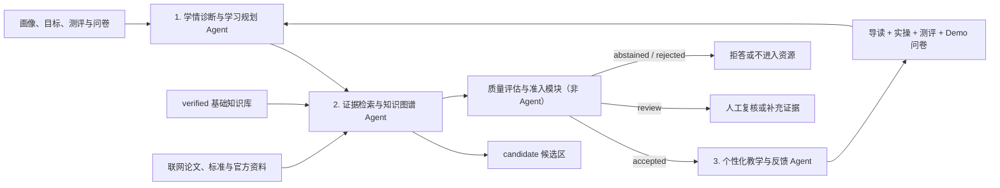

# 系统架构

## 1. 三个基础 Agent

三个 Agent 的业务边界保持稳定：

1. **学情诊断与学习规划 Agent**：理解用户，输出盲区、难度、路径和概念状态；
2. **证据检索与知识图谱 Agent**：检索、抽取和组织可信知识，输出带原文证据的子图；
3. **个性化教学与反馈 Agent**：只使用通过准入的知识生成资源，并收集反馈。

批判、辩论、序贯反证、时序分析和假设排序保留为第二个 Agent 的内部策略，
不再作为独立 Agent 出现在轨迹中。网页的 `legacy` 与 `full` 预设只切换这些
内部策略，不改变三个基础 Agent 的数量。

## 2. 独立质量评估与准入

质量模块不承担业务角色，因此不计入 Agent 数量。它在知识图谱与教学资源之间执行：

- 来源 ID 和原文证据检查；
- 证据数量、独立性和反证检查；
- 过度外推与绝对化命题拦截；
- `accepted / review / abstained / rejected` 准入；
- 证据支撑度、画像契合度、知识覆盖率、问卷反馈和综合质量评分。

当前自动评分是工程基线，正式比赛指标仍需全文金标准、专家盲审和真实用户测试。

## 3. 知识库分区

- `verified`：经过团队复核，可参与本地检索和正式资源生成；
- `candidate`：联网或增量上传所得，只供本轮研究和人工复核；
- 候选文献必须带复核说明才能提升为 `verified`；
- 当前候选区保存在进程内，后续再接数据库和审计日志。

## 4. 可审计数据协议

每次运行继续输出：

- `profile`、`diagnosis`、`report.knowledge_state`；
- 只有三个节点的 `agent_trace`；
- `papers`、`claims`、`graph`；
- `quality_assessment`；
- `resources` 与 `resources.feedback_form`；
- `metrics`、`performance`、`system_config`；
- 作为内部策略输出的 `innovations`。

现有 HTTP API 和前端主要字段保持兼容，新增候选知识入库和问卷反馈字段。