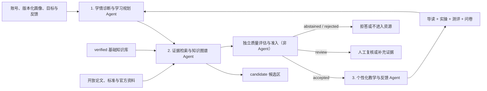
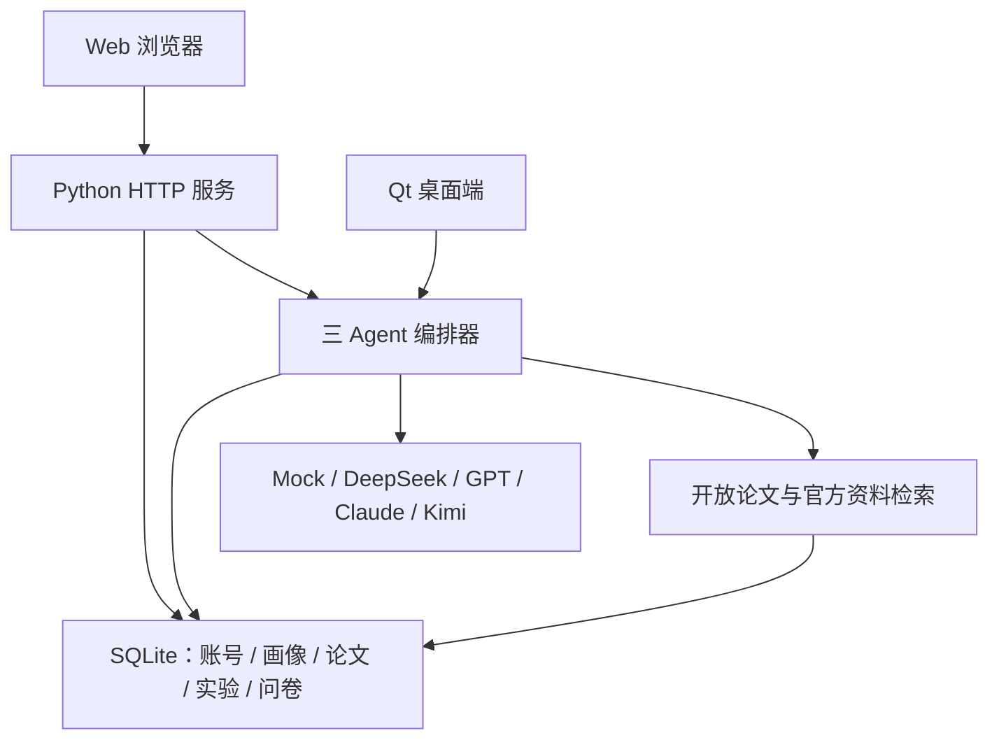

# 系统架构

## 1. 三个复合智能体

三个 Agent 的业务边界保持稳定：

1. **学情诊断与学习规划 Agent**：理解用户，输出盲区、难度、路径和概念状态；
2. **证据检索与知识图谱 Agent**：检索、抽取和组织可信知识，输出带原文证据的子图；
3. **个性化教学与反馈 Agent**：只使用通过准入的知识生成资源，并收集反馈。

原有批判、辩论、序贯反证、时序分析和假设排序没有被删除，而是成为第二个 Agent
的内部工具策略。`legacy`、`full` 和各消融预设只切换策略，不改变三个基础 Agent
的数量。质量评估独立于三个业务 Agent，不在 `agent_trace` 中伪装成第四个 Agent。

## 2. 产品端与运行时

- Web：账号登录、长期画像、SQLite 论文切片、研究历史、A/B/C/Full 对照和问卷；
- Qt：本地桌面推理工作台，提供控制台、诊断与命题、资源与评测、原始日志四页，
  使用仓库内合成画像，不读取 Web 登录会话或用户数据库；
- 离线 Mock：两端共同保留的确定性降级基线；
- 实时模式：检索开放论文与官方资料，再调用用户选择的模型供应商。

SQLite 默认位于 `outputs/runtime/yanhai.sqlite3`，部署时由
`YANHAI_DATA_DIR` 指向代码目录外的持久目录。密码使用 scrypt 加盐哈希，
登录会话通过 HttpOnly、SameSite=Lax Cookie 传递。当前没有邮件验证、密码找回、
管理员后台和用户自助删除，因此仍属于验证环境。

## 3. 独立质量评估与准入

质量模块在知识图谱与教学资源之间执行：

- 来源 ID 和原文证据检查；
- 证据数量、独立性和反证检查；
- 过度外推与绝对化命题拦截；
- `accepted / review / abstained / rejected` 准入；
- 证据支撑度、画像契合度、知识覆盖率、问卷反馈和综合质量评分。

当前自动评分是工程基线。正式比赛结论仍需全文金标准、专家盲审和真实用户测试。

## 4. 知识库分区与持久化

- `verified`：经过团队复核，可参与本地检索和正式资源生成；
- `candidate`：联网或增量上传所得，只供本轮研究和人工复核；
- 候选文献必须带复核说明才能提升为 `verified`；
- 伙伴提交实现的候选区当前保存在进程内；
- SQLite 同时保存领域论文切片和每轮冻结证据快照，用于长期实验留存。

两种存储的职责不同：知识状态分区负责准入，SQLite 证据快照负责复现实验。后续应把
候选区、提升记录、操作者和复核说明也迁入数据库审计表。

## 5. 模型供应商与安全边界

Web 公开注册由 `YANHAI_REGISTRATION_OPEN=1` 显式开启，缺省关闭。登录用户可选：

- `free-deepseek`：前端不要求 Key，服务端转换为 DeepSeek 请求并注入
  `secret/DeepSeekAPI.txt` 中的服务器 Key；
- `deepseek`、`openai`、`anthropic`、`kimi`：用户在本次请求中提供 Key；
- `mock`：不联网、不产生模型费用。

服务器 Key 在进程启动时读取，更新文件后必须重启服务。该文件不得提交 Git，
也不得进入 Qt 或 Web 发布包。

## 6. 可审计数据协议

每次运行输出：

- `profile`、`diagnosis`、`report.knowledge_state`；
- 只有三个业务节点的 `agent_trace`；
- `papers`、`claims`、`graph`；
- 独立的 `quality_assessment`；
- `resources` 与 `resources.feedback_form`；
- `metrics`、`performance`、`system_config`；
- 作为内部策略结果的 `innovations`；
- Web 单次运行对应的 `research_record`；
- 对照实验的 `answer_variants`、`hallucination_evaluations` 与
  `survey_responses`。

所有进入最终资源的事实性结论必须具有可追溯来源、通过质量准入，并在资源中保留
来源 ID。明确标记为待验证的研究假设不得伪装成已证实结论。

## 7. 技术选型与后续替换

基础版采用 Python 标准库 + 原生 HTML/CSS/JavaScript：

- Mock 不依赖外部 API，比赛现场可离线运行；
- Web 持久层使用 Python 标准库 `sqlite3`，无需额外数据库服务；
- JSON 种子知识库继续作为离线可审查基线，SQLite 用于长期积累；
- 核心编排器与 UI 解耦，后续可替换为 CAMEL、LangGraph 或自研调度器；
- 测试使用 `unittest`，无需安装额外包。

| 当前模块 | 后续能力 |
| --- | --- |
| 关键词检索 | 稀疏 + 稠密混合检索、重排器 |
| 人工关系切片 | 领域实体关系抽取与专家审核 |
| 规则内部策略 | 结构化输出的大模型工具与 NLI |
| 工程质量门控 | 校准模型、专家反馈学习 |
| 进程内 candidate + SQLite 快照 | 统一审计数据库 |
| JSON 图谱 + SQLite | Neo4j / NebulaGraph |
| 单机 HTTP + SQLite | FastAPI + PostgreSQL + 任务队列 |
